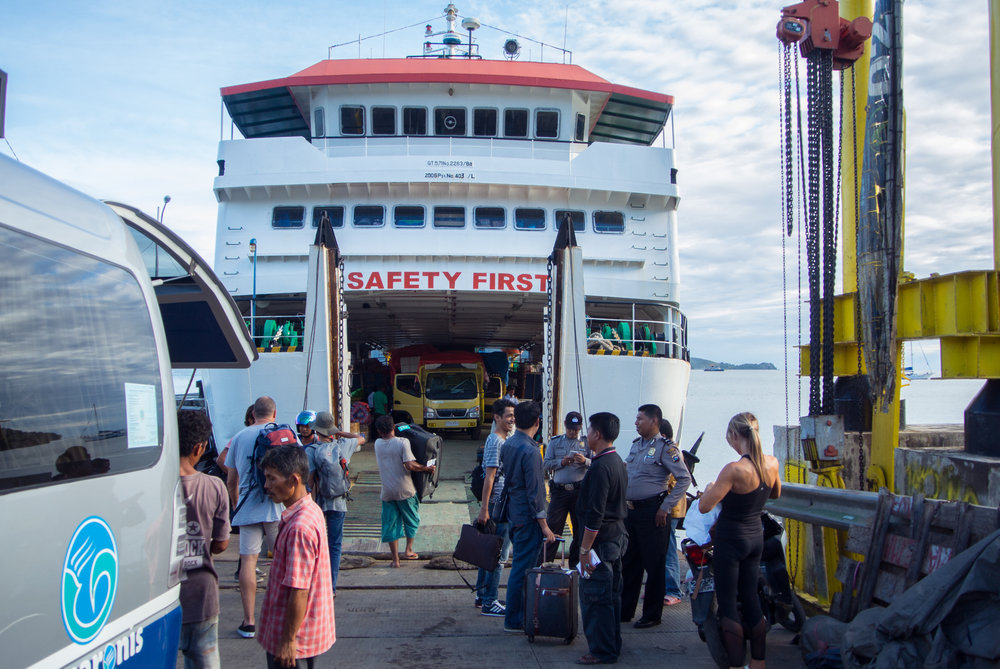
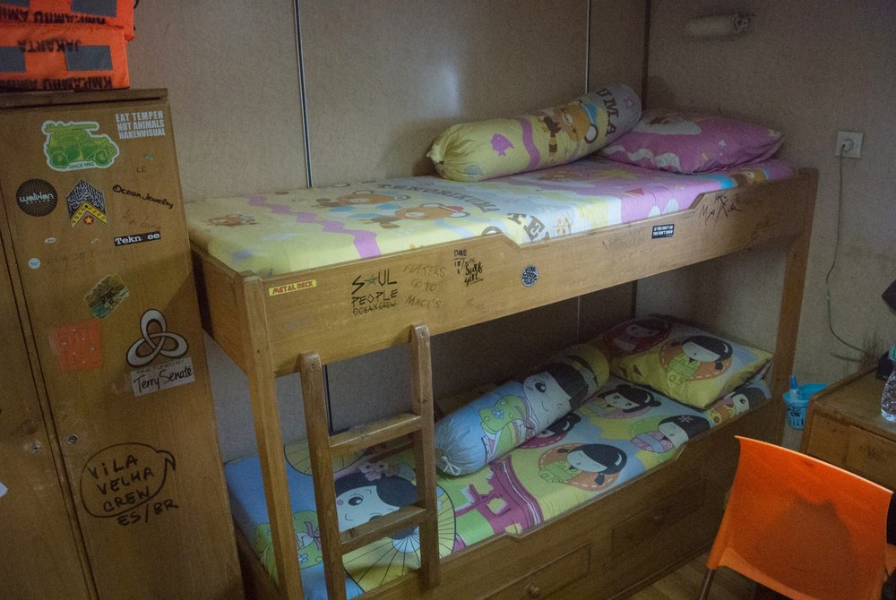
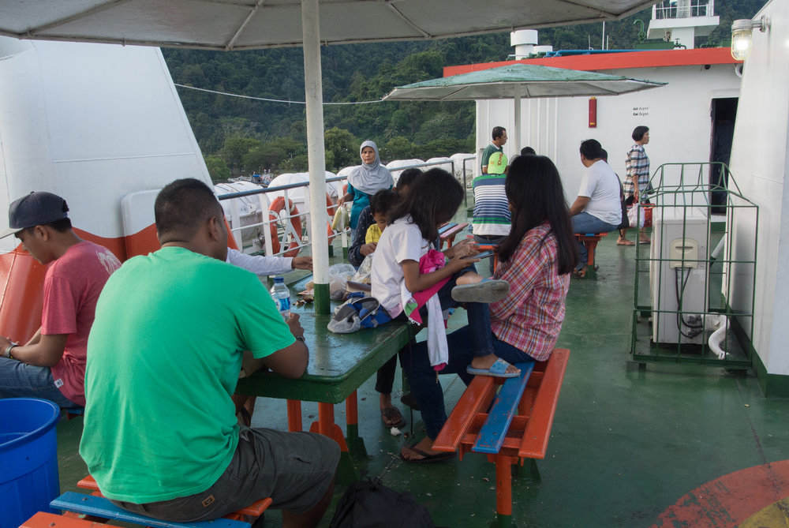
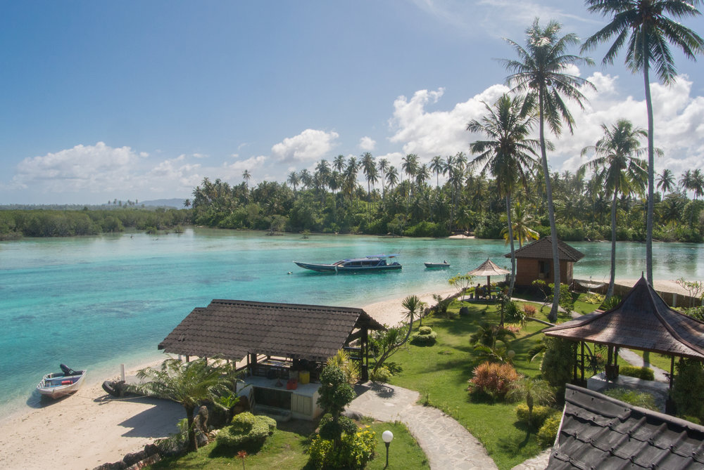
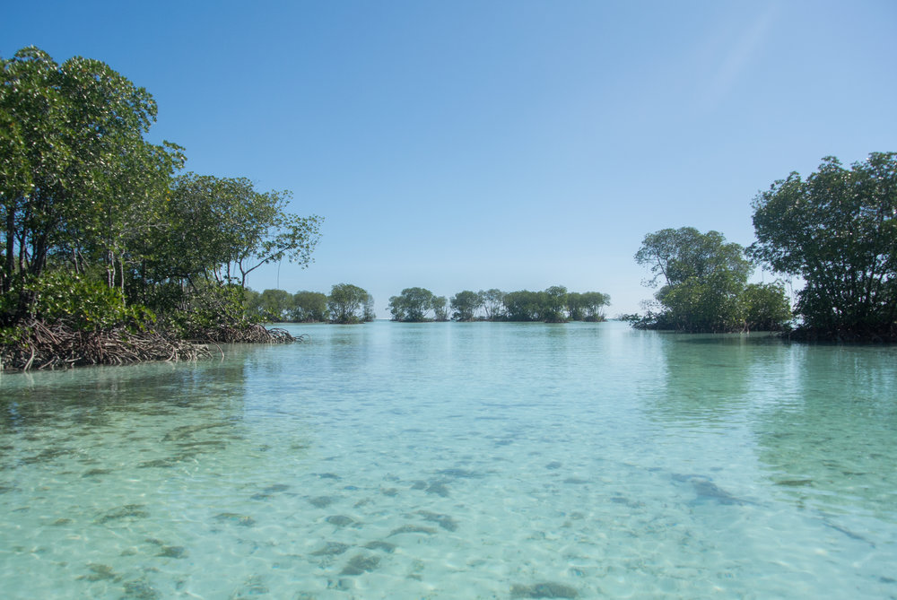
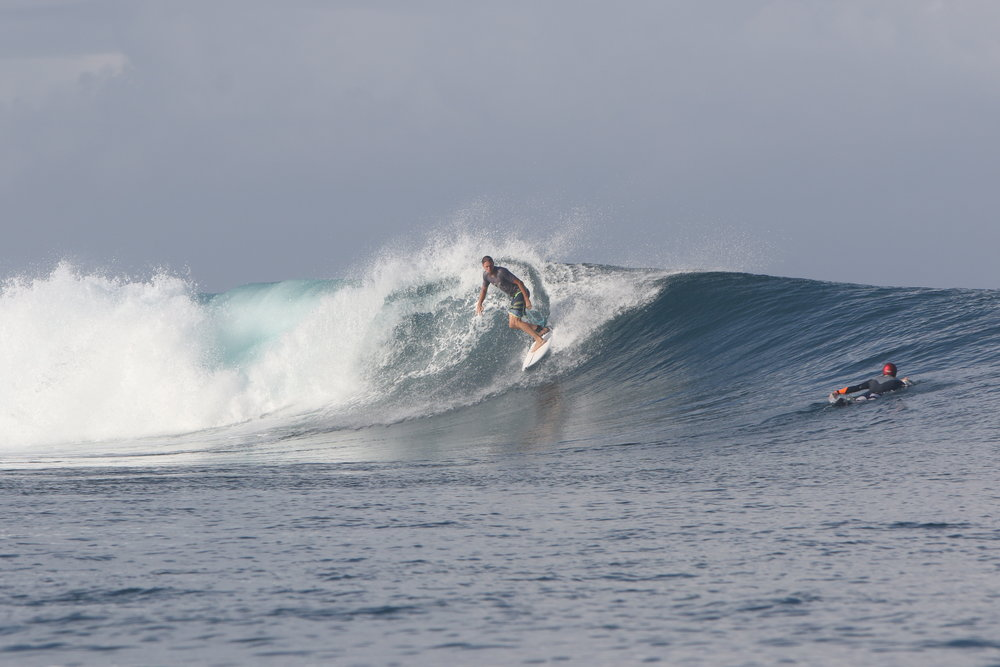

## Mentawais

During a 6 weeks trip through Indonesia, our personal highlight was a trip to the Mentawais, a group of islands 150 km off the West Coast of Sumatra, Indonesia. To get there is a long and not always comfortable journey but it was definitely worth the trip.

Our adventure to Paradise started in Padang, Sumatra. You can reach Padang easy and cheap from Kuala Lumpur, Jakarta or Singapore with [Air Asia](https://www.airasia.com/en/home.page?cid=1) or [Garuda Indonesia](https://www.garuda-indonesia.com/sg/en/index.page?). We booked ourselves into the [Macaronis Resort](https://www.macaronisresort.com/), which offers different packages for your stay. They organized the whole trip for us, started with a shuttle from the airport in Padang to the Mercure Hotel, where we stayed at the Pool until the late afternoon. From there another shuttle took us to the Padang ferry terminal where we boarded our ferry to paradise.

## Getting There

We were really happy to have a first class ticket, which included a cabin with two bunk beds! Second class passengers would sleep on a chair and the classes below were even more uncomfortable. We enjoyed a really good sunset dinner with a couple of Aussies and lots of Bintangs. After a more or less pleasant sleep on our overnight ferry, we reached the Mentawais after 14 hours the next morning. From here we moved onto a Speedboat taking us to Macaronis Resort, where we were welcomed with fresh coconuts after another 1 1/2 hours on a boat.

## Surf & Relax

Having spent the last 5 weeks all over Indonesia, I have to admit we had never seen a place like this before. The nature was amazing, white beaches, endless crystal blue water, palm trees and no buildings at all. The best was that it was absolutely uncrowded, meaning we shared our hotel with only 20 other people. Florian enjoyed surfing everyday in really great waves, and a camera from the hotel to check crowds and size of waves before heading out. Whenever one wanted to head out, he would just walk out to a small pier and hitch a ride into the lineup. For those wanting to give surfing a try, surfboards can be borrowed for free and for the more ambitious, surfing lessons can be booked as well.

While Florian was surfing, I enjoyed the quiet and relaxing atmosphere at the pool, at the beach and had some amazing massages. I also used the Stand-up Paddle Board to explore the Mangroves and took the Shuttle boat to the surfing point to watch Florians surf sessions. During our stay everything was included except for alcohol. Everyday we had delicious food and spent time with nice and friendly people.

## Things to bring

*   Bikini & Boardshorts
    
*   Surfboard if you surf - but you can borrow one as well
    
*   Mosquito Repellents
    
*   50 Sunscreen
    
*   Malaria Prophylaxis - we brought it, but didn't use it
    

* * *