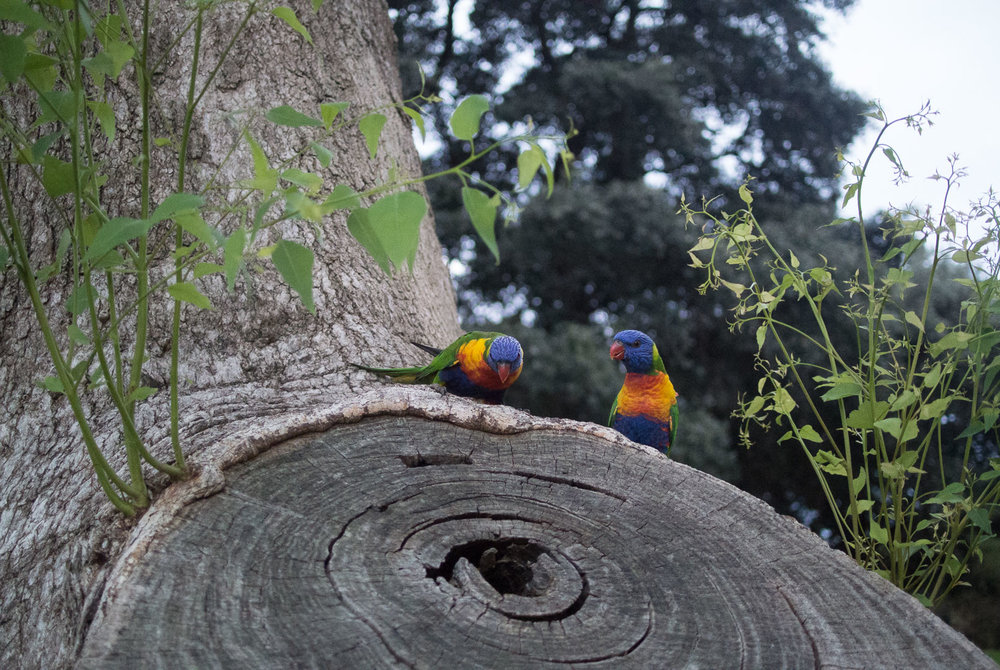
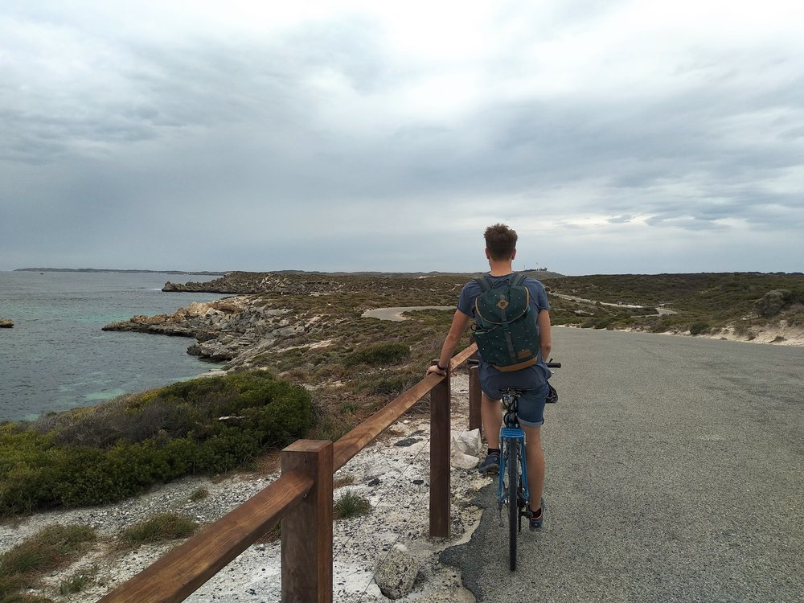
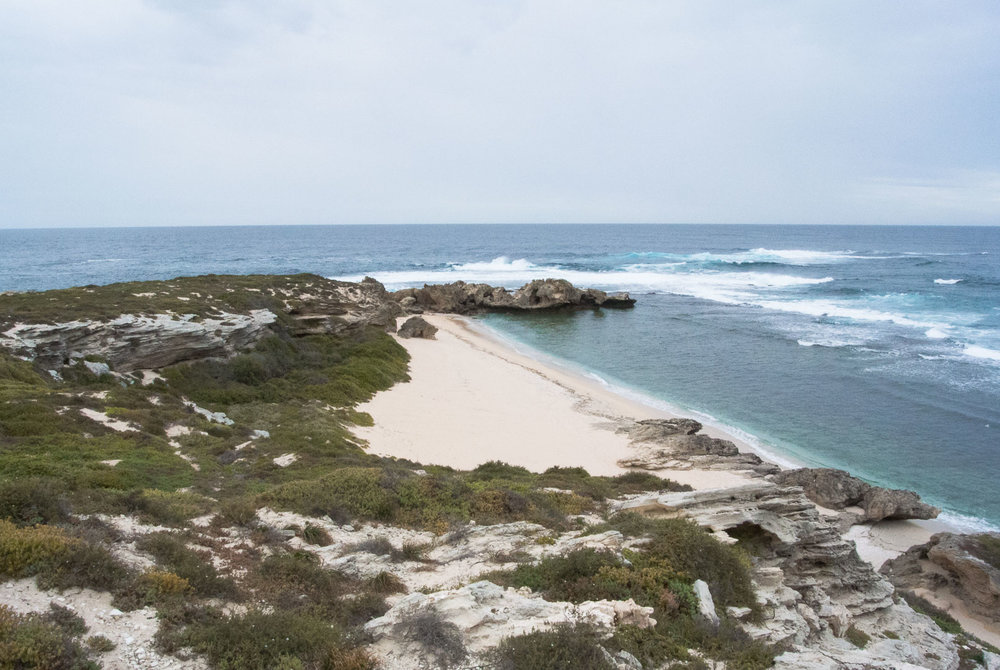
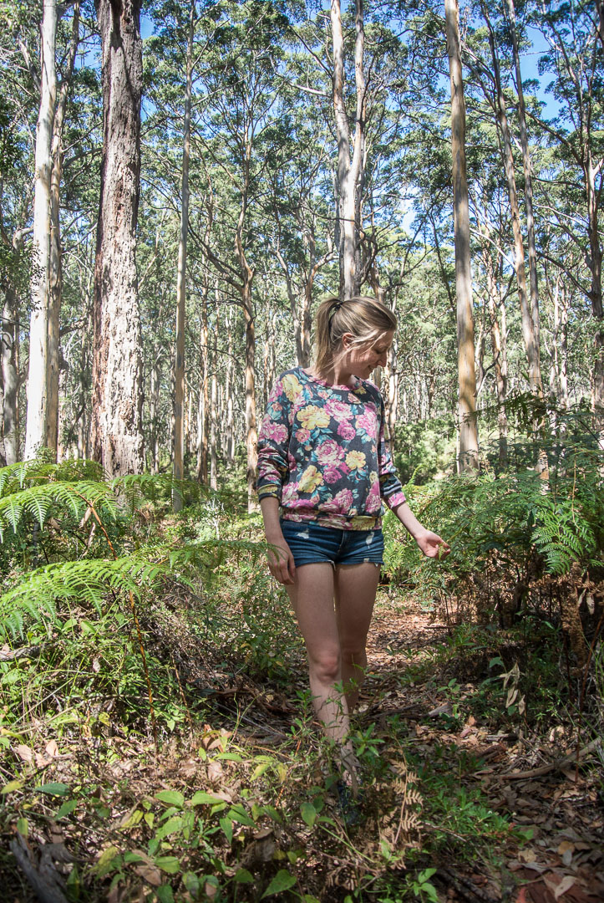

## Perth

My Husband needed to go to Perth for a two week business trip, so I took the chance to join him to go for a long weekend trip at the end. We stayed in Perth for a couple of days, did some Sightseeing and met some old friends from the Mentawais. On the weekend we visited Rottnest Island to see the little Quokkas. Getting there by ferry is easy - just book a ticket at [Rottnest Express](https://www.rottnestexpress.com.au/). Once arrived, you can rent a bike and take a ride around the island, which is probably the best thing to do. After exploring all the viewpoints, the lighthouse and Quokkas, we had a really good fish 'n chips and and some local wine right in front of the beach before our departure.

## Roadtrip

Easter weekend we rented out a car at the airport for our little Road Trip to Margaret River. It was our first time to drive on the left side, so it took a while to get used to driving. From Perth to Margaret River took us around 3 hours, but we were lucky to leave quite early for the weekend, which let us avoid the long weekend traffic (we heard it could really take around 5-7 hours then). Because of the Public Holiday and our quite spontaneous trip, there were not really a lot of accommodations left and it was a little more expensive as usual. So if you plan to go there during Public holidays, better book everything in advance.

## Margaret River

Our first night we stayed in Yallingup at the [Caves House Hotel Yallingup](https://www.caveshousehotelyallingup.com.au/), which was great and had a really nice breakfast. From here on we left to explore Meelup Beach, Eagle Bay and the Cape Naturaliste Lighthouse. On our way to Margaret River, we stopped at Canal Rocks and the Injidup natural Spa, where you can jump into a natural pool and get a massage from the ocean surf. We spent three more nights in Margaret River, where we discovered this quite idyllic guest house. The guest house is run by a retired couple, taking care of the great house including a library, DVD-Store and the everyday fresh baked cake. The two were just super friendly and welcoming so we kind of fancied the idea of retiring exactly like this ourselves :-) Check out their website, [Margaret River Guest House](https://www.margaretriverguesthouse.com.au/). Margaret River is a small town with a lot of shops and restaurants. It's a good location to explore the area as you can reach a whole bunch of great, empty beaches, small towns and lots of vineyards within 30 min. We spent our day driving from beach to beach which was quite exciting taking all the small, empty and sandy roads to remote beaches. Just make sure get a car with sufficient ground clearance to not get stuck in the sand … it took us quite a while to get out of the sand at one point :-)

## Other Tips

*   Margaret River is popular for it's vineyards. Don't be like us and drive there with a car, you can try wines for free. Better book a wine tour. You'll find the brochures everywhere or just get in contact with other visitors, who can sure recommend a tour.
    
*   If you like hiking and maybe camping at the beach. There is a beautiful Cape to Cape walk along the beaches. We did some parts of it and really liked it.
    
*   Take a stop at the Surfers Point overlooking the famous waves of Margaret River. It’s just great to stay and watch the surf all day and eventually even catch a few yourself.
    
*   There are a lot of carparks and viewpoints along the beaches. Just stop for a while and enjoy the moment.