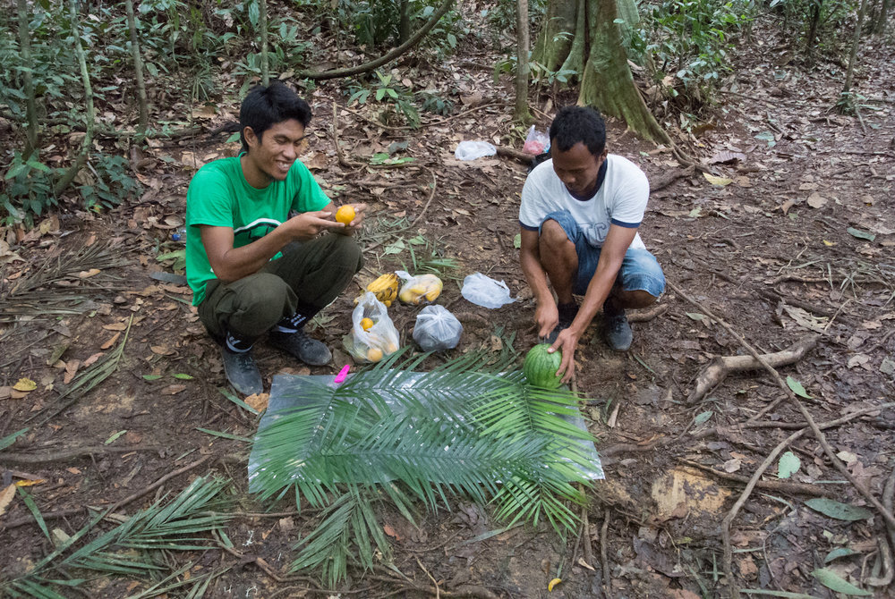
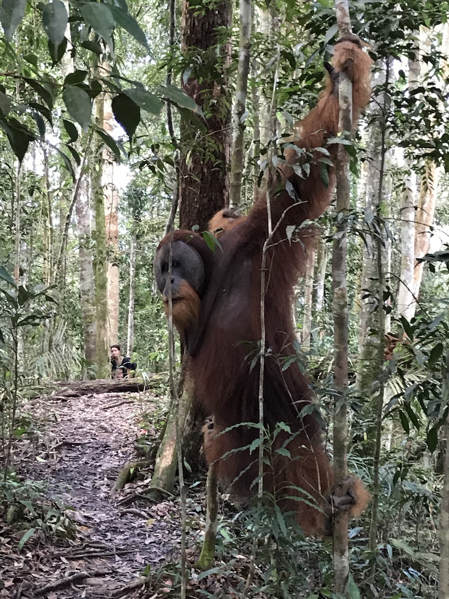
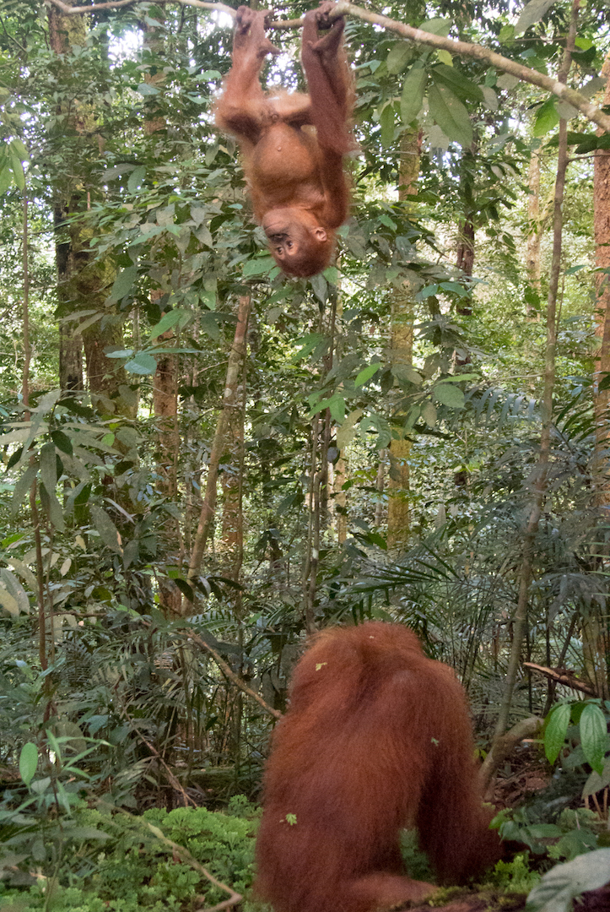
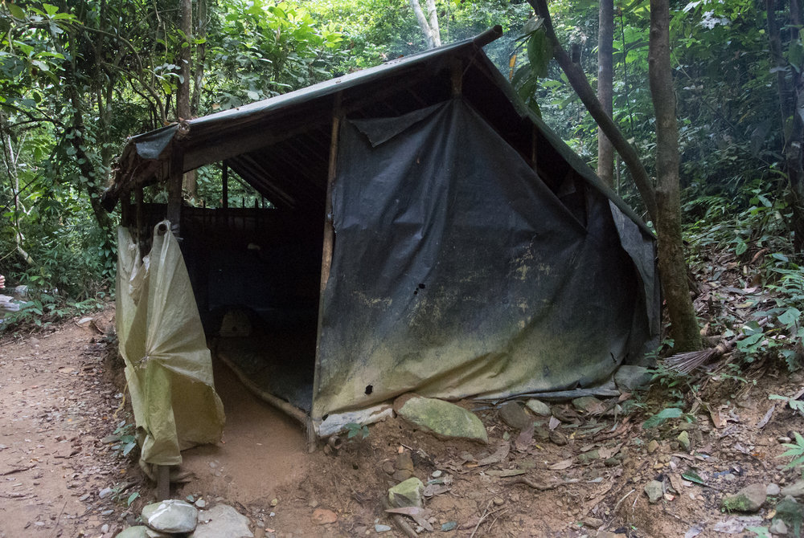

## Getting there

Bukit Lawang is a small village in the north of Sumatra/Indonesia and is the entrance to the Gunung Leuser National Park, one of two remaining habitats for Orangutans in the world. First of all, try to plan your visit to Bukit Lawang during off season, it will be less crowded and cheaper of course. Book a flight from Singapore or anywhere in Indonesia to Medan/Sumatra with [AirAsia](https://www.airasia.com/tw/zh/home.page?cid=1), the flights are quite cheap. To save time in Medan, choose a hotel close to the airport (the city centre of Medan isn’t that nice) we stayed in [Thongs Inn](https://web.thongsinn.com/). From here it takes 4 hours to get into Bukit Lawang. The hotel arranged a driver to bring us there and pick us up and it was a fair price.

Most of the ride is along palm oil plantains, this sets the scene for visiting the endangered species in one of the world richest and most diverse tropical rainforests. Without destruction of their natural habitat to plant more palm trees these beautiful animals would probably not be close to extinction. Among the declining population are of course Orangutans but also Elephants, Tigers, Rhinos and many other Animals. 

Ask the driver to stop by at a local Murtabak-Shop to try this delicious local sweet along the way.

## Bukit Lawang

In Bukit Lawang there are plenty of hotels and homestays on offer. We stayed at the [Ecolodge Bukit Lawang](http://ecolodges.id/en/) right in front of the river and next to the rain forest entrance. The rooms/bungalows are nice and clean. In the morning you will be woken up by little grey monkeys who run and play really loud on the roof. In the garden you might see a snake, but be careful they could be venomous ;)

The village itself has quite a few souvenir shops and lots of restaurants with local food. We really liked walking along the river while watching kids jump in the water with little tubes just to float down with the current again.

The most important thing is of course to book your jungle-tour. You will need a guide in order to get access to the national park. Like everywhere in Indonesia there are thousands of options. We booked the tour with [Jungle Edie](http://www.jungleediebukitlawang.com/) and were escorted by two really nice guys. Make sure your guides have an official certificate form the National Park Authority and are eco-friendly of course. We left our personal belongings back in the hotel and only packed for the hike.

## Jungle Trekking

We did the 3 days / 2 nights tour and where quite happy with it. Hiking through the humid jungle is a sweaty exercise, but it will be rewarded by seeing different types of monkeys, especially the big semi wild Orangutans.

During the 3 days we saw a lot of them, most of them known by the guides. Among them, Mina. In her life, she had a lot of bad experience with humans being held captive and treated pretty bad - you can see by the scar above her eye. Most of her time she stays on the ground and everybody shows respect to her - even the guides are scared and feed her with bananas to keep her calm (and feeding is sure not a good thing here!).

After meeting Mina on our way to the next viewing spot we ran into an unknown male - meaning not even the guides knew this big fellow. Seeing only females so far, this was quite an impressive sight, as males are a lot bigger and their faces look different compared to the females. The guides where pretty cautious at first but after a while a few people got close to him and it turned out he was quite shy and nice. He went along flirting with a female who unfortunately just wasn't interested.

It was amazing to see and observe these big monkeys, our closest relatives. We loved it, especially the cute, little baby Orangutans. During the hikes and nights at the camps the guide and porter took care of our wellbeing and prepared picnics including fresh fruits, rice and of course tea. We spent the first night in a simple camp at a small river with only a mosquito net, a tarp and a simple mattress on the ground.  To reach the second camp at the main river we had another day of hiking and actually crossed this much bigger, stronger stream. To finish our hike, we packed all our stuff into waterproof bags and got delivered a bunch of old inflated truck tires. The guides tied them together and we rafted down the Bahorok River back to Bukit Lawang.

## What to bring

*   Flashlight
    
*   Mosquito repellent
    
*   Sunscreen
    
*   Light bag
    
*   Enough water!
    
*   Comfortable shoes
    
*   Light sleeping bag
    
*   Soap - in case you wanna wash yourself in the river