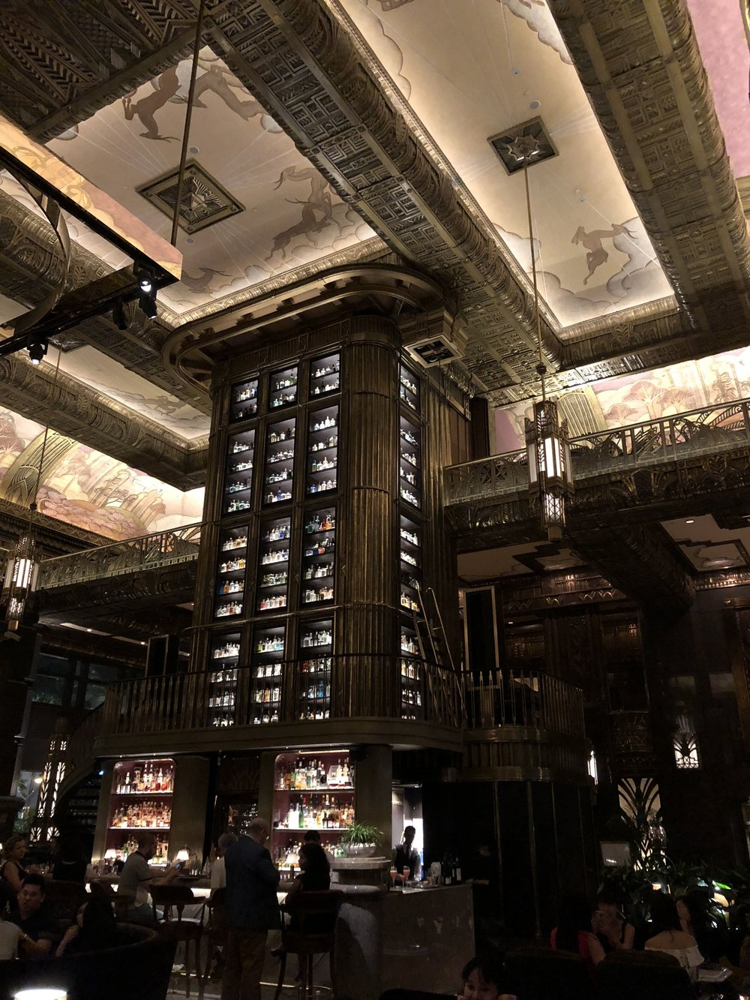
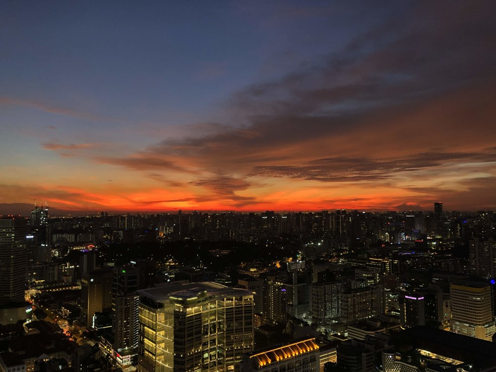
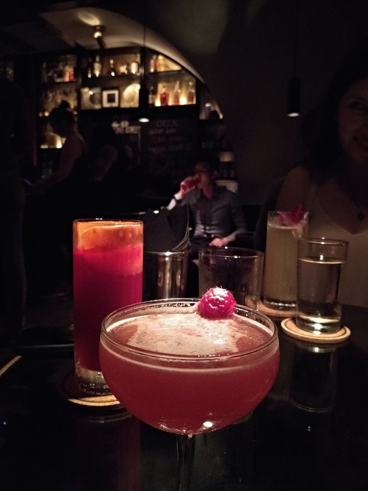
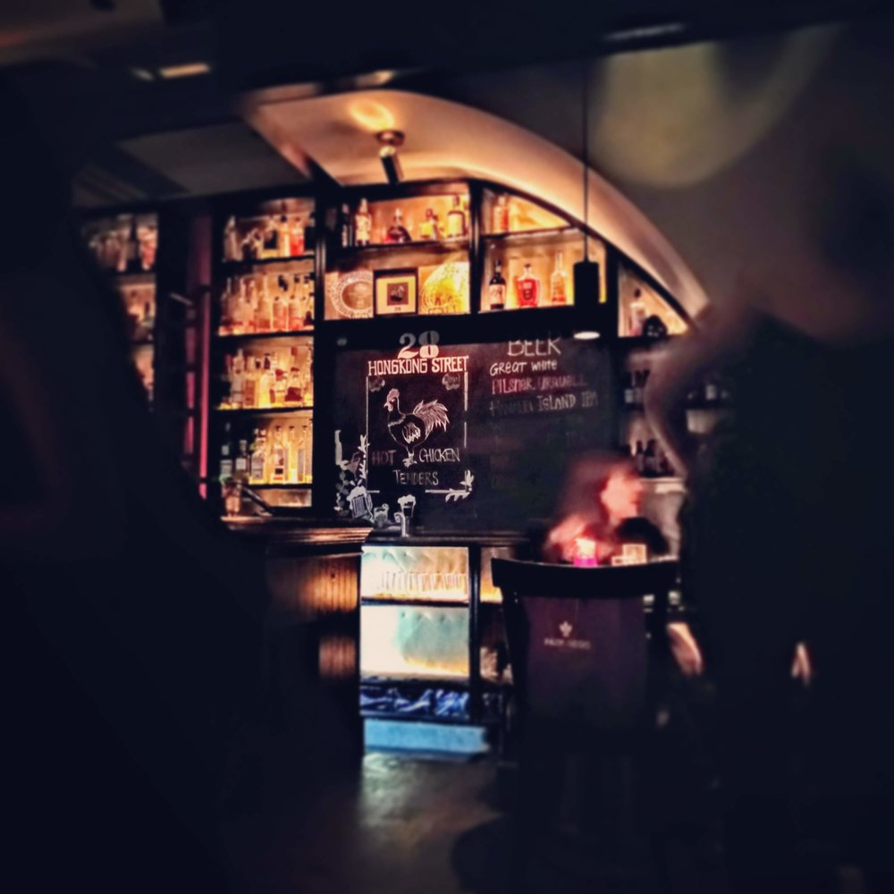
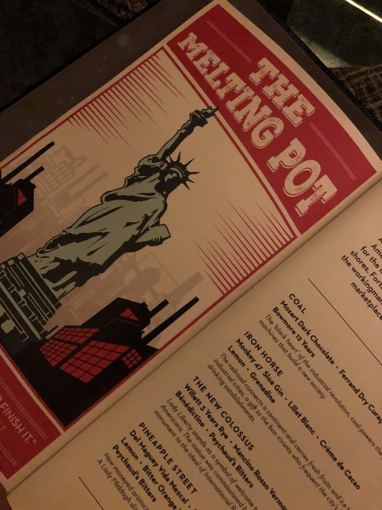
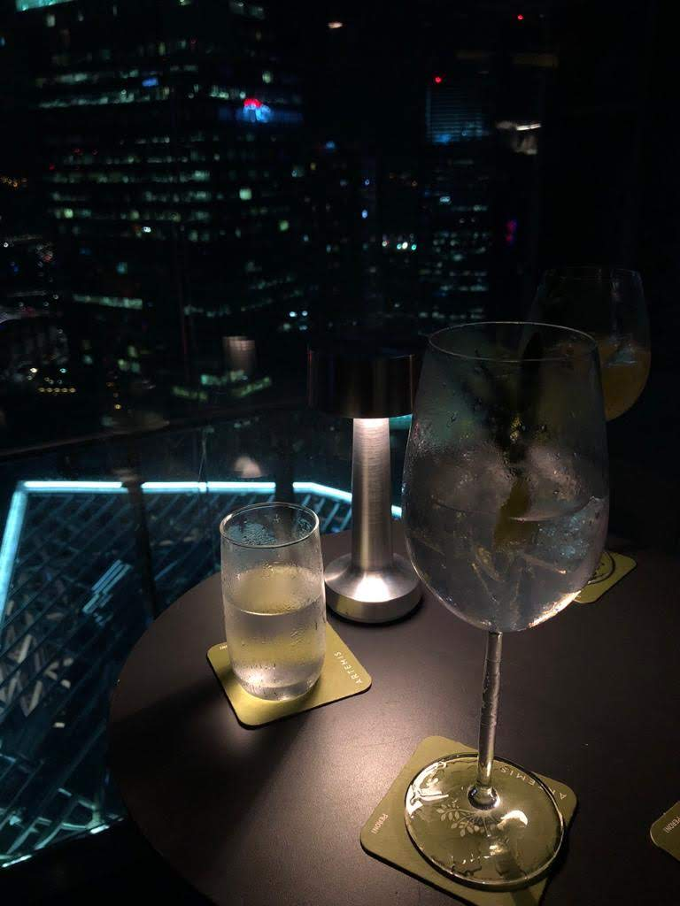

## ATLAS Bar

600 North Bridge Rd, Parkview Square, Singapore 188778 | [+65 6396 4466](https://www.google.com/search?q=atlas+bar&spell=1&sa=X&ved=0ahUKEwjOkPHsn8zfAhWKWrwKHRKhCUsQBQgrKAA&cshid=1546334423390000&biw=1442&bih=901# "Call via Hangouts") | [http://atlasbar.sg/](http://atlasbar.sg/)

One of our favorite bars in Singapore is the [Atlas Bar](http://atlasbar.sg/) located on the first floor of the unique Parkview Square building in Bugis. If you don’t have time for a drink make sure to stop by and take a look inside. The style of this place, with fancy Art Deco design and super high ceiling is amazing and still manages to create a nice atmosphere. Stated as one of the best bars in the world Atlas Bar is famous for its Gin and Champagne collection with the finest from all over the world. If you ask for the Gin menu, you’ll get a full book.

The drinks themselves are great and a great variety is offered additionally to lots of good Gin, Whisky, Tequila etc. My favorite sure is the popcorn which is served with an indescribable yet tasty seasoning. I haven’t really figured out how reservations work, it seems to be booked up to three months in advance, but you can always put your name on the waiting list and wait at another bar - sometimes up to an hour. It’s worth it.

Dress Code: smart casual from 5 pm | no slippers or shorts

## LeVeL33

8 Marina Blvd, #33-01, Singapore 018981 | +65 6834 3133 | [https://level33.com.sg/](https://level33.com.sg/)

[Level 33](https://level33.com.sg/) is probably named in the most travel guides for Singapore as the the world's highest urban craft microbrewery. Located in the Marina Bay Financial Centre (MBFC), it offers an amazing view on Marina Bay and the city skyline. From their outdoor terrace you can taste different types of self brewed craft beers (or any other drink) and enjoy your evening in a smooth and calm atmosphere.

We never had a reservation, but after a short waiting time at the bar, you’ll get a table with a great view. Most of the times we went here, it was really spontaneous and never an issue.

Dress Code: no

## Mr Stork

5 Fraser Street Level 39, Andaz, Singapore 189354 | [+65 6408 1288](https://www.google.com/search?q=mr+stork&oq=mr+stork&aqs=chrome.0.69i59j69i60l3j69i57j69i60.1275j0j4&sourceid=chrome&ie=UTF-8# "Call via Hangouts") | [singapore.andaz.hyatt.com](http://singapore.andaz.hyatt.com/)

Quite unknown when we visited the rooftop bar our first time, [Mr Stork](https://www.hyatt.com/en-US/hotel/singapore/andaz-singapore/sinaz/dining) is getting more popular. For good reason. On level 39 of the Andaz Hotel in Bugis, it has an amazing 360° walk around with views all over Singapore. You’ll always find a place right at the bar, but there are various options like little teepee’s for more privacy.

Sunsets are stunning up here and the drinks are really good. We recommend the self brewed Andaz Pale Ale. Be sure to go there with good weather, there’s limited space under shelters. Mr Stork is a walk-ins only bar, if you’re planning to go there with 10 or more people, it’s better to email them before.

Dress Code: no

## 28 HongKong Street

28 Hongkong St, Singapore 059667 | [+65 8318 0328](https://www.google.com/search?ei=pTgrXPqyOIr_8gWpgJ_oBQ&q=28+hks&oq=28+hks&gs_l=psy-ab.3..0i71l8.6315.6429..6669...0.0..0.0.0.......0....1..gws-wiz.pd429cGrYLU# "Call via Hangouts") | [https://www.28hks.com/](https://www.28hks.com/)

[28 Hong Kong Street](https://www.28hks.com/) is one of Singapore’s hidden bars. You won’t expect a high quality bar like this behind a simple and inconspicuous door like here in Hong Kong Street. Taking a step through the door and behind the night curtain, you’ll enter a cozy bar atmosphere with great drinks.

28 Hong Kong Street is one of a top drinking spot in Singapore, right next to Singapore’s CBD.

## Manhattan Bar

Regent Singapore, 1 Cuscaden Rd, Level 2, Singapore 249715 | [+65 6725 3377](https://www.google.com/search?q=manhattan+bar+singapore&oq=manhattan+bar&aqs=chrome.0.69i59j0j69i57j69i60l2j0.1811j0j4&sourceid=chrome&ie=UTF-8# "Call via Hangouts") | [https://www.regenthotels.com/regent-singapore/dining/manhattan](https://www.regenthotels.com/regent-singapore/dining/manhattan)

[Manhattan Bar](https://www.regenthotels.com/regent-singapore/dining/manhattan) is a grand hotel bar located on Level 2 at the Regent Singapore and is inspired by the ‘Golden Age of cocktails and fine drinking’. Cocktails again are quite good and their big comfy sofa’s create a relaxed atmosphere. It’s a bit out of town though so it will take a while to get there.

Dress Code: Smart Casual | no slippers, singlets & tank tops

## Southbridge

80 Boat Quay, Rooftop Level 5, Singapore 049868 | [+65 6877 6965](https://www.google.com/search?ei=1zwrXKKfIYSF8gWPzb_wCg&q=southbridge+singapore+bar&oq=southbridge+&gs_l=psy-ab.1.0.35i39j0i67j0i20i263j0l7.559827.565460..567645...1.0..0.344.3407.2-11j2......0....1..gws-wiz.......0i71j0i131j0i10.d5OAECptgU0# "Call via Hangouts") | [http://www.southbridge.sg/](http://www.southbridge.sg/)

Located at Boat Quay right in front of the Singapore River, [Southbridge](http://www.southbridge.sg/) is a rooftop bar on the 5th floor with a beautiful setting. It is not quite comparable to the other high up rooftop bars but because of it’s location it offers a unique view into Marin Bay and Singapore River.

Come here before sunset and enjoy the view.

## Artemis Grill

138 Market Street Rooftop #40-01, CapitaGreen, Singapore 048946 | [+65 6635 8677](https://www.google.com/search?q=artemis+singapore&oq=artemis+si&aqs=chrome.0.0j69i57j0l4.2421j0j4&sourceid=chrome&ie=UTF-8# "Call via Hangouts") | [https://www.artemisgrill.com.sg/](https://www.artemisgrill.com.sg/)

[Artemis Grill](https://www.artemisgrill.com.sg/), a Mediterranean rooftop bar and restaurant located on the 40th floor of the CapitaGreen office tower in Singapore’s CBD. Artemis Grill is another location we really enjoyed drinks and food at. With amazing panoramic views on the city skyline and the Marina Bay. At first it might only look like a fancy restaurant but it also has a bar outside.

Dress Code: Smart Casual