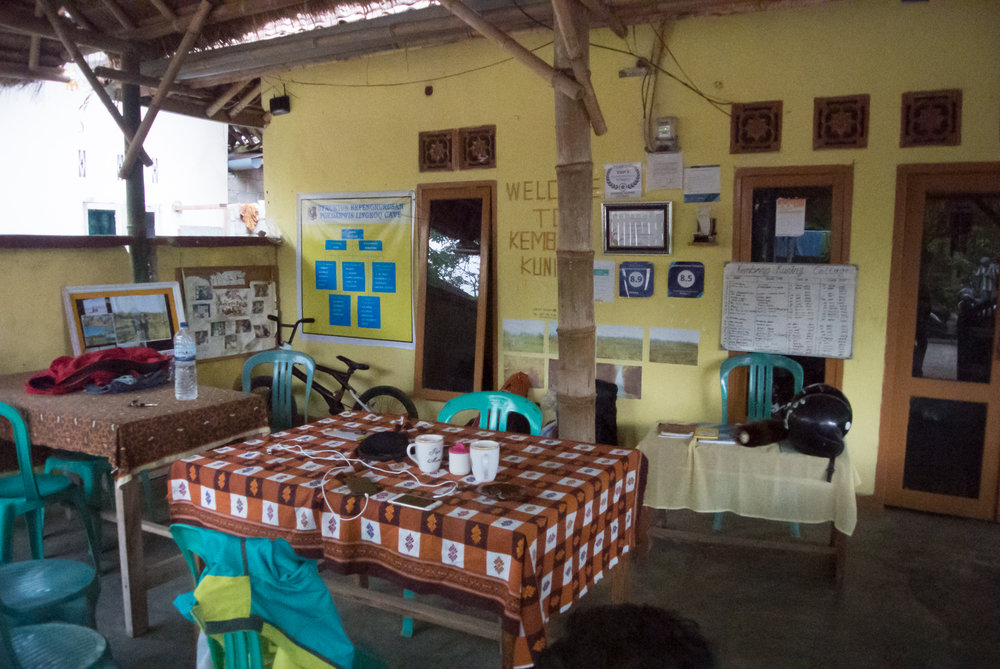
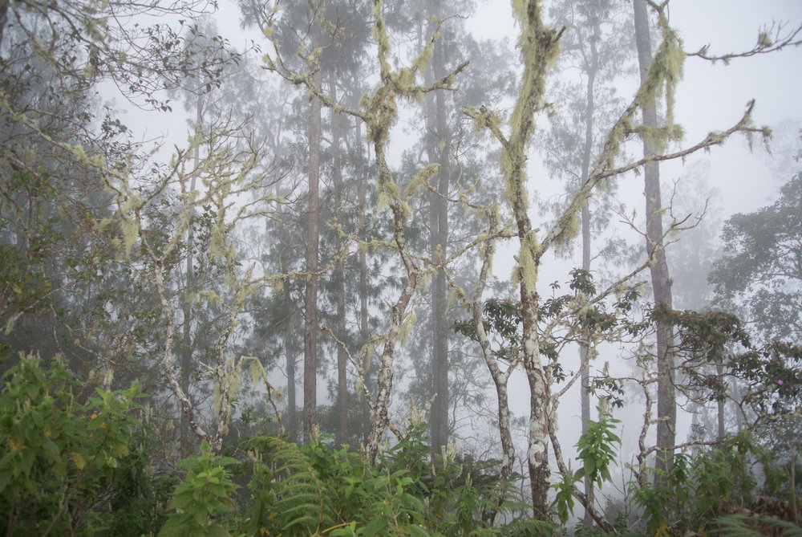
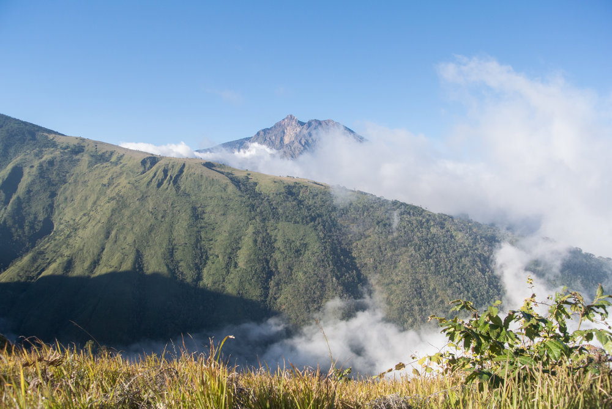
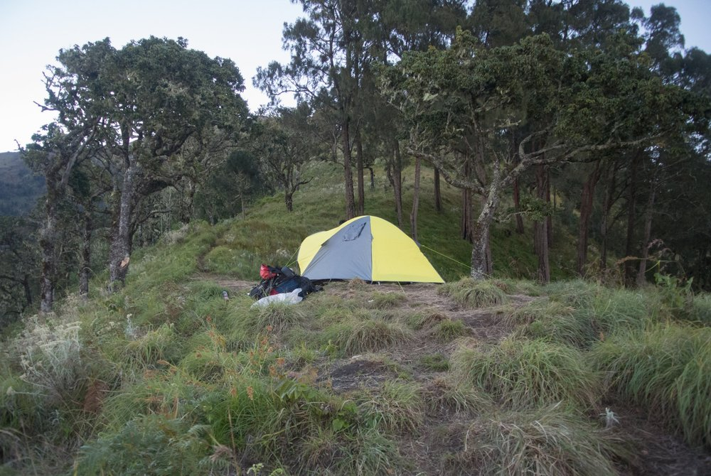
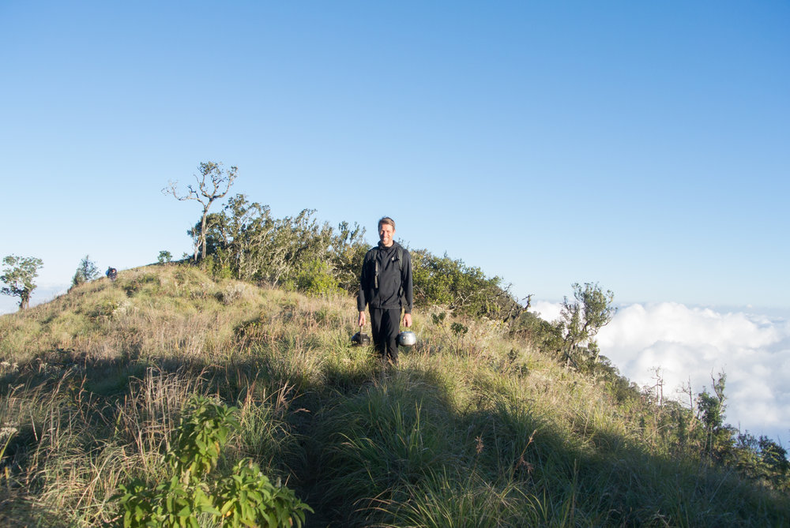
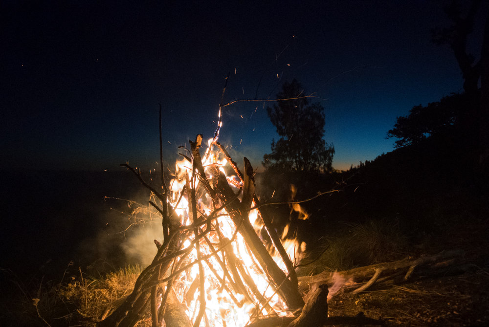
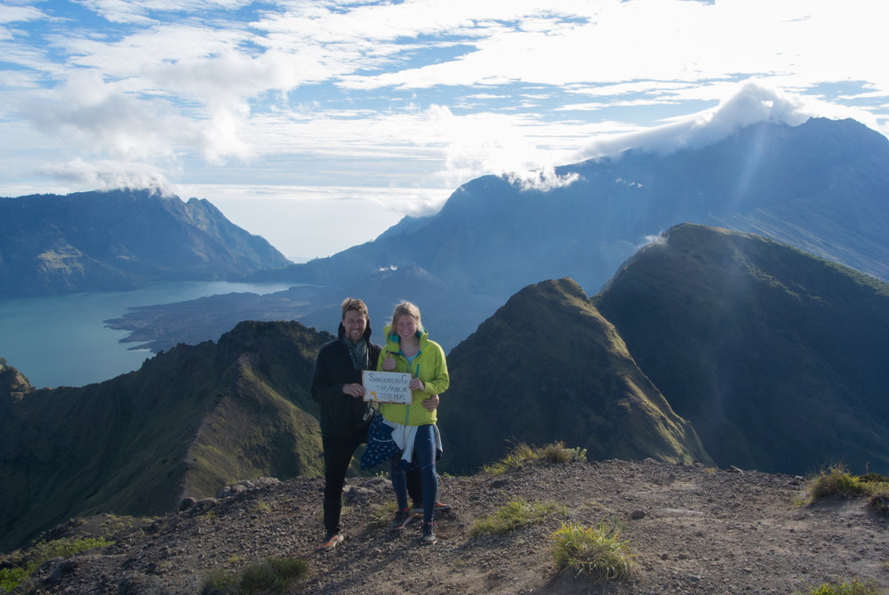
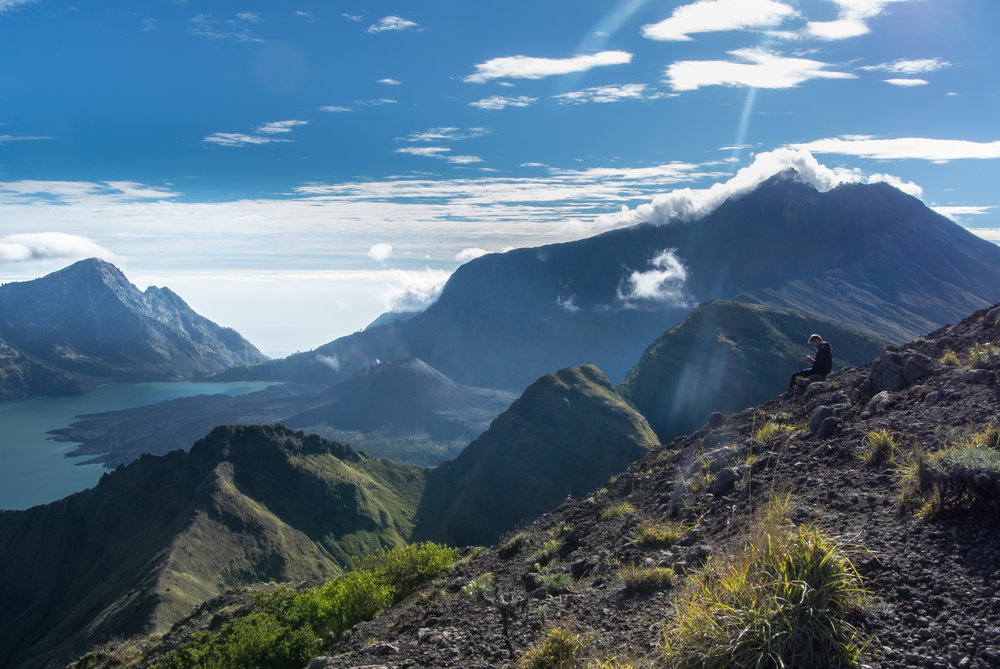

## Sangkareang

After a lot of online research, we found out that there is a route to hike the popular Rinjani Mountain without the masses of tourists and with a little more adventure. This meant we actually wouldn't climb Rinjani (3726m) but go for Sangkareang (3200m), which is on the opposite side of the huge, water filled caldera and the mini-volcano inside.

**Pro**: no crowds,  no trash (at least not as much), view on Rinjani and really off the beaten track  
**Cons**: you're not climbing Rinjani.

## Getting There

We booked a very simple accommodation in Tetebatu, [Mysha Guest House](https://www.google.de/maps/place/Mysha+Guest+house/@-8.5580672,116.4237891,17z/data=!3m1!4b1!4m7!3m6!1s0x2dcc355135c5031f:0x63381d9b349c0c69!5m1!1s2018-05-27!8m2!3d-8.5580672!4d116.4259778) where we also booked a guided tour to hike the mountain. The tour cost us both about 3 Million Indonesian Rupiah, included a night in the Guest house, food and the tour itself, which included a guide and a porter to bring the supplies (we didn't actually think this was really necessary but without having super light gear, you'll just carry loads of stuff up there).

We got to Tetebatu by scooter which we had rented in Kuta, the drive is about 1 1/2 hours and you can just leave the scooter at the hostel together with the rest of your stuff you don't need to bring on the mountain.

## The Hike

After getting briefed on the tour the next day, we had dinner with some dutch guys who cooked local food together with one of the owners and it was really tasty. We had a short sleep, no shower because we had only cold water and a really good Pancake for breakfast before our ascent.

With one guide and one porter it took us about 8 hours hiking through different vegetation zones, different weather conditions and amazing natural scenes. The track was often steep and sometimes a bit slippery, but nothing one can't handle. During our hike we made a couple of stops to enjoy the views, have some snacks and give the two guys a little break, carrying all the gear (they actually wouldn't let us help for an hour or two).

## Camping on the Crater Rim

We reached the rim at about 2200m after 8 hours in the late afternoon and were really impressed by the awesome view above the clouds. The location was simply stunning on an completely empty crater rim. After collecting fire wood, getting water from a nearby source and building up our campground, we had a hot Pop-Mie (Instant Noodles) at the camp-fire. The sunset, stars and the campfire scenery was just beautiful but it was getting quite cold. The night obviously was pretty cold so make sure to put on some extra layers of t-shirts.

## The Summit

We got up early the next morning to see the sunrise around Rinjani which was quite nice and got a decent pancake for breakfast. Then our second ascent up to the summit at 3200m started, which took us another 2 hours. The view was again amazing, with Gili islands on the one side, steep slopes in clouds and the big blue caldera lake including the little volcano on the other. Crowning it all: Mount Rinjani. After the obvious photo session, we hiked back down, had some lunch and packed all our gear for the descent. We made it down a lot faster and arrived at the hostel after 6 hours and took our scooter back to Lombok, where we arrived in the evening.

## Things to bring

*   Running shoes with some good soles
    
*   enough cash, there is no ATM to pay for the hike in Tetebatu
    
*   long pants (it's quite cold up on top)
    
*   Rain-jacket (your hiking through the cloud forest)
    
*   light backpack
    
*   couple of extra layer for the night
    
*   a bit of exercise and stamina - it's a 8 hour hike up a steep mountain. We run once a day and hike/walk a lot in our spare time and it was doable
    

* * *