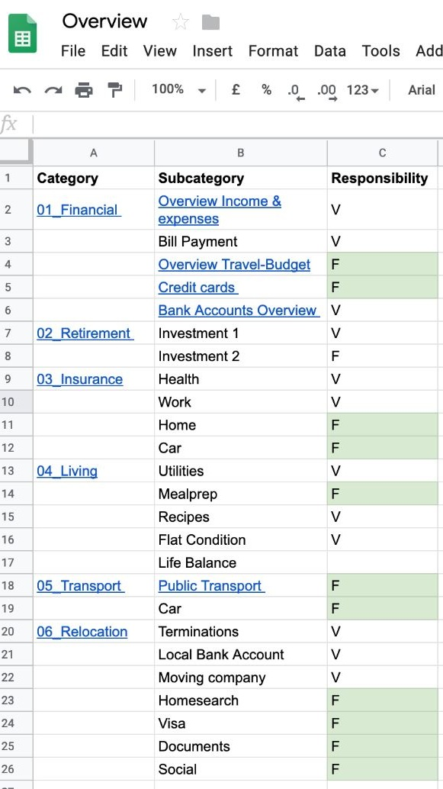
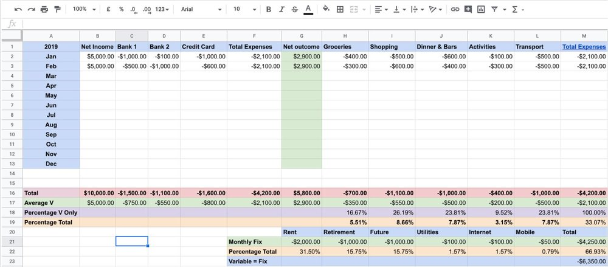

Moving to different countries requires a fair bit of planning and bookkeeping<!-- end -->:

*   How much budget will we have?
    
*   How much do we actually need?
    
*   How much will our cost of living change?
    
*   How do we get our currency from A to B?
    
*   How will living in this country be? (Check out my article on [Singapore - Cost of Living](https://vickystrauf.com/home-1/2019/2/23/singapore-cost-of-living))
    

Even if you don’t move to a different country, keeping track of your expenses and putting in a little time to organise and structure your finances can actually help you save a lot of money. There are many ways to do this but we have decided to use [Google-Docs](https://www.google.com/docs/about/). It’s free, easily shareable, allows Excel-Like macro functionality and works on all devices. Multiple users can work in one document at the same time and link to stored and shared documents in Drive as well.

In the following sections I want to show you which tools we use and how we use them to be more efficient and have more time for the fun stuff (check out the travel section [here](https://vickystrauf.com/home-1?category=Travel))!

## Getting digital

A couple of years back we decided to get rid of all the paper and scan our documents. We simply bought an old [Canon document scanner](https://rover.ebay.com/rover/1/705-53470-19255-0/1?icep_id=114&ipn=icep&toolid=20004&campid=5338482618&mpre=https%3A%2F%2Fwww.ebay.com.au%2Fitm%2FUSED-Canon-Image-Formula-DR-C125-Document-Scanner-USB-Interface-1112%2F283139723639%3Fhash%3Ditem41ec715177%3Ag%3ALZAAAOSwlUhbjhZ2%3Ark%3A1%3Apf%3A1%26frcectupt%3Dtrue) on eBay - these are quite good as you can scan whole batches of documents at once. This is what you should look out for:

*   Digital documents can be stored in Google Drive, they will be [OCR](https://en.wikipedia.org/wiki/Optical_character_recognition) scanned automatically, so you can full text search through all documents on any device.
    
*   Since the documents are in your cloud account, they are quite safe and you can't lose them.
    
*   I’ve shredded all documents except for these important ones and I am quite happy with the small amount of documents remaining.
    
*   We maintain a shared folder for all our common documents within Google Drive, which allows us to both scan, store and access documents of each other.
    

## Google Sheets

Google offers a complete office suite in the cloud and you won’t miss much if you’re used to Excel. Combined with their Drive to store files, [Google Sheets](https://www.google.com/sheets/about/) is a powerful tool. This is how we’ve structured our sheets:

We created one main sheet to group topics we want to track information on and linked to all detailed documents from here (this comes in quite handy as you don’t need to know where all your documents are - this is your single point of access).

The categories really depend on your situation, ours are:

*   Finance
    

*   Retirement
    
*   Insurance
    
*   Living
    
*   Transport
    
*   Relocation
    

This even allow us to assign owners to the topics.

## Financial

This is probably the most interesting - at least to me. We track our current income, taxes, fixed and variable expenses as well as estimate our cost of living in different countries. These categories split across tabs in the sheet - one of them is the variable expense overview 2019;

In here we measure our expenses from various sources and match it to the income. By categorizing the expenses, we can easily see how much money we spend say for food or for transportation. We tried to use as few categories as possible so it does not get too confusing. With this you don’t only have an estimate, but you will get a pretty good average of your expenses over time and in case you change plans you have a good base for comparison.

It seems like a lot of work, but it just takes 30 minutes every month. It’s easy; I’ll copy my bank and credit card statements for the respective month and classify the expenses into the categories (Groceries, Shopping, Dinner & Bars, Activities and Transport). This totals the sum per month, so the average balances accordingly. We use these documents a lot to detect areas with saving potential and calculate our way through crazy ideas of future projects we have. Check out this shared version [here](https://docs.google.com/spreadsheets/d/e/2PACX-1vRE7F4yAnF7_7r58KWCkX1lbKkOM0k364Z8G9eTe6Z2ZrjXCXYamR_KoepnRxv7rpAYo2S9rd7DdswA/pubhtml?widget=true&amp;headers=false).

## Global Broker Account

Another interesting topic in the finance area is a global broker account. I wish I had discovered this broker a little earlier as it really is perfect for FX-Trading and holding different currencies (nothing serious I do but just think about getting Singapore Dollar onto your new Australian Bank account).

When you move to a new country with a different currency, you will always have the problem of exchanging currencies depending on your needs. The whole thing gets a lot more complex after your second move, so when adding a third currency. A friend therefore suggested to move to this broker, which is pretty cool (check it out [here](https://www.interactivebrokers.com/Universal/servlet/OpenAccount.IBrokerGuestLogin?partnerID=U9870396&invitedBy=fritz1337)).

It just gives you lot’s of flexibility on the above. For instance it will allow you to transfer all sorts of different currencies into their account - free of charge. They have bank accounts in all major countries and will hold your money in these accounts, but show your account as one global one with all funds and stocks visible, usable and interchangeable.

## Retirement

It seems far away, but we sure need to take care of it. Moving countries brings a lot of additional complications in this area. Germany has a mandatory retirement scheme which let’s the current working generation pay for the current retired generation - might sound like a good idea, but it’s not. As a foreigner in Singapore you are not part of any plan at all and need to take care yourself and Australia runs Superannuation funds. Because of all this we try to invest our savings ourselves as much as we can and in this document simply keep track of where we want to invest and what accounts hold how much of our assets.

## Insurance

Nothing special about this. We just make sure we know what we have and how much we need to pay at what time.

## Living

Now this is mostly around food. We do meal prep and therefore plan ahead different recipes and the required ingredients. I will probably write a separate article on this particular topic, but since we usually cook for 5 days, we have the recipe with conversion to servings and links to the actual instructions and the shopping list.

We use [Google Shopping List](https://shoppinglist.google.com/) as our central repository since you can share and control it from Google Home. We simply create a shopping list for each recipe in here and can then just access them from our phone while in the supermarket. This is how we avoid going grocery shopping more then once a week:

*   Meal Prep from Monday to Friday
    
*   one cooked meal for Saturday and Sunday
    
*   Our regular food supply for all week is stocked up with a predefined list
    

## Transport

Is all about our car (the Troopy), public transport and travel expenses. Nothing special here.

## Relocation

Includes all that needs to be done to actually move. A few months before moving we typically start with an open issue list that we assign tasks and priorities and run through every now and then. This was key to our first move as there are a thousand things you need to bear in mind. Additionally this includes contracts and their termination policies, credit card comparison, homesearch etc.

## Others

Last but not least a feature I really love, to keep track of places I like and places I would like to check out - Google Maps. This is how my account looks for Singapore and it’s really handy to quickly pencil in a friends recommendation or something you just found on Facebook. Green are the places I want to go to and the heart-symbol are all places I really like: