## Java

Java was our first stop on a bigger Indonesia holiday we did last year. Java is one of the main islands of the world’s largest island country Indonesia and the island with the highest population in the world. It’s located between Sumatra on the west and Bali on the east and lies on the Pacific Ring of Fire. In total we spent 6 days in Java and would have stayed much longer if only we had more time. Here are our favorite five places we visited in Java:

## Yogyakarta

We booked a cheap flight from Singapore to Yogyakarta. Yogyakarta, also known as Jogja is a city in the south of Java and not as big and crowded as Jakarta. The cities center is really nice and the people are friendly. We spent hours hanging around along the famous Jalan Malioboro just watching local people, streetlife and trying different kinds of delicious street food. We suggest to visit the market or a gallery to see how local women create traditional Batik art. Besides Malioboro, which is quite nice, there is not that much to do here. Luckily there are two great temples close by.

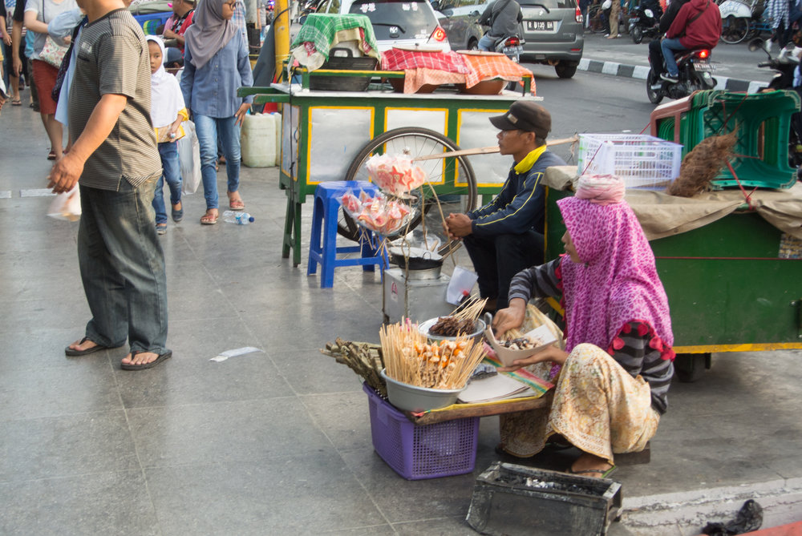

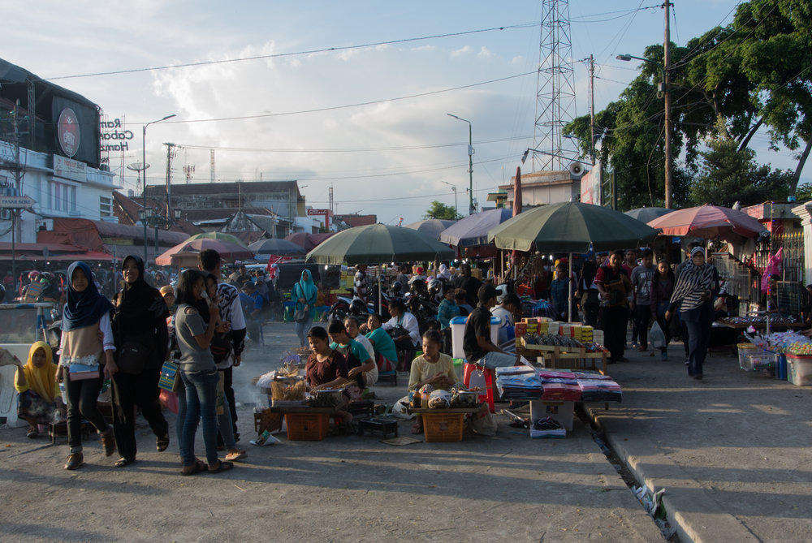

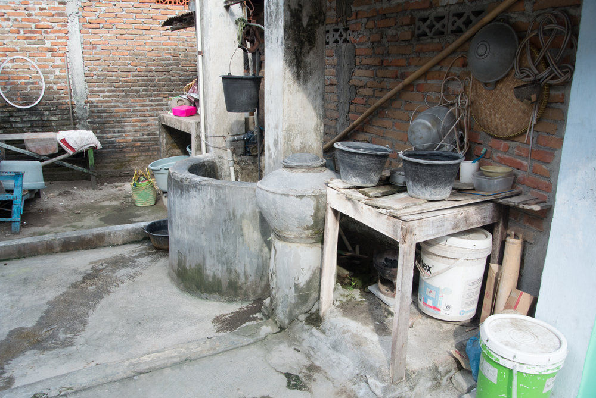

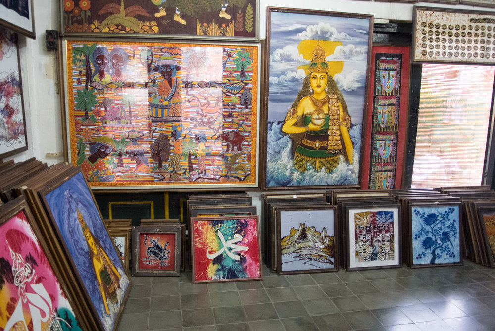

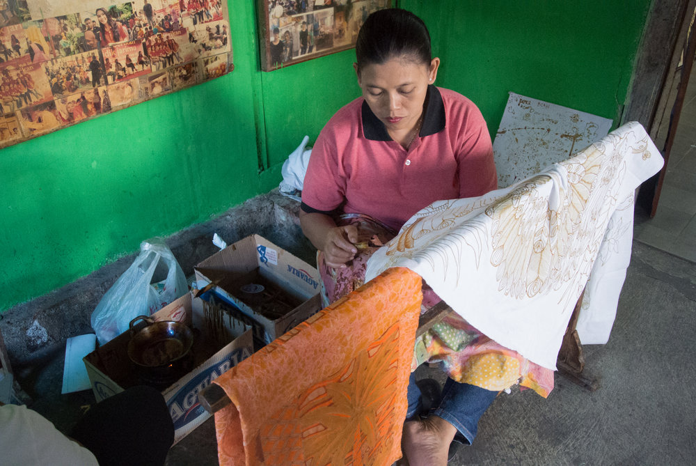

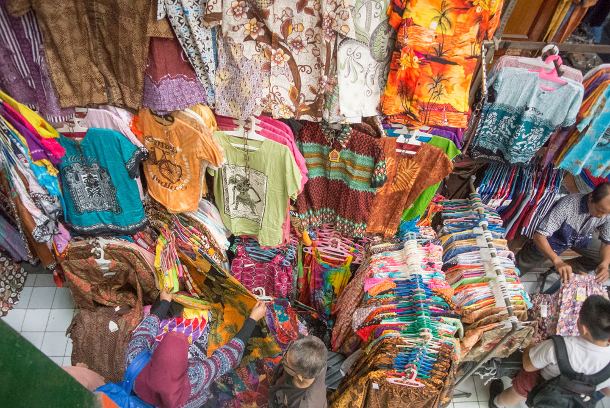

## Prambanan Temple

Prambanan is the biggest Hindu temple in Indonesia. If you stay in Yogyakarta you can easily go there by bus. The temple is located 17 km outside of the city and the duration to get there depends on the traffic and the frequency the bus driver stops to pick up random people along the road. This is actually how buses work in most of Java, the driver drives and another dude tries to get people to drive with their bus by loudly advertising his ride to people on the road. Sure a fun thing to see. This way the bus gets loaded up with more and more people so it can get quite cozy in there. Nothing really bad if you’re in for a little adventure. Prambanan itself is an impressive temple and we liked the streets covered with umbrellas, but the park was not that clean and well looked after. Entrance fees were quite high for foreigners in our opinion.

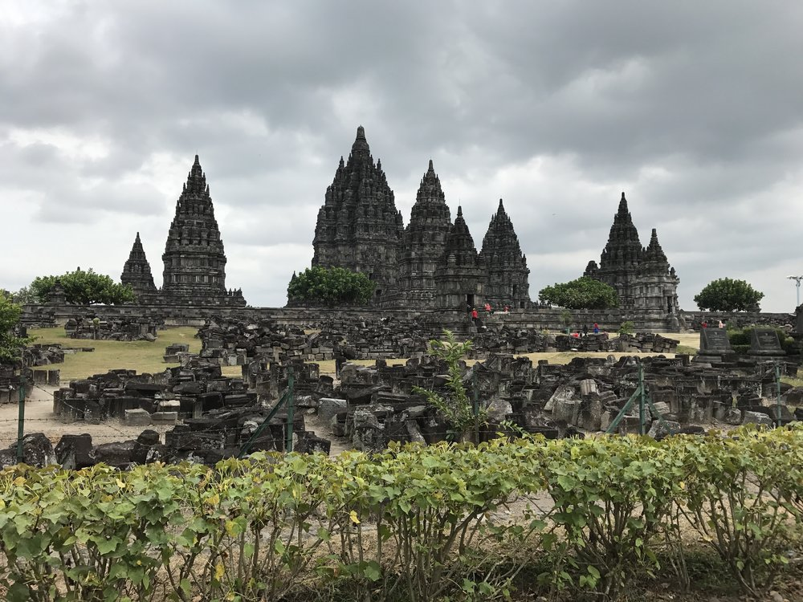

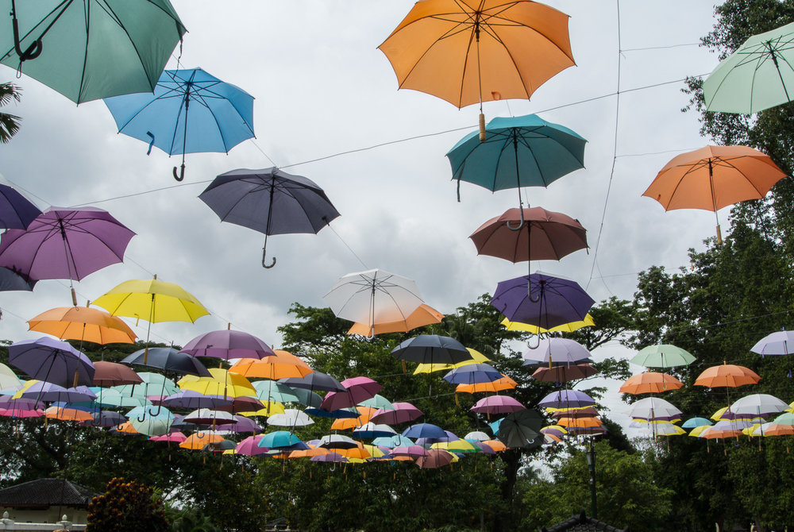

## Borobudur Temple

Borobudur is the biggest Buddhist temple in the world and there is a slight chance you have seen it on a few pictures. We had a nice hotel in Muntilan and just walked there in the morning. We skipped the sunrise, since we heard about the crowds but it's supposed to be quite nice. Borobudur was our favorite temple in Indonesia. The big bells and Buddha statues on top are beautiful and the view over the forest is amazing, especially in the morning. Definitely worth a visit!

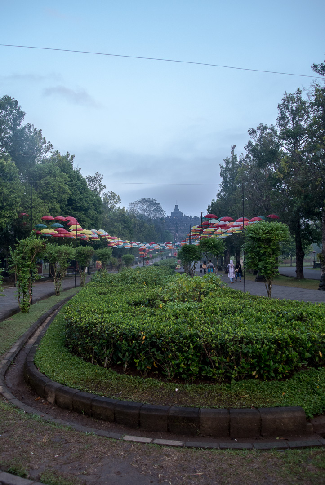

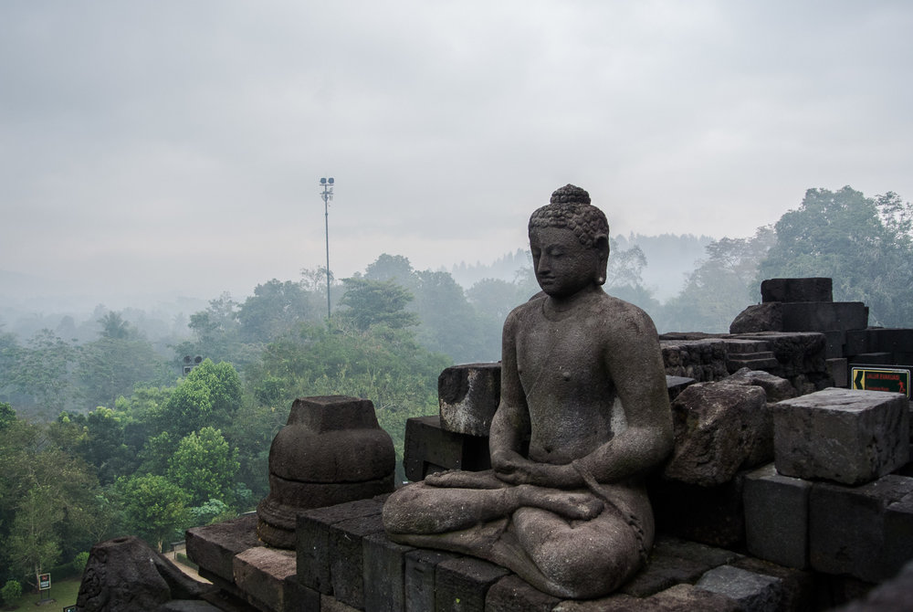

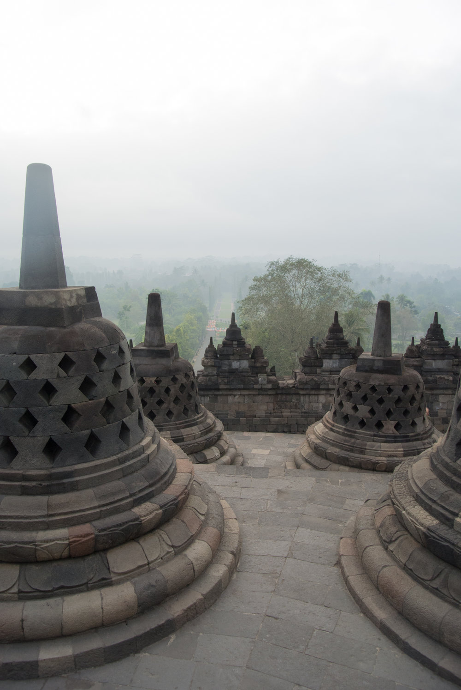

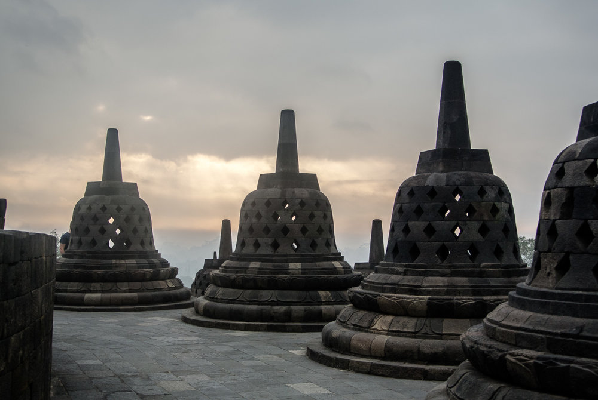

## Mount Bromo

Mount Bromo is an active volcano in East Java. To get there you can take an early morning train from Yogyakarta to Surabaya. Just buy the tickets one day before your departure at the train station. From Surabaya you have to take a bus to Probolinggo. In Probolinggo look for ‘Toto Travel’, here you can book another bus that will bring you to Cemoro Lawang, a small village close to Mount Bromo. Plan in some time, the rides and waiting times can be frustrating long and the guys will most certainly try and rip you off. Just overthink everything and negotiate on all prices. We waited close to Probolinggo until our driver had enough people booked to drive up.

In Cemoro Lawang we booked a basic Homestay without any hot water. The night up here was cold, so you want to bring warm clothes. Early in the morning, at around 3 am you’ll be   woken up by a thousand Toyota Landcruisers, bringing all early birds to the different sunrise spots and finally to the front of Mount Bromo. If you’re not that lazy, just avoid the masses and walk up yourself. You should walk to the viewing spots, the view is awesome. You’ll see the huge caldera of a previous volcano (must have been massive) and inside the still active Mount Bromo.

We actually managed to avoid the high entrance fee, by navigating down a little footpath into the caldera. It’s on the way back from the viewing point. If you download maps.me you will see a little path winding down into the caldera. The area around Bromo is amazing and you feel like you’re on another planet. After walking through the caldera you will reach Mount Bromo, from here it’s just a bunch of steep stairs and you’ll see the big active crater. Smoke is rising and loud sounds like thunder will give it a mystic atmosphere. You can walk around the crater rim but be careful as it can be quite narrow. After descending, you walk back to the little footpath up to town and hitch one of the buses back to Probolinggo.

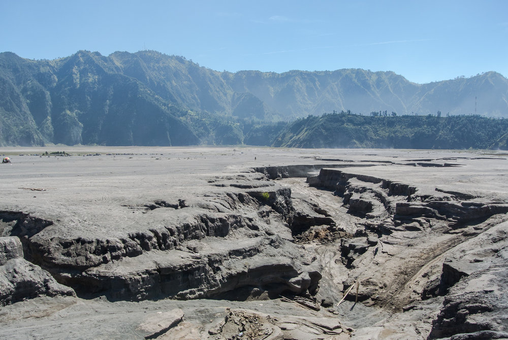

## Kawah Ijen

Ijen is another volcano located close to Banyuwangi at the east end of Java. In Banyuwangi there are plenty of accommodations and our suggestion is to rent a motorbike here. If you can, get a gas mask straight away as you need it later and will be cheaper down here in town. You can rent a bike for couple of days and drive up the mountain a little bit. We stayed at [Kampoeng Joglo Ijen](https://www.booking.com/hotel/id/kampoeng-joglo-ijen.en-gb.html?aid=357004;label=gog235jc-hotel-XX-id-kampoengNjogloNijen-unspec-sg-com-L%3Aen-O%3AosSx-B%3Achrome-N%3AXX-S%3Abo-U%3AXX-H%3As;sid=bed9cfc6662f44d889cb25343d17e99d;dist=0&keep_landing=1&sb_price_type=total&type=total&) and actually explored the crater twice. Right after lunch we drove up the first time. Up at the trailhead there is a little parking lot. From here it will take you about 1.5 hours to walk up to the top. The bike ride probably is another 40 minutes to get to the trailhead.

Ijen has a big turquoise crater lake, the largest acidic crater lake in the world and it’s beautiful, especially when sun is shining. But that’s not all, Ijen has something special. When you visit Ijen at night, you will see sulfuric gas emerging from the cracks around the lake. The gas is so hot, it actually burns with a blue flame. These blue flames can only be seen at night and you will have to make the hike down into the crater, which is obviously dark and quite steep. Bring a headlamp and a gas mask. It will take about 30 minutes down into the crater. We got up around 1 am. When you arrive there in the early morning you won’t be alone. Depending on the season there can be a whole lot of people joining you. Locals will try to tell you that you need a special guide to go down into the crater, which you sure don’t. The way up is super easy, be careful on the way down into the crater though.

On the way down you will already meet a few hard working men, carrying baskets packed with sulfur, which they mine with their hands and without any gas masks. That’s really frustrating to see after walking through thick layers of sulfur smoke. Even with a gas mask the smoke is painful in your eyes and breathing is unpleasant. Down here you will spend a while, watching the blue flames and mine workers. The way back up can be quite busy, people will still be descending and the workers are doing there job carrying heavy baskets of sulfur up and out of the crater. On top you can stay for the sunrise. And ride your bike back to town, if your lucky you will see Bali on your way down.

From here we actually took a ferry over to Bali which was the next step of our journey.

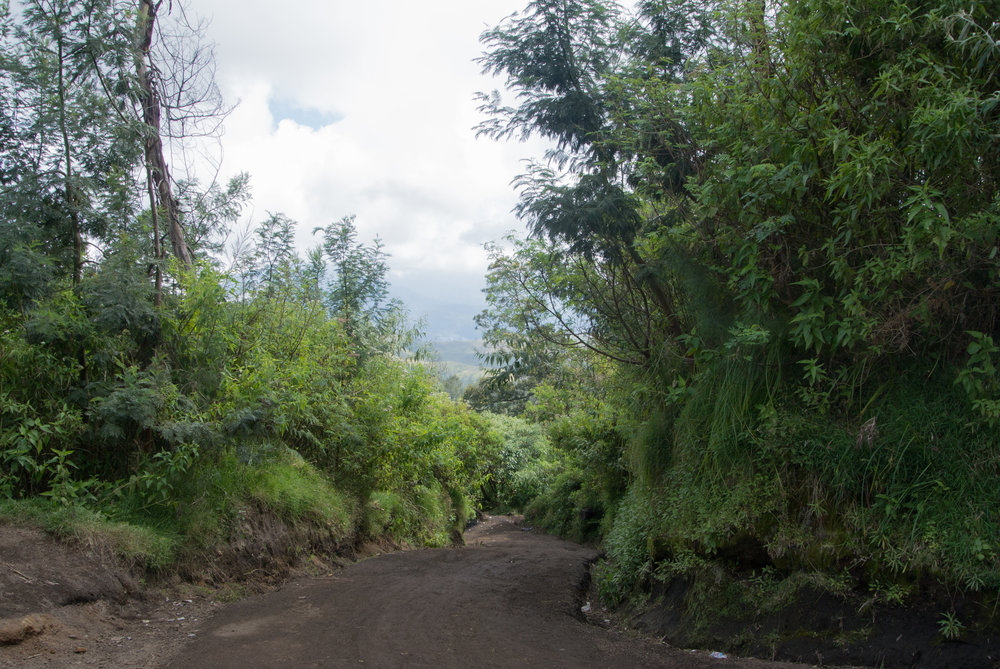

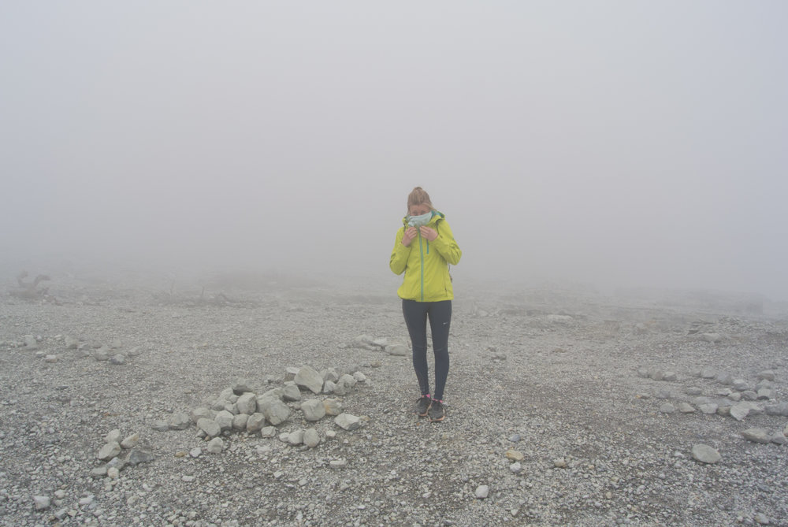

