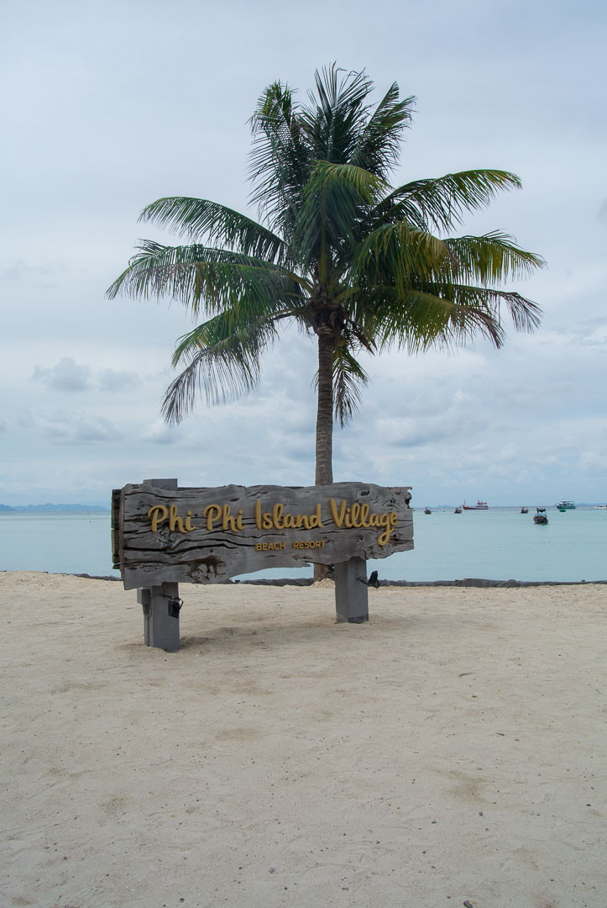
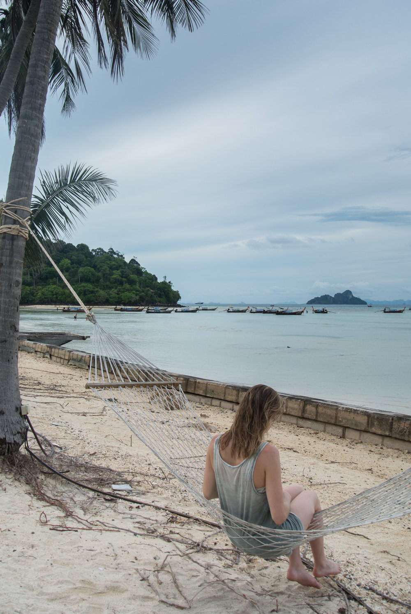
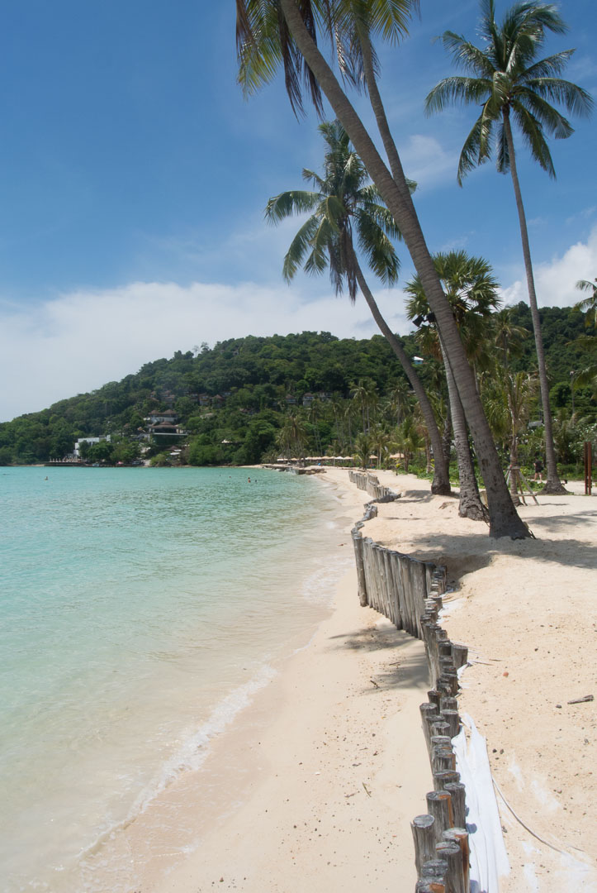
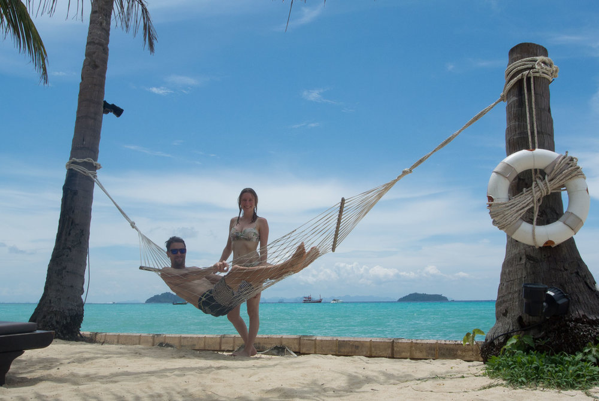
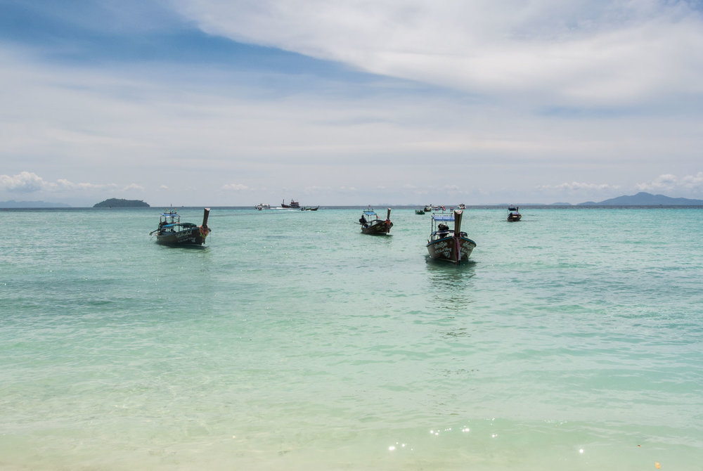
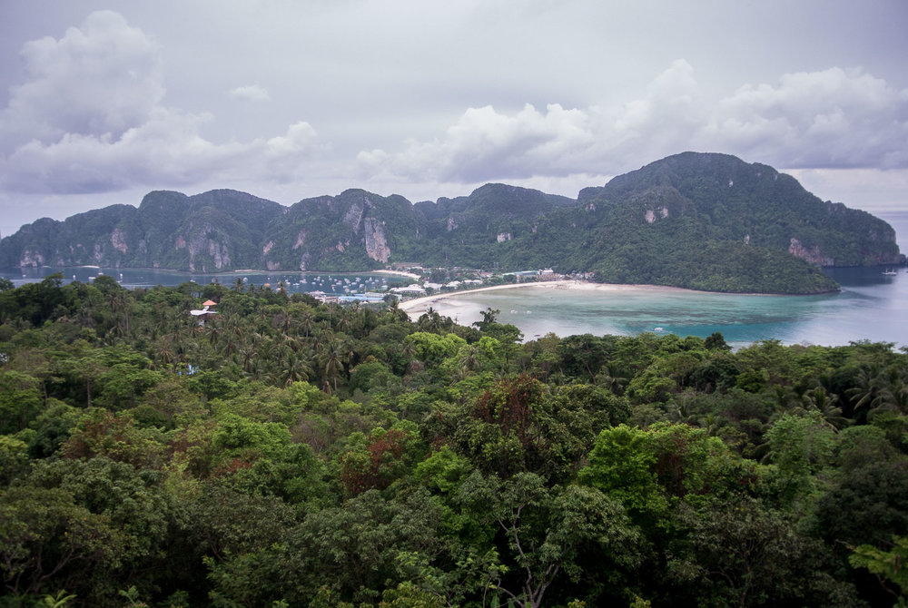
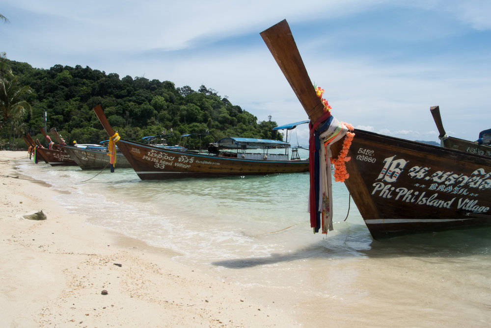

To escape the city for a weekend, Phi Phi Island in Thailand is a pretty good option. There are various Friday night flights from Singapore to Phuket. <!-- end -->We jumped on a 1 ½ hour flight with [Jetstar](https://www.jetstar.com/sg/en/home). Due to our late arrival in Phuket we decided to stay there overnight, and catch the first ferry from Rassada Pier at 8:30 am (check the timetable [here](https://www.phuketferry.com/)).

The ticketing at the terminal can be quite a hassle on the first ferry as you won’t be the only ones with weekend plans. So just make sure the guys give you the right ticket to get back on the time you want (return ticket is cheaper).

## The Ferry Ride

The ferry takes about 2 ½ hours and especially if it's packed and looks a little like rain, you want to make sure to get a seat inside. Our ferry stopped at the famous ‘The Beach’ film set, Maya Bay, which is quite spectacular but really crowded. Once arrived at Tonsai Pier in Phi Phi Island, you’ll have to pay a small ‘Keep the Island Clean’ - Fee and walk straight into a whole bunch of gentlemen wanting to take you to YOUR hotel. Most hotels have their own boat, so make sure to check upfront to know what to look for and what price it's going to be.

## Phi Phi Island Village Resort

[Phi Phi Island Village Resort](https://www.phiphiislandvillage.com/) was very welcoming  and we got drinks and biscuits to start our day. They’ll make sure to get you onto the right boat back to catch the ferry back to Phuket in time. The Resort itself is a really nice place, with few people, friendly and helpful staff and clean and comfortable rooms.

You can take a swim in different pools and the beach is right in front of the hotel in case you prefer to swim in the ocean. Furthermore there is a huge Spa Area where they offer different types of Massages and a little shop with local wellness products. Alcohol in Singapore is quite pricey so we sure enjoyed the good and cheap cocktails at the Pool Bar and the Hotel Bar during happy hour. For breakfast they offer a great buffet with tons of options right in front of the beach.

## Phi Phi Island

Phi Phi Island in general is very touristic and there might be better places to go in Thailand to dodge the crowds, but once you arrived at the hotel it is really nice. The white beaches with endless crystal clear blue water are amazing. If you feel to do some exercises, a hike to different Viewpoints might be a good idea, but don’t forget your mosquito repellent, especially in the mornings there will be a whole lot of mossies on the tracks. We hiked to Viewpoint two and three early in the morning, which was great, because it was just us up there. The views were nice but as read on the internet, a lot of people suggest to go there between 10 am and 2 pm to enjoy the amazing blues and turquoises of the ocean, when the sun’s out.

For more adventure and action, ask for boat trips at your hotel. They usually offer trips to different snorkel and diving spots and other small islands with beautiful beaches.

## Things to bring

*   Bikini & Sunscreen :)
    
*   Mosquito Repellent
    

* * *