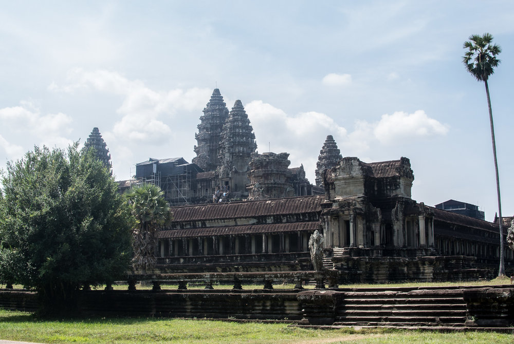
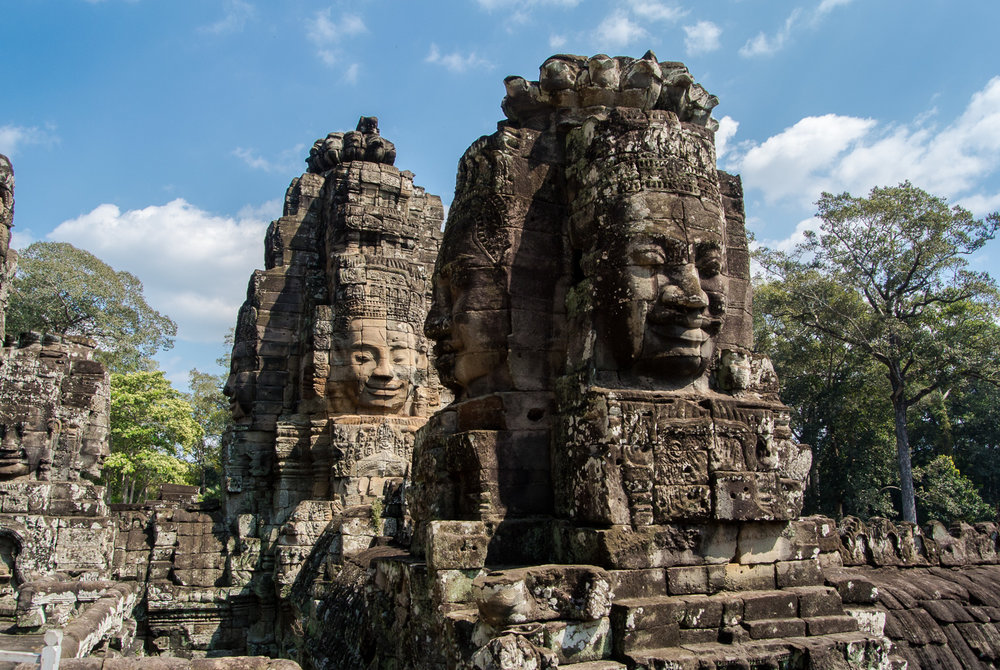
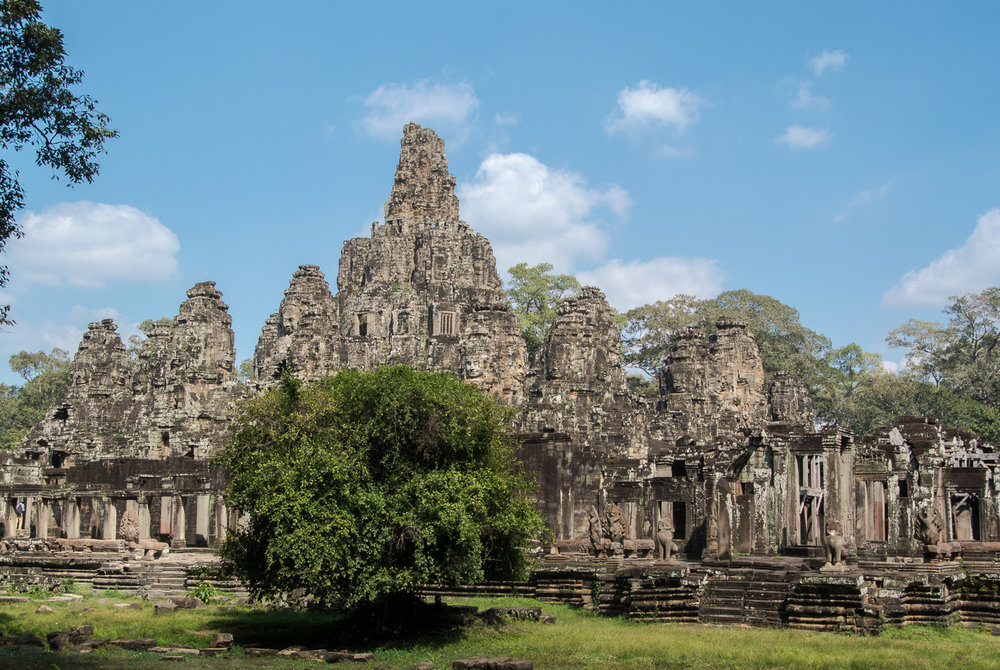
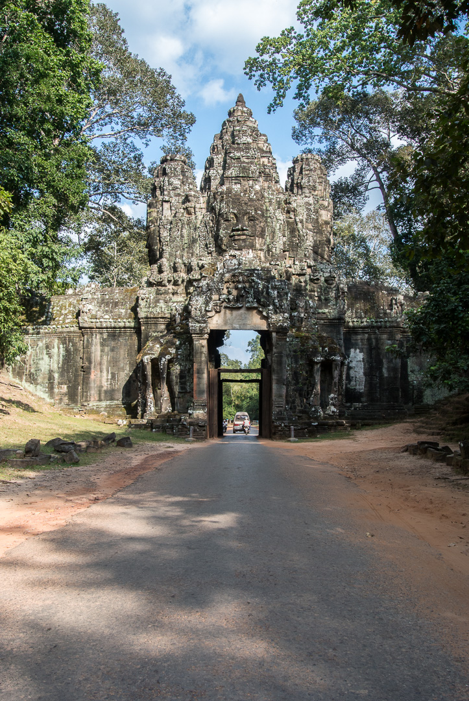
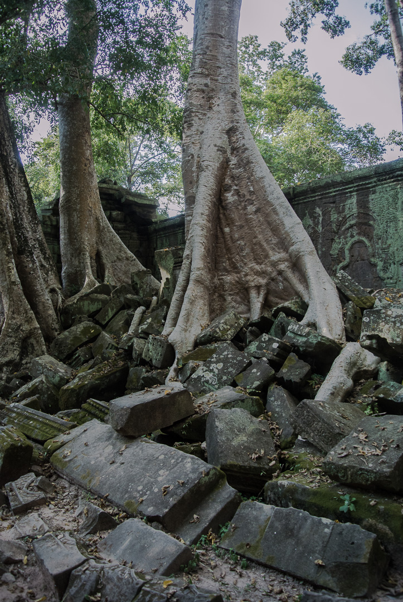
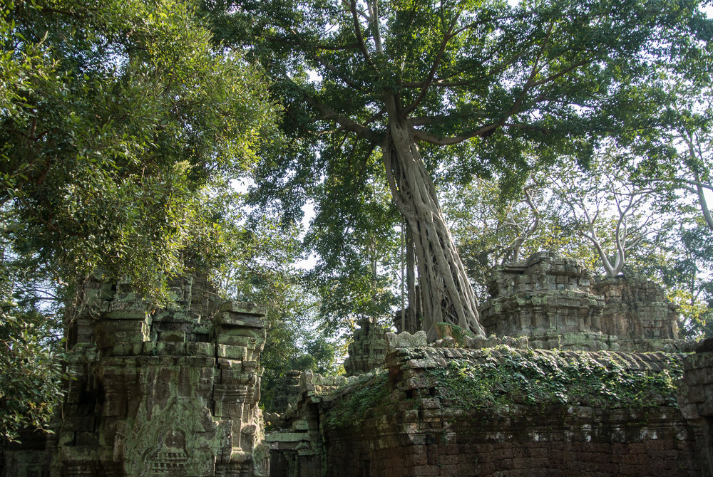
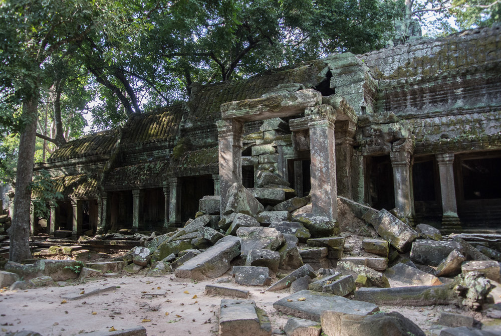
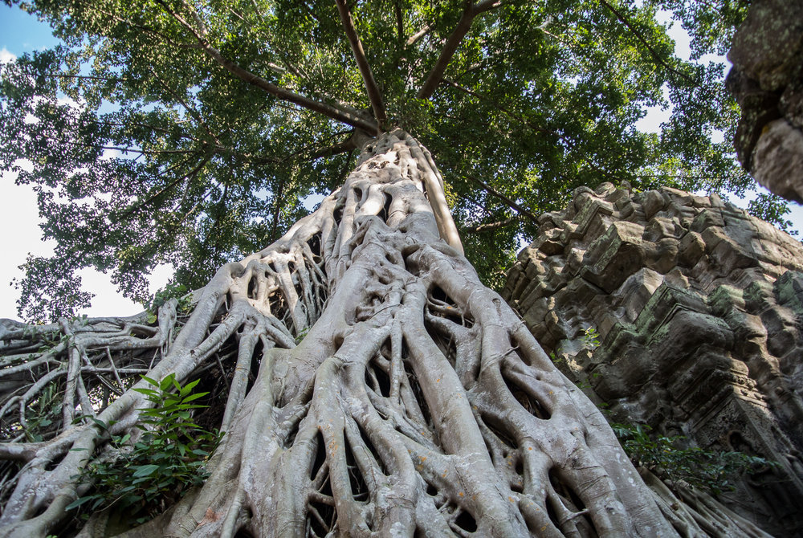

## Getting there

Bookings early will get you a fair priced flight from Singapore to Siem Reap (it’s not cheap). Jetstar and Air Asia offer flights which take about 2 ½ hours. Make sure to check out if you require a visa for immigration. After arriving at the airport, Siem Reap city centre is convenient to reach by hotel shuttle or taxi in about 20 minutes. In the city centre you’ll find a lot of restaurants, bars, ATMs and everything you need. Tuk Tuk drivers cover public transport, if you want to be independent, rent a motorbike. Angkor Wat official ticket center is located 4 km outside and I recommend to buy a 3 days ticket to get the most out of your temple visit.

## Diamond D'Angkor Boutique

We stayed at the [Diamond D’Angkor Boutique](http://www.diamondangkor.com/) in central Siem Reap close to Pub Street. The stay included free airport shuttle, which was easy to arrange and on time. We were picked up by Tuk Tuk (20-30 minutes) and our way back was in a van. The rooms were okay, a simple breakfast was included and the staff was super friendly and helpful. We had a pool which was very refreshing after a full day of temple visiting.

## Angkor National Museum

Before actually starting with the main attraction in town - the famous temples, we payed the [Angkor National Museum](http://www.angkornationalmuseum.com/)  a visit. With an entrance fee at about $12 per person the museum wasn’t really worth it. There are heaps of Buddha statues and a lot about art and religion of the Khmer civilization. For us there was no structure and it was hard to get an overview. We sure missed a bit on the history and construction of the actual temples.

## Angkor Wat

Angkor Wat is one of the largest religious monuments in the world and the best preserved temple in Siem Reap. Obviously it’s also the most popular and crowded temple, especially during and after sunrise. For us the best time to visit Angkor Wat was around 12 pm. It’s hot but you can enjoy the temple with less people. Wee read a lot about the sunrise being very crowded, but it actually wasn't too bad on a Tuesday morning arriving at 5 am. We parked our motorbike at the left parking lot right in front and found a good place on the stairs at the lake. There weren’t that many people as on the right side and it was worth the visit. The colors and the view was amazing.

## Angkor Thom

Angkor Thom is the big capital city of the Khmer empire with the main temple, Bayon in the center. The temples here were our favorites. They are less crowded and beautiful as well. Bayon features towers with big stone faces. You will see monkeys and can enjoy a nice sunset between the temples, it may not be as spectacular but with less people. The way out leads you through Victory Gate, a beautiful ancient gate.

## Ta Prohm

Ta Prohm is the second favorite temple all tourists visit. Even in the afternoon there were a lot of people to watch the famous spot featured in the first Tomb Raider movie. The temple actually was absolutely amazing, it’s surrounded by jungle, trees and roots are growing out of the temple ruins and you see the big famous trees right inside the temple. Ta Prohm is a good place to go when sun is burning down, as there is lots of shade.

## Phnom Bakheng

Phnom Bakheng is a temple on top of a hill with one of the most popular sunset points overlooking Angkor Wat. It’s a 15 minute walk with lots of people. At the top you might have to queue up to get into the actual temple. The huge number of visitors to Phnom Bakheng makes it the most threatened temple in Angkor. So they will only let 300 people in. If you want to see the sunset, make sure to be on time. In case you're too late, there's a platform a little bit further down where you can watch the sunset as well (but not with Angkor).

## Siem Reap

After a full day of temple watching you should check out Pub Street. It’s a touristy place but you can enjoy cheap drinks in a restaurant or bar while just watching all the people on the street. You’ll get a beer from USD 0.5 and things like 2 cocktails for one. Local kids will try to sell you some fried spiders or snakes and mine victims will play music on the street. You should try fried ice rolls at one of these street shops. Since we’ve been to night markets in Vietnam and Taiwan the Night Market in Siem Reap was disappointing, typical stuff you can buy all over Asia. We liked walking along the river during the day or at night.

## Food Recommendations

*   Footprint Cafe - delicious smoothies and juices
    
*   Sister Srey Cafe - good breakfast
    
*   The Christa Restaurant and Bar - tasty red and green curry
    
*   Khmer Kitchen Restaurant - dinner
    
*   Curry and Fish Amok
    

## Good to know

*   ABA ATM had the cheapest transaction fee - $4
    
*   You can pay with Cambodian Rhiel but almost everyone uses USD
    
*   Rent a motorbike, the traffic is really okay for Asia! - $8 per day, $1 petrol per liter
    
*   Get a 3 day pass for the temples - the official ticket center is open until 5 pm, you’ll get a ticket with your face on it, the ticket is valid for the evening and the next three days, so you can enjoy your first sunset without loosing a day. Prices are:
    
    *   1-day pass – US$ 37
        
    *   3-day pass – US$ 62
        
    *   7-day pass – US$ 72
        

*   On our first day we got a Tuk Tuk round trip to the official ticket center and sunset spot Srah Srang for $8
    
*   Women need to cover knees and shoulders in the temples
    
*   Enjoy a Cheap massage at your hotel or on the street
    
*   Don’t forget sunscreen ;)
    

\[caption id="" align="alignnone" width="1613.0"\] Angkor Wat \[/caption\]