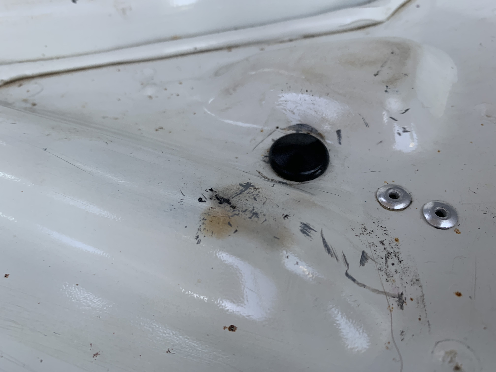
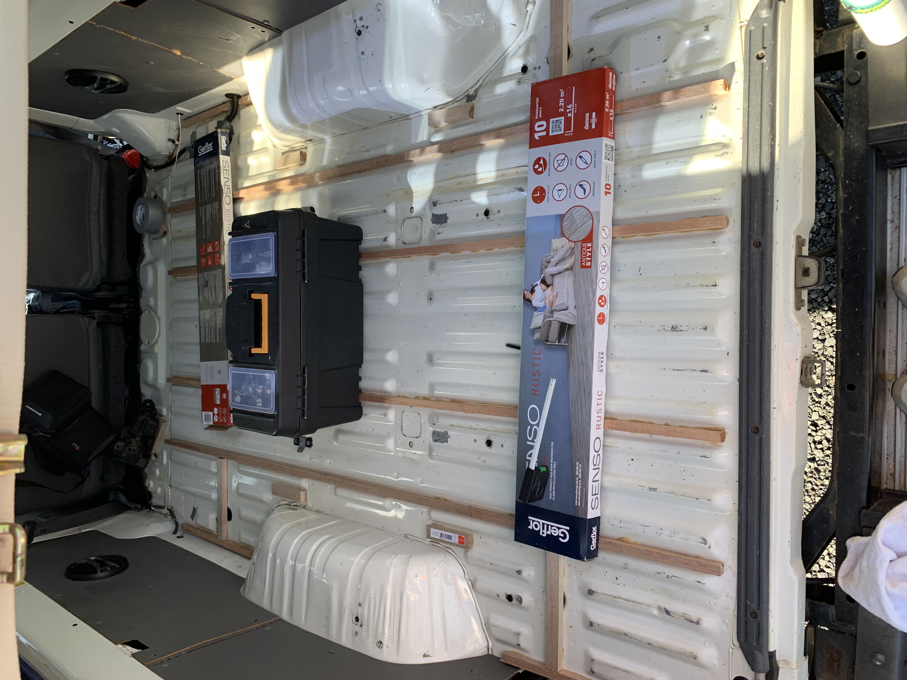
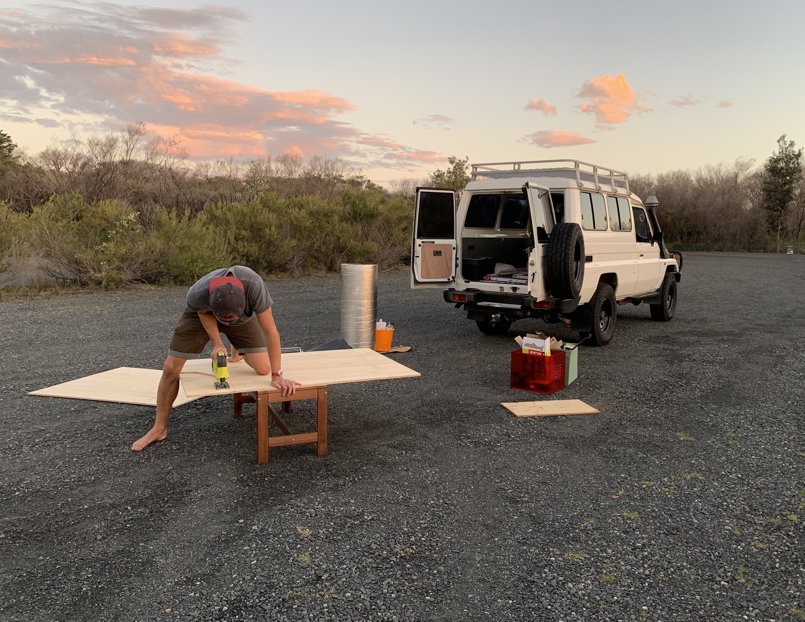
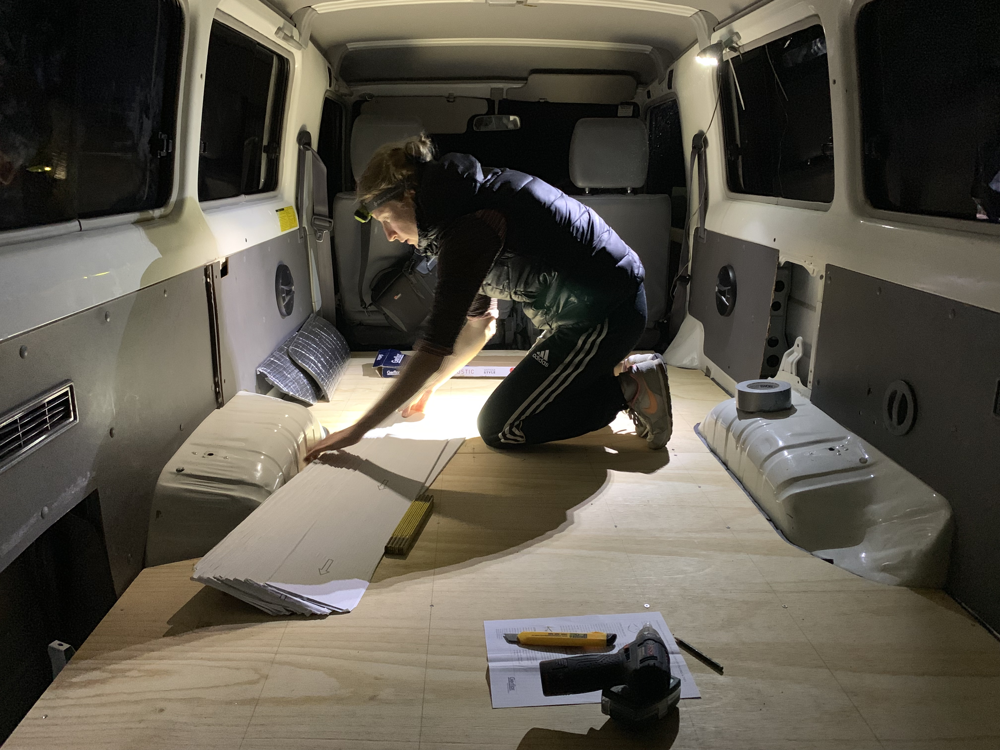
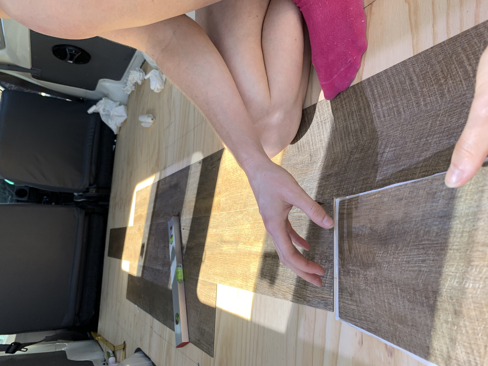
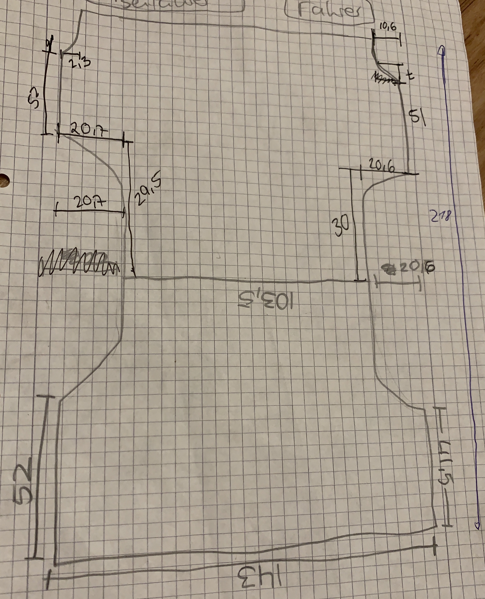
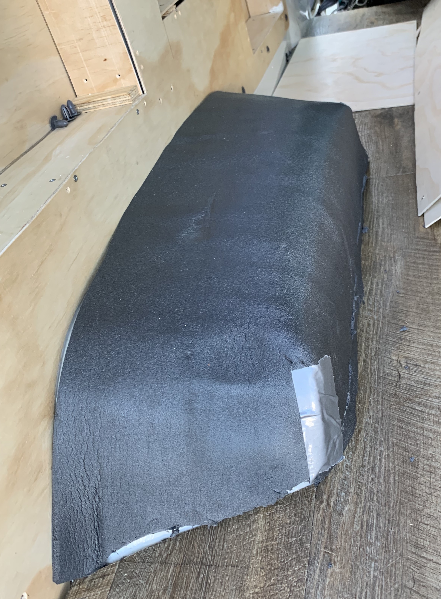

To make your car a comfy home, start with the floor. It's pretty easy and even if you are not very skilled you can get the job done.<!-- end --> This is how we did it:

## Steps

1. take out all the old stuff, clean the floor and check for rust. You want to make sure to have everything properly sealed and treated before moving ahead. Seal all holes using SikaFlex and blind grommets.
2. Measure properly (measure twice, cut once :-))
3. Glue framing in between the bumps using non structural pine and liquid nails (read instructions on how to achieve best results)
4. Cut 12mm ply into shape and glue Formshield to it (heat and sound insulation available at Clark Rubber). We had to cut this into two pieces. When laying the ply onto the floor, take notes on where your frames are and draw lines onto your ply accordingly.
5. Screw ply and insulation to frames.
6. Lay self adhesive vinyl on top (read instructions)

## Shopping List

1. Thin timber framing (this needs to fit in between the bumps on the floor)
2. Plywood 12 mm, 2x (109x143cm)
3. [Formshield Insulation 3,2m²](https://www.clarkrubber.com.au/formshield) 
4. [Vinyl 3,2m²](https://www.bunnings.com.au/senso-914-x-152-x-2mm-2-2sqm-rustic-walnut-self-adhesive-vinyl-planks-16-pack_p6600039)
5. Sikaflex (to seal any holes in the floor.)
6. Sikabond / liquid nails
7. Spraying glue or double sided tape (to fix formshield to plywood.)
8. Screws (long enough for 12mm ply and the timber frames)
9. [Blind grommets from Clarkrubber](https://www.clarkrubber.com.au/blind-grommet)
10. Rust prevention Spray (Lanolin)
11. Sandpaper

## Measurements

Floor - 218,5 x 143 cm = 3,2m²

## Tools needed

* Jigsaw
* Utility knife
* Ruler & Pencil

## Cover the wheel arches

Use the remaining of the Formshield and a bit of dual sided tape to cover the wheel arches.

