Public transport in Taipei is really good and comfortable, so you can easy take the MRT from Taipei Airport to the city. <!-- end -->Buy a TOP-up card at the ticket machine, so you can top up your card anytime and use it for MRT and bus during your stay in Taipei. - Make sure to get cash from the ATM before, otherwise you can’t buy a ticket. The ride will take about 45 minutes. We stayed at the [citizenM Taipei North Gate Hotel](https://www.citizenm.com/destinations/taipei/taipei-hotel), which has cool and clean rooms and is in walking distance to the Central Station. In Taipei there are different things to see and to do, here’s a short list of our favorites:

*   Chiang Kai-shek Memorial Hall - national monument
    
*   Bopiliao Historical Block with traditional architecture
    
*   Take a walk through the Da’an District - you’ll find a lot of nice little shops, restaurants, bars and bakeries
    
*   Go on top of the 10th highest building in the world - Taipei 101
    
*   Songshan Cultural Creative Park with the Taipei Design Museum - an old factory warehouse with exhibitions and shops for designers
    
*   Eslite Spectrum Songyan Store - take a walk through cool design shops and try different foods and drinks
    

*   Try a Mango Sensation at Ice Monster - it’s a typical Taiwanese dessert and it’s worth a 30 minutes wait
    
*   Enjoy a beer at Landmark, a Craft Beer Taproom from Taihu Brewing, with a great outdoor location
    

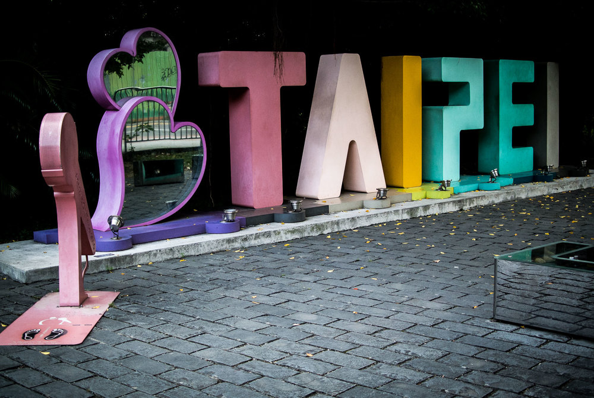

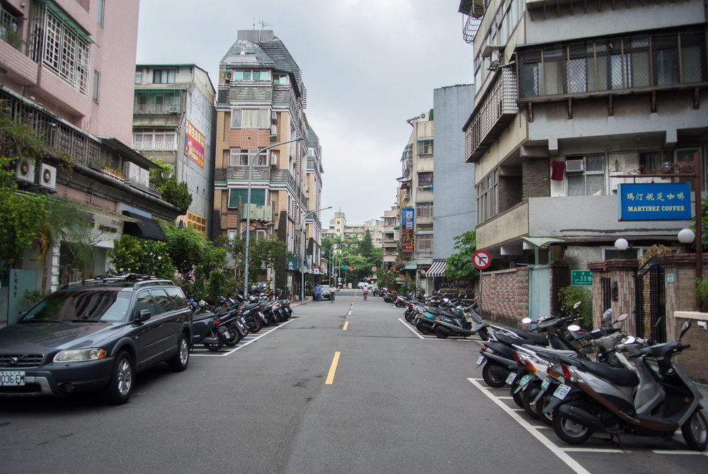

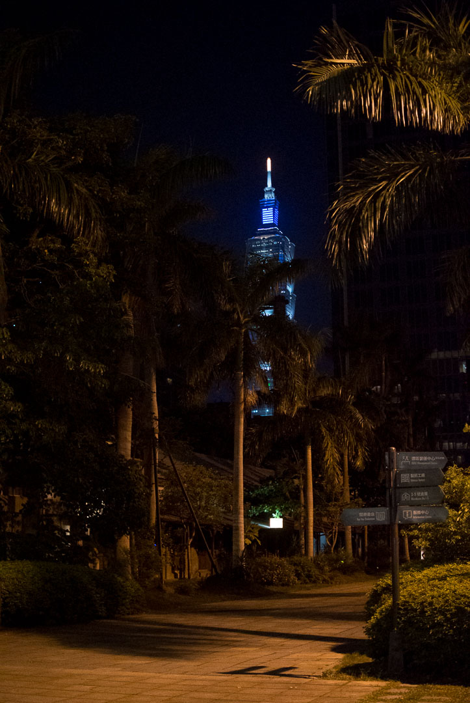

## Road trip to the east coast

To discover the east coast of Taiwan, we decided to rent a car and go for a road trip. We booked a [THSR](https://www.thsrc.com.tw/index_en.html) ticket (Taiwan High Speed Rail) from Taipei to Kaohsiung, one month in advance to get a seat and a discount on the ticket - it's quite tricky to buy it without a Taiwanese passport but it works.

In Kaohsiung we took the MRT to the airport where we picked up our rental car we also booked in advance with Avis. The pickup was easy, just go to the info desk, they will call the Avis station for you and they’ll pick you up and bring you back after your trip. For navigation, use [Maps.Me](https://maps.me/) - a detailed and easy to use offline app. Driving in Taiwan is simple, streets are in good conditions and for Asia the traffic is ok. Along the way, stop at different viewpoints.

Our first night, we stayed in Kenting. The Airbnb was nice, but the small village itself wasn’t worth the visit. There’s not much to do, only a few restaurants and the beach is pretty crowded by tourist buses from the city.

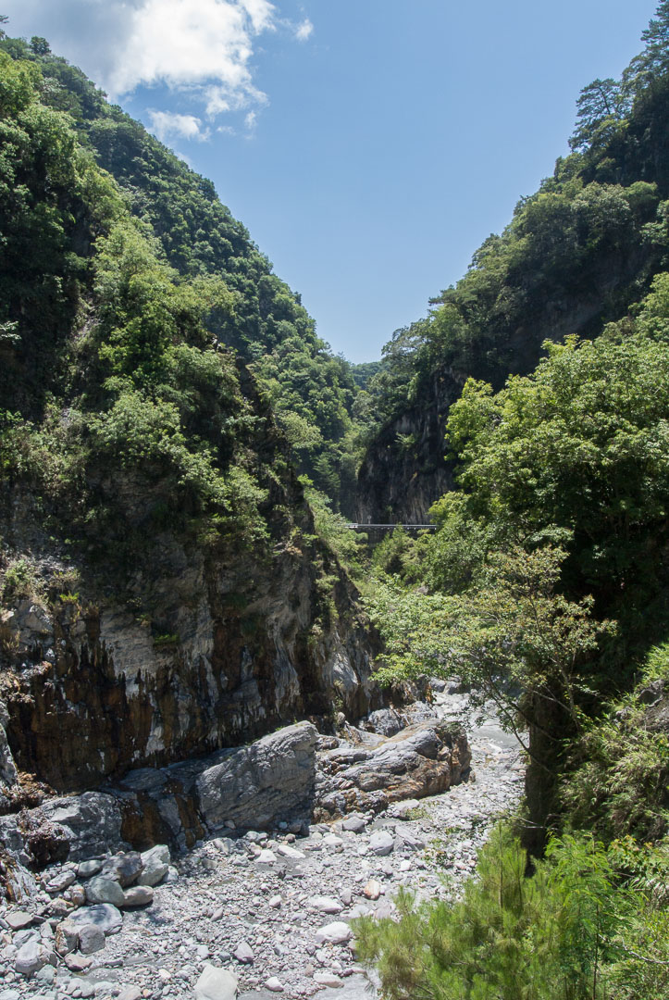

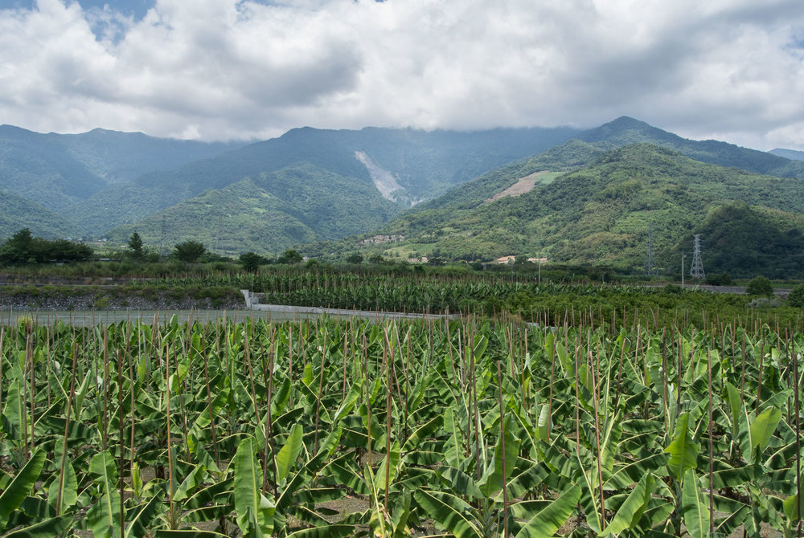

## Dulan

Dulan in contrast was nicer and had much more charm than Kenting. We stayed in a cheap but nice hostel and met a friendly couple from Perth, who we had a few beers with and really good time. In Dulan the beach is less crowded and you can take a swim, go for a surf or just take a walk along the beach. We found a nice cafe on the cliffs, the [Cape Cafe](http://www.capecafe.tw/). There is an old sugar fabric with a cool bar inside, an expat is selling his own brewed beer and there’s live music on weekends.

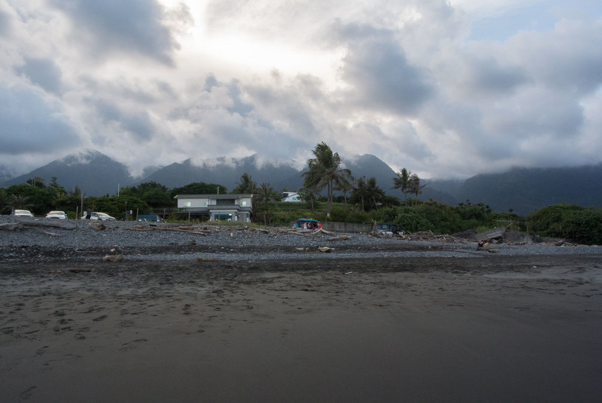

## Walami Trail

The Walami Trail is a 13.6 km long hiking track located in the [Yushan National Park](http://www.ysnp.gov.tw/css_en/default.aspx). Before you enter the trail, you need to get two permits, a Mountain Permit and a Park Permit, otherwise you’re only allowed to enter 1.5 km of the track. We stayed at an Airbnb in Yuli where you can buy supplies for your hike and have a good dinner with the locals. Other than stated on the official park website we did not need to apply for the permits a week in advance. We just stopped at the Nanan Visitor Center (operating hours: 9 am - 4:30 pm) one day before and asked for the permits. They were really friendly and told us what to do.

At the visitor center you'll get your park permit, for the mountain permit you need to walk over to the police station. You need to fill out some forms with your personal details and an emergency contact in Taiwan, make so make  sure to bring your passport! The Police Officers were really friendly, gave us tea and prepared us for possible surroundings on the trail like poisonous snakes, hornets and black bears. We actually encountered all three of these! You need to take the Permits on your hike and drop it back at the police station afterwards, to let them know you’ll be safe.

We started our hike at 7:15 am and reached the end of the Walami Trail at 11:45 am. After a 30 minutes lunch break (make sure to bring enough food and water), we went all the way back and finished our hike at 15:30 pm. So in total we’ve hiked 27.2 km, which is actually a really long distance, but the trail is easy and nice to walk. You can choose to do it this way or stay at a basic hut, located at the end of the Walami Trail and continue to hike deeper into the mountains. To sleep in the hut, you'll need to place a reservation and bring your sleeping and cooking gear. Water sources and toilets are available.

In fact, if you’re fit, the trail is doable in one day, the hike is easy and nice and you will cross multiple suspension bridges. The only downside for us was the lack of nice viewpoints.

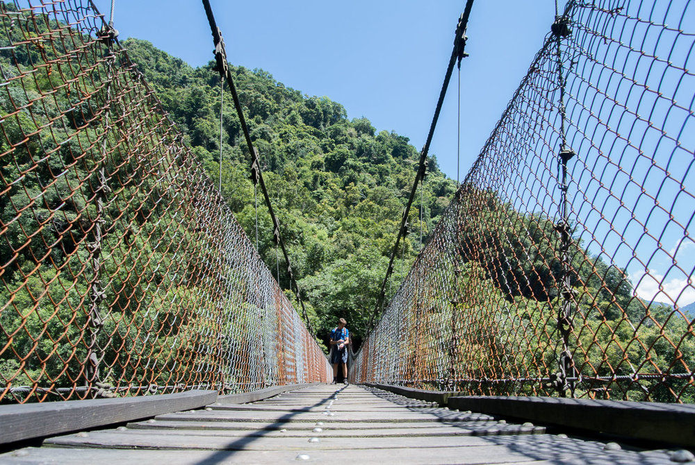

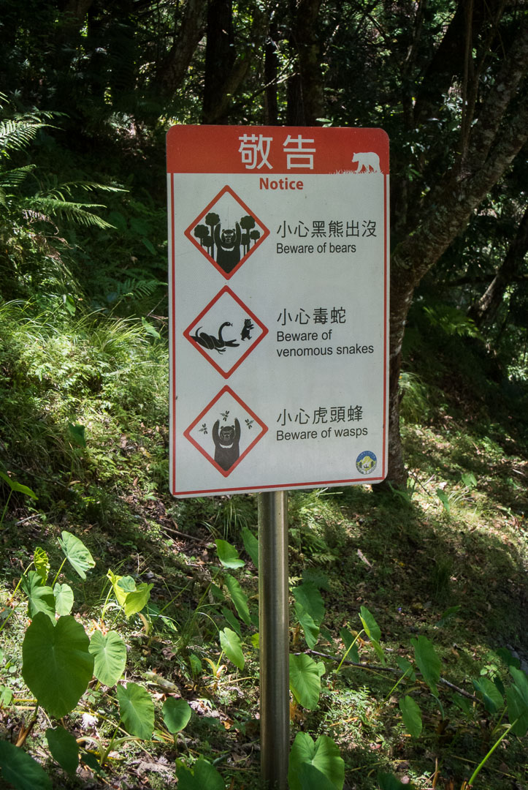

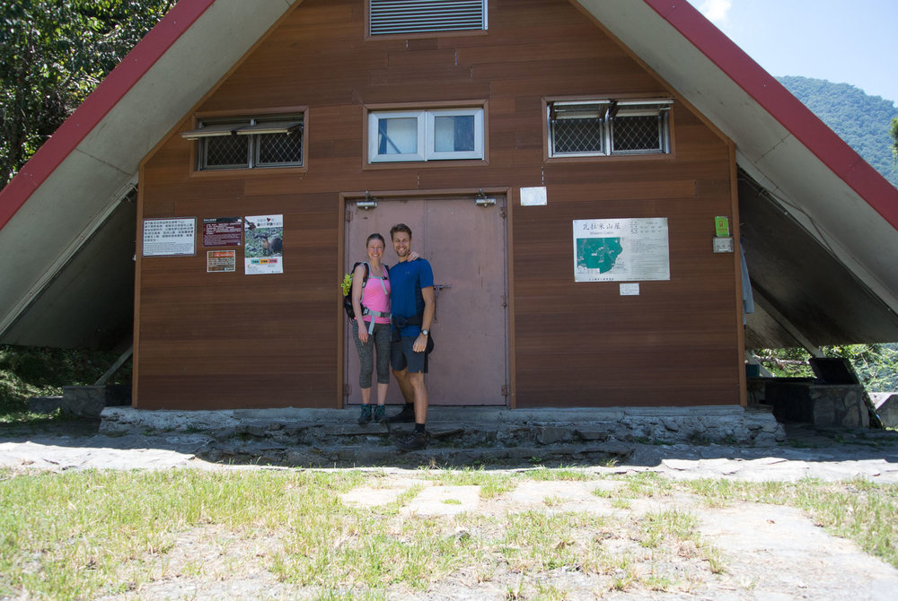

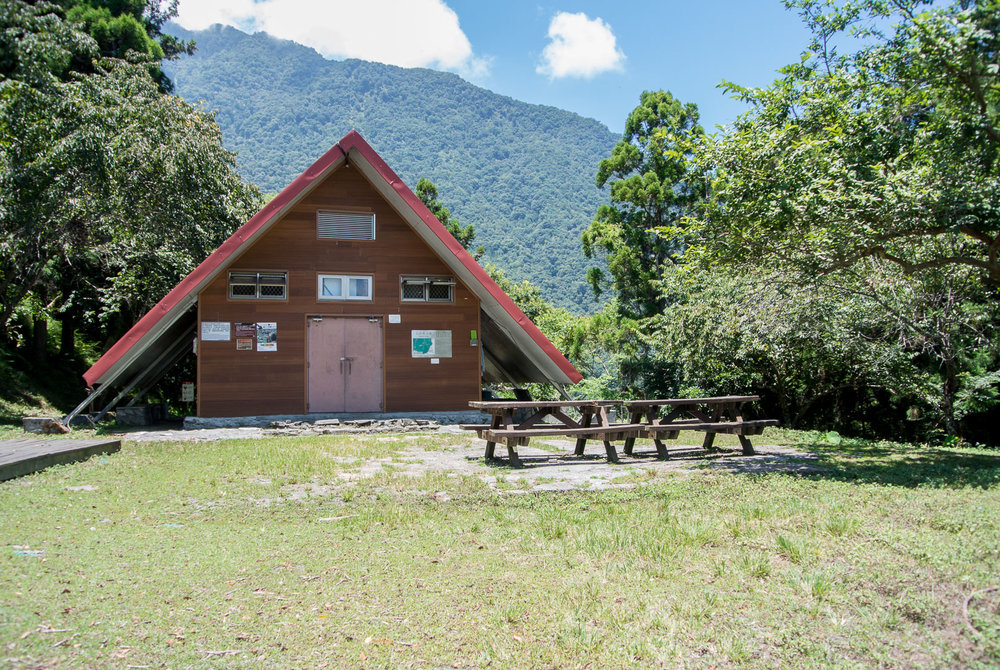

## Sixty Stone Mountain

Sixty Stone Mountain is located in the Hualien Country close to Fuli Township and is part of the Taiwan [East Rift Valley National Scenic Area](https://www.erv-nsa.gov.tw/erv/user/main.aspx?Lang=2). Especially during flower season in July - August it’s worth a visit. Views are amazing and the most beautiful thing are the blossom fields full of yellow / orange day (tiger) lilies. There are different viewpoints and it seemed a little bit like you’re in the German Allgäu. Be sure to arrive early and avoid the cars full of tourists who will arrive from 9 am.

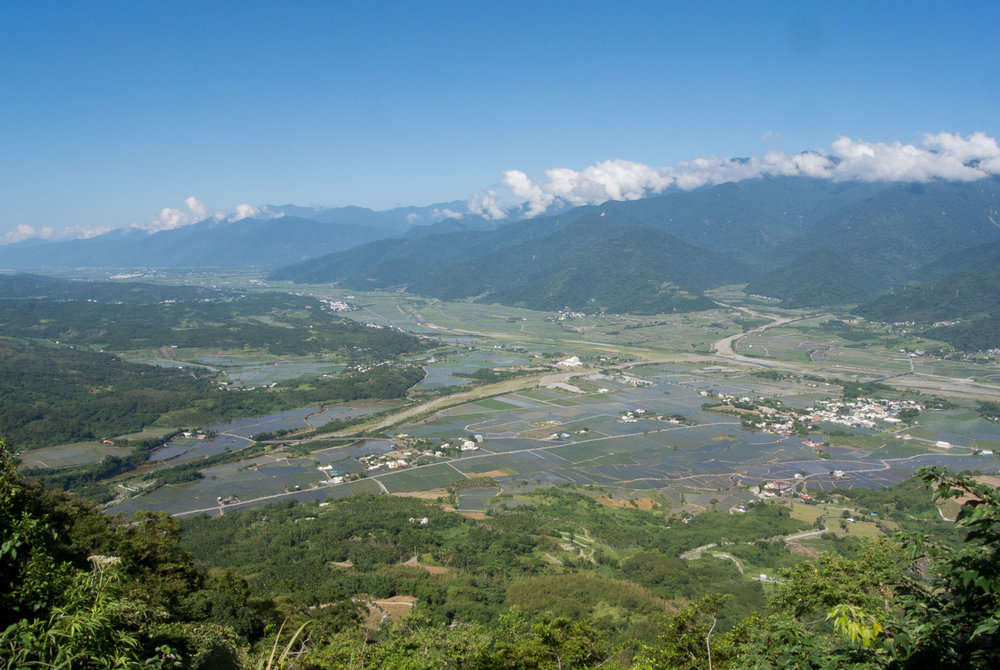

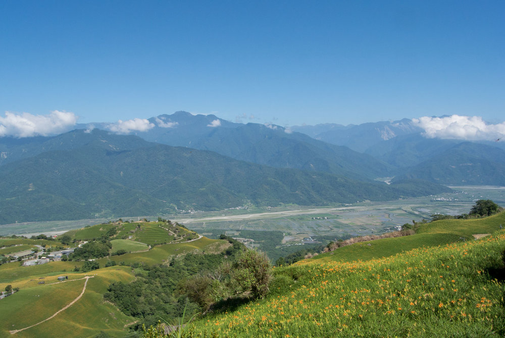

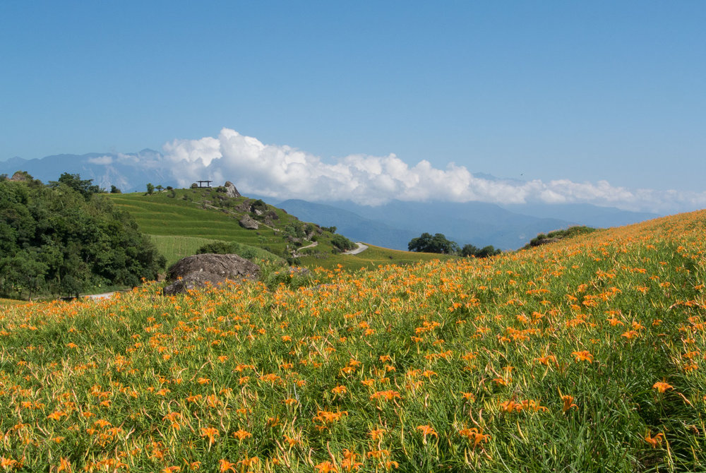

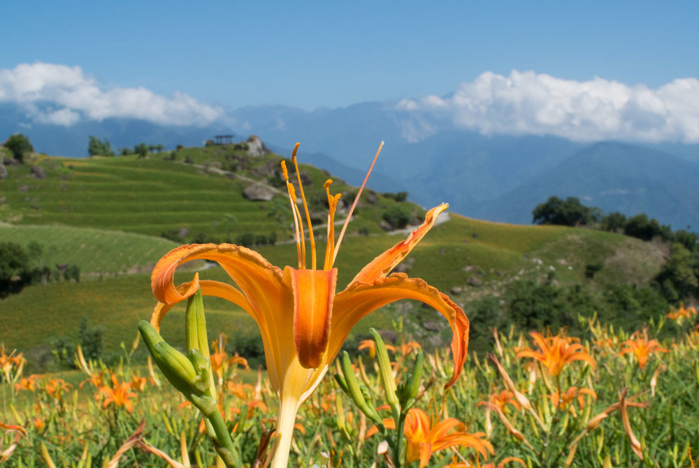

## Donghe

Donghe is another nice place where we stayed at the coast. Taitung Open Surf Shop & Hostel was a cheap and good accommodation to stay. There are different shops where you can rent a surfboard, which isn’t that easy because of operating hours and some only rent for guests. My husband rented his surfboard at Low Pressure Restaurant & Guesthouse, who were helpful and friendly and food was good as well. The price charged for a day  is 800 Taiwan dollars, so you might want to consider bringing your board. Donghe has a few good surf spots including a nice long right hander, with warm water and only a few people out. We found a delicious bakery who sell traditional steamed buns - Taitung Buns.

## Things to bring

*   Sunscreen - in summertime it’s absolutely scorching
    
*   Hiking shoes & small Backpack
    
*   Surfboard & surfing gear
    
*   International driving license
    
*   Mosquito repellent