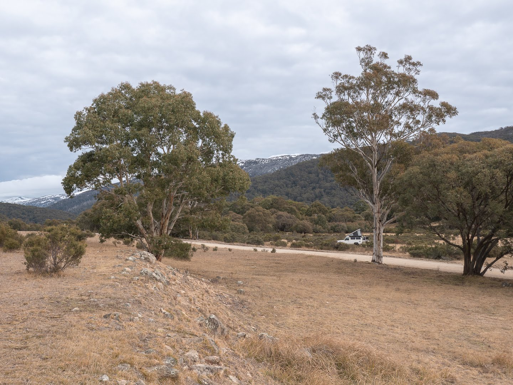
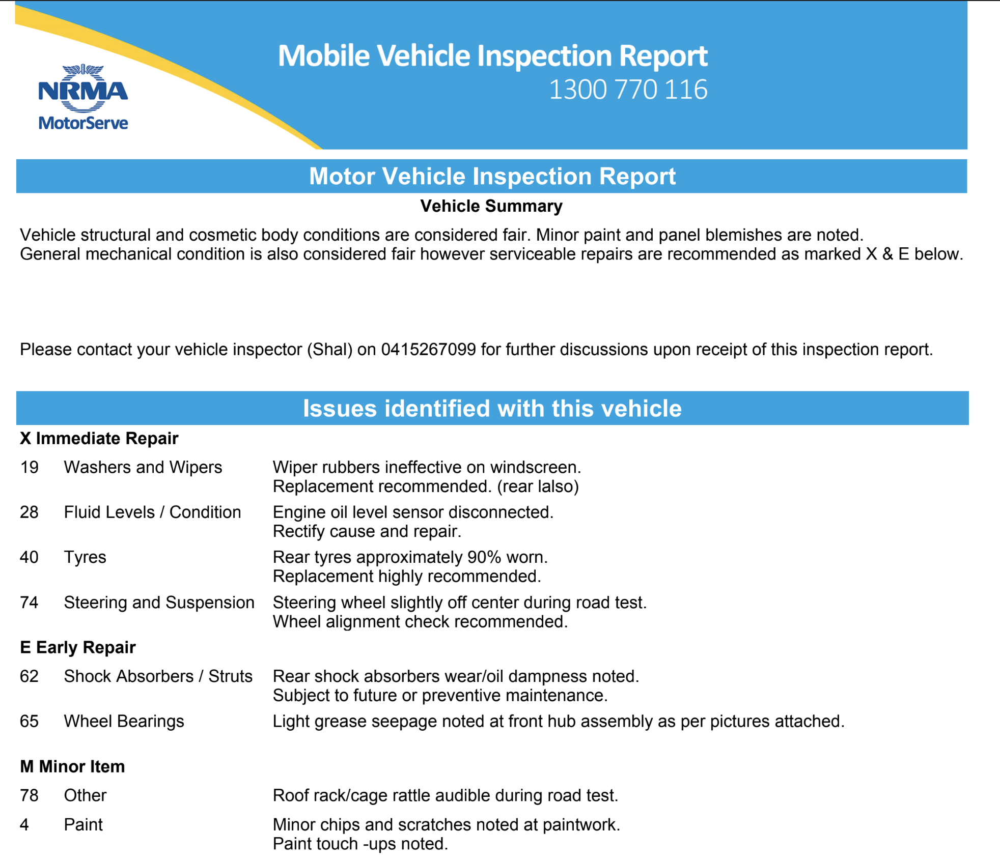
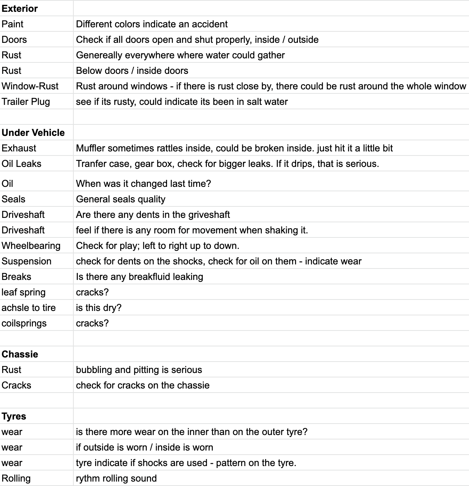
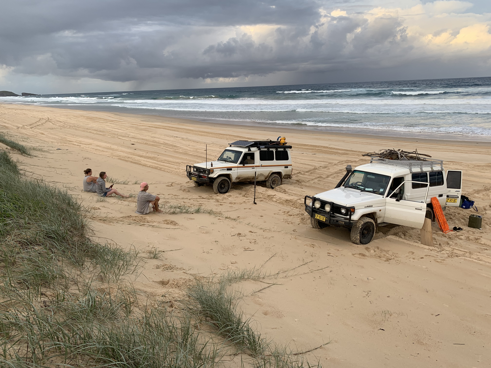

Troopy is the short form for a Toyota Landcruiser Troopcarrier. Toyota describes the Troopy as “Still powerful, still indestructible.” and we take their word for that.<!-- end --> It pretty much is a combination of a reliable engine and a box shaped chassis. In short great for touring and modifying it to your likes.

## Why we got a troopy

We moved from Singapore to Australia and the increase of available country just longs for a change in lifestyle - from city to bush (Australia has great cities too, but you can’t compare it to the metropolitan Singapore). The sheer size here, makes you want to explore the remote areas and what better way to do this than in a 4x4. We are not alone - compared to Singapore or Germany you will see a great amount for four wheel drives all over Australia.

Our life in Singapore consisted mainly of trips to surrounding countries in southeast asia, which is great to travel on a budget - we love doing that! ([checkout a few trips here](https://roadvagabonds.com/2018-6-9-weekend-getaway-phi-phi-island-thailand)). In Australia we try to stick to the same principle, by sleeping in the car and camping in the bush instead of staying at the Hilton.

With the box shaped chassis, a Troopy is absolutely perfect to turn into a nice little camper, the simple engine can be repaired easily (at least in theory) and it is spacious. We got inspired by other Overlanders for quite a while (check out [Bodensee Overlander](https://www.instagram.com/bodenseeoverlander/?hl=en) and [The Way Overland](https://www.instagram.com/thewayoverland/?hl=en)) and really wanted to give it a try while we spin up further ideas and future plans. So what better time than now, what better place than here (all hell can’t stop us now...).

## Buying a troopy

Troopy’s are very popular in Australia and it can be hard to find a good one. They are not sold in a lot of countries so a good chunk probably leaves overseas. The prices are stable and with their indestructible engines they keep a decent price-tag even at high kilometers.

We searched on [Carsales](https://www.carsales.com.au/), [Gumtree](https://www.gumtree.com.au/), [eBay](https://www.ebay.com.au/), [Facebook](https://www.facebook.com/groups/troopybuyswapsell/) and eventually were successful on eBay. I guess it’s key to find someone who is not aware of all big platforms to score a good deal. Be willing to travel and make sure to inspect properly.

### Stuff to watch out for

* **Rust**; around the coast the air is salty and accelerates corrosion - look for rust around the windscreen, bottom of doors, floor pan in footwells, firewall seams, roof gutters and under windows. Troopy’s are work-cars and so a lot of them will be used in mines. Be careful with ex-mining vehicles as they might not be treated as well as you would.
* **Towing**: did the previous owner tow a lot? The engine will have to work a lot harder when towing.
* **Owners**; how many previous owners? If someone keeps a car for very long he typically looks after it.
* **Service Logs**: how frequently was it serviced?

### Inspecting the troopy

We don’t know a lot about cars so it is challenging to inspect a car like this. If you can’t bring someone who knows a few things about cars, here’s what you can do:

* **[NRMA](https://www.mynrma.com.au/cars-and-driving/car-servicing/mobile-vehicle-inspections)** They offer a mobile service and you don’t have to be onsite at the same time. They will send an expert who thoroughly inspects the vehicle and sends you a detailed report of issues including photos.

* **Do your homework**. Even with no mechanic background you can get yourself up to speed here. We’ve watched a bunch of videos on YouTube ([this series from Ronny Dahl is quite good](https://www.youtube.com/watch?v=2bbx3HXiDNo)) and created a checklist we simply walked through at the vehicle.

Once inspected, you can start negotiating based on your findings. Pick it up, transfer rego and started selling the stuff you don’t need.

## The troopy community

Whenever you see another troopy on the road, you will get a wave and a smile. The community is great and most of them are part of a vibrant facebook group [Troopcarriers of Australia](https://www.facebook.com/groups/108913365878238/). Almost 8K members help each other on mechanical issues, modifications, trips or just answer and discuss all sorts of topics. It is a great source of inspiration on travel destinations and the frequently hosted meetups are good to see what other people are doing with their Troopy’s. After all we found some good friends this way and went on a bunch of great adventures together.

We had the troopy for a while now and absolutely love it, not only driving and exploring in it but also kitting it out and modifying it to your needs. In the next posts I want to explain what we did so far.

---

## Fitting out our troopy (I will link to the topic once available)

* [Floor, what materials, process, plan etc. Sound deadening](https://roadvagabonds.com/2019-7-17-how-to-put-a-floor-into-a-troopy)
* [Back door table](https://roadvagabonds.com/2019-7-20-diy-how-to-build-a-foldable-backdoor-table)
* [Storage boxes](2019-7-30-troopy-fitout-storage-box-bench-bed-all-in-one)
* [Bed](2019-8-01-troopy-fitout-a-convertible-bed-and-desk)
* [Kitchen cabinet](2019-7-31-troopy-fitout-kitchen-slideout-fridge-and-drawers)
* [Sliding fridge](2019-7-31-troopy-fitout-kitchen-slideout-fridge-and-drawers)
* [Desk](2019-8-01-troopy-fitout-a-convertible-bed-and-desk)
* Poptop - Mulgo
* [Drawer](2019-7-31-troopy-fitout-kitchen-slideout-fridge-and-drawers)
* [Kitchen top](2019-7-31-troopy-fitout-kitchen-slideout-fridge-and-drawers)
* Cushions
* Dual Battery System
* Solar Panels
* [Water supply](troopy-fitout-thorburns-45l-water-tank)
* Dual Wheel Carrier

## Troopy Maintenance
* [How we fight rust](troopy-maintenance-how-we-fight-rust)
* [Troopy service 10 1hz engine](troopy-maintenance-oil-change-and-service)