December might not be the best time to travel to Vietnam, because it's the cooler and rainier season.<!-- end --> Nevertheless, we found cheap flights with [Jetstar](https://www.jetstar.com/sg/en/home) from Singapore to Da Nang. The flight is about 2 ½ hours and immigration is easy. Check out if you need a [Visa](https://www.vietnamimmigration.com/check-vietnam-visa-requirement/), some countries don't require one, like Germany.

After arriving in Da Nang we got some cash from the ATM (for a better exchange rate, change money at home) and bought a water to get small notes, some taxi drivers tend to have no change ;). Taxis are available at the airport, Grab works as well and it's even cheaper. We took a Grab to Hoi An, which took about 40 minutes and cost VND 350 k.

## Hoi An

Hoi An is an ancient small town with yellow French colonial houses, nice cafes and restaurants, popular for it's beautiful streets covered with colorful lanterns and tailor shops. Our first night we stayed at the beach. [Victoria Beach Resort](https://www.victoriahotels.asia/en/hotels-resorts/hoian.html) had nice rooms and very good breakfast. The beach isn't worth a visit and there's not much you can do.

So we moved to a homestay in Hoi An city center the second night, which was better. We liked driving around with the bicycle, walking through the streets and along the river during the day and at night. Unfortunately Hoi An got quite crowded with busloads of tourists in the afternoon, so the streets were really packed with people.

In the evening you can spend your time at the restaurants and bars right in front of the river, watching the city gets colored with beautiful lanterns in the dark.

We had a super good Banh Mi at Banh Mi Phuong, a popular little street shop, always with a queue in front. Another recommendation is Nostalife, a Vietnamese restaurant.

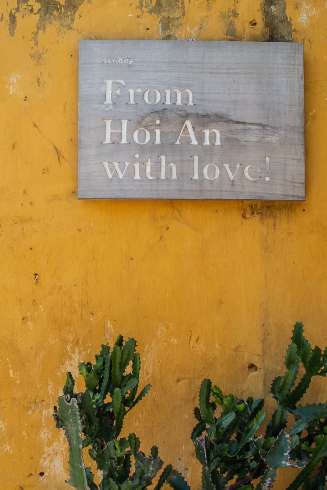

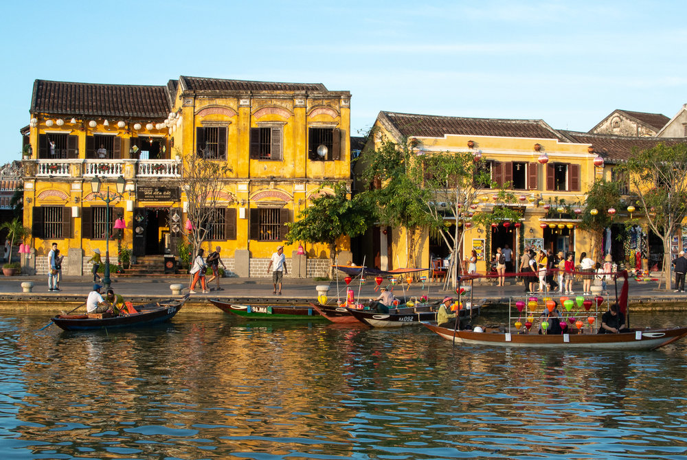

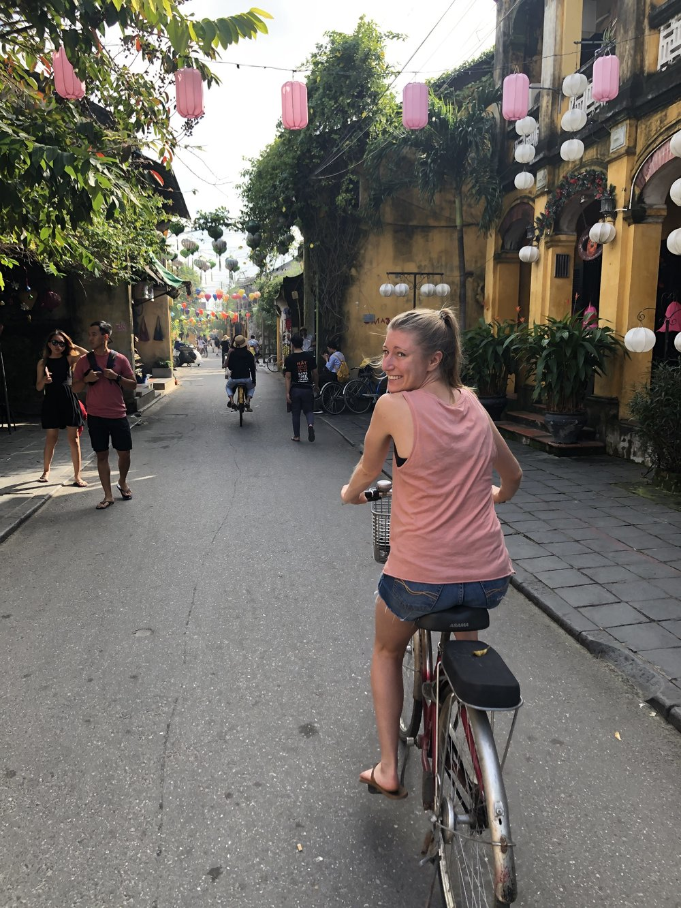

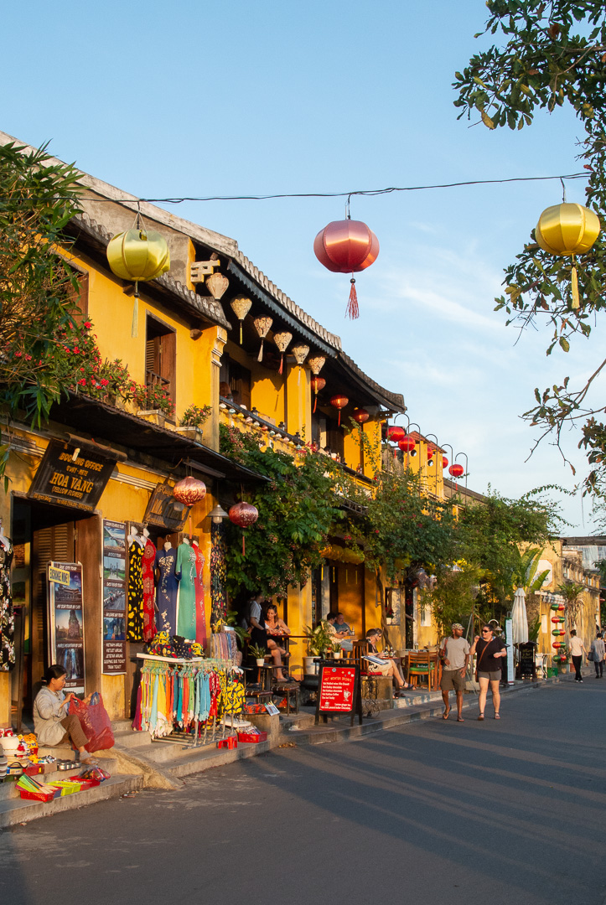

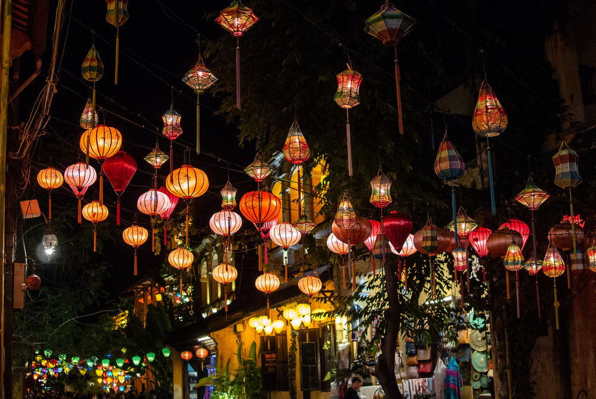

## Da Nang

Da Nang is the fifth largest city in Vietnam and is located at a long stretch of beach. We stayed two nights at the beach and rented a motorbike to ride around and get to restaurants and bars in the city center. With your motorbike you can take a ride over the Hai Van Pass, a 21 km mountain pass street between Da Nang and Hue with nice ocean views. We’ve seen more scenic panoramas, but it's not that crowded and there's no entrance fee, so still fun to do.

Marble mountains are an other touristic attraction in Da Nang. We paid VND 40 k per person. It was crowded and if you don't go for the elevator, you have to take steep and slippery stairs. There are some shrines and caves but it’s not really worth the trip.

From Da Nang we took a train to Dong Hoi. You can easily buy a ticket in the ticket office at Da Nang train station, located in the city center. In case your travel plans change, adjust your dates for a small fee at the ticket office - an easy and short process. The train ride is okay, seats are comfortable and snacks are available. Views are nice, but you can’t open the quite dirty windows, so it’s not like one of these epic train rides in Sri Lanka. Departure: 10 am, arrival: 3:45 pm, so the ride is actually quite long as the train travels really slow. At Dong Hoi train station, you will be welcomed by taxi drivers who want to sell you a way too expensive ride. Pay attention and try to negotiate, we paid VND 300 k to Phong Nha but heard of others sharing a ride with VND 80 k.

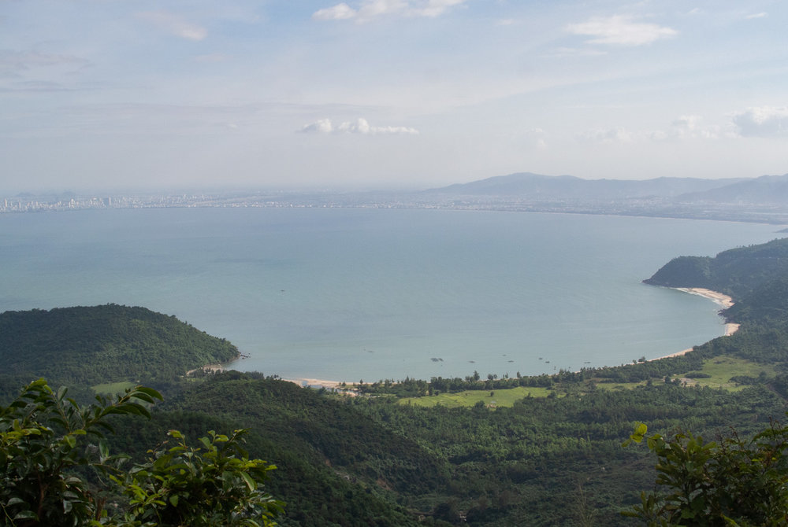

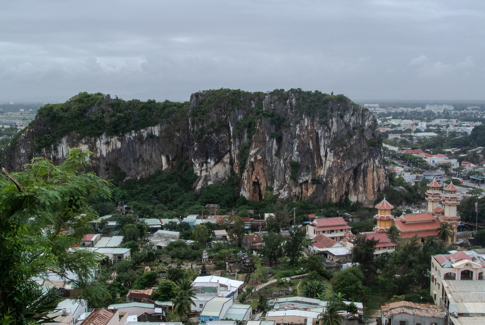

## Phong Nha

Phong Nha is a small village located close to the entrance of the Phong Nha-Ke Bang National Park, a protected area famous for its giant caves. It contains around 300 caves and grottos and the largest cave on earth, Son Doong Cave. It’s a 4 day trip to get there and costs about 3000 USD which we found just slightly overpriced. Right now the license to visit the cave is handed out to one tour operator exclusively, so these guys of course, try to make a good profit out of it. I assume it really is tough to get there and 3 night including equipment can’t be available for 10 dollars, but 3000 is a little much given the pricing of other things here.

We spent our first night at Lake House, 5-10 minutes outside of town by car. The location was actually not that good as there’s nothing around to reach walking. The rooms and food are okay, the transportation to town and to the train station were overpriced. If you are into tours and really want someone to take care of ALL logistics this is probably a nice place, but in case you want to explore by yourself, you are better off staying in town. That’s why we moved to Phong Nha, where we stayed in a simple homestay with good restaurants and bars around.

A motorbike for 24 hours cost us about VND 80 k and we really enjoyed being flexible and driving around the National Park. As the weather was rainy during our stay, we just visited the Botanical Garden and Paradise cave. The whole area looks amazing with all it’s dense forests, rivers and mountains - make sure to drive around here on a nice day. The entrance fee for Paradise Cave is about VND 250 k and a wooden walkway guides you through the cave. The Botanical Garden has 3 different type of trails through the jungle, all passing by  the waterfall with a nice view. We were happy to wear hiking boots as it’s not a typical botanical garden walk. It can get quite slippery on the trails, so be careful.

We decided to take the bus from Phong Nha to Hue. It cost VND 320 k for the two of us and  brought us to Hue just within 4 hrs. The bus is a cheap and comfortable alternative to the train and you don’t have to get to Dong Hoi train station - it starts right from Phong Nha.

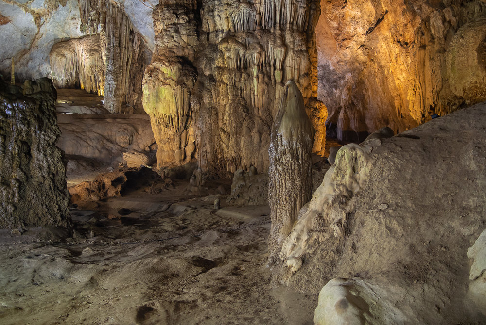

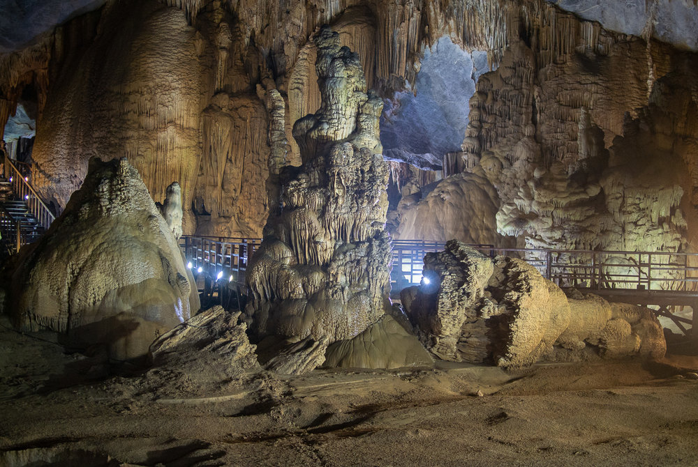

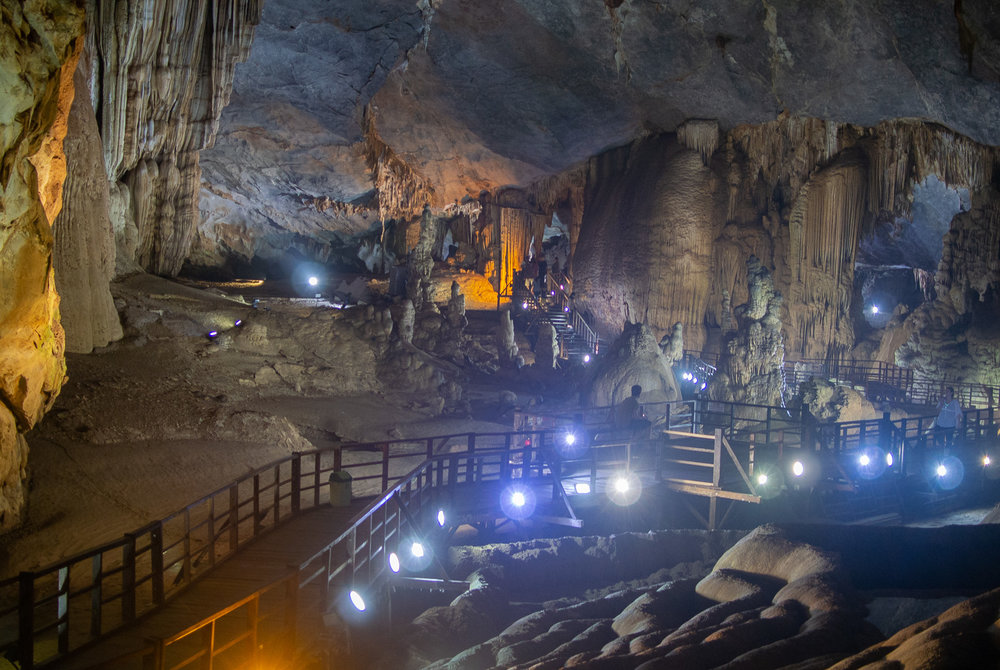

## Hue

Hue is a city located in central Vietnam. From 1802 to 1945 Hue was the capital of the Nguyen dynasty, the last ruling family in Vietnam. So the most common attraction here is the Imperial City, also known as the Citadel. For an entrance fee at about VND150 k you can take a walk through the ‘old’ palace, gates and walls. The major structures were destroyed in the war, but the site is being rebuilt gradually.

There are a few more historic tombs and buddhist temples to visit along the Perfume River. It’s easy to go there by motorbike or bicycle, rentable in the city.

In Hue there are heaps of restaurants and small cafes with stylish interior and good food. Our recommendations are [Madam THU](http://madamthu.com/) and Nook Eatery, modern Vietnamese restaurants. The nightlife in Hue is quite nice as well, a lot of bars and restaurants welcoming you with good happy hour deals and friendly people you can have a good time with.

After Hue we took a bus back to Da Nang. We booked it through our hotel and its cost us 6 USD per person and took around 3-4 hours.

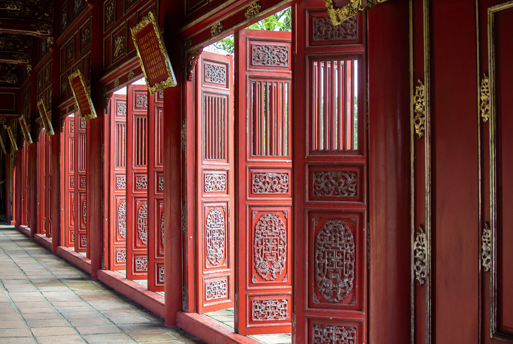

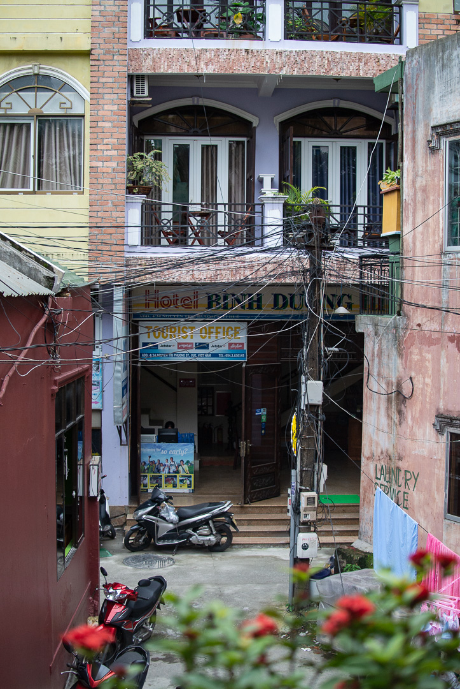

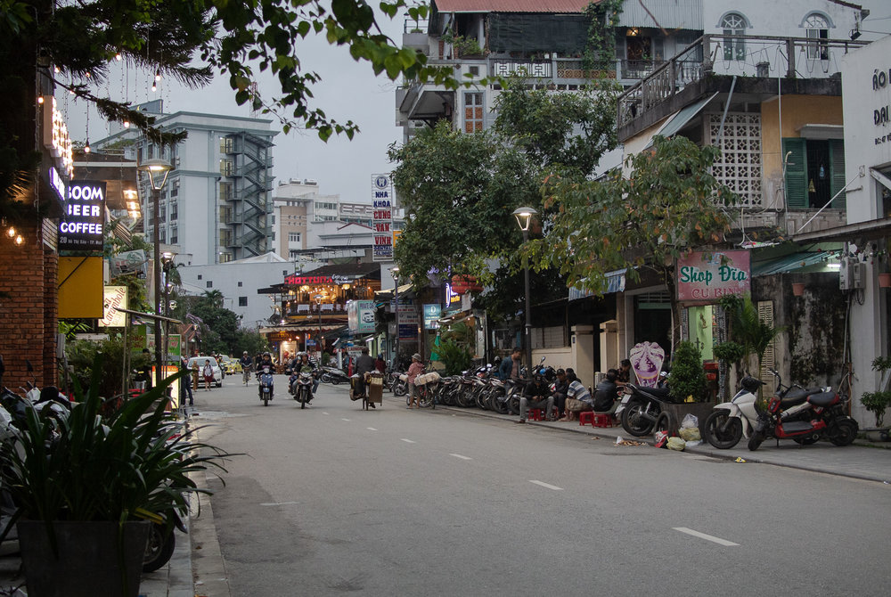