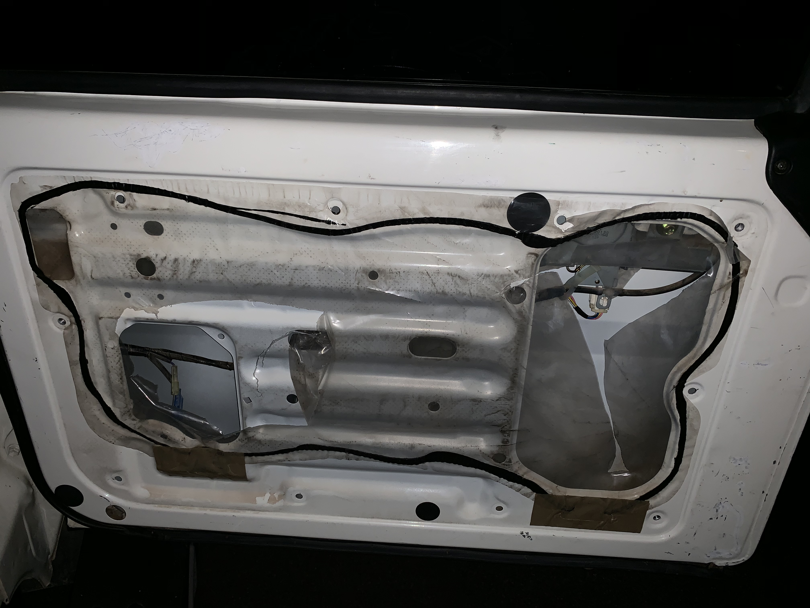
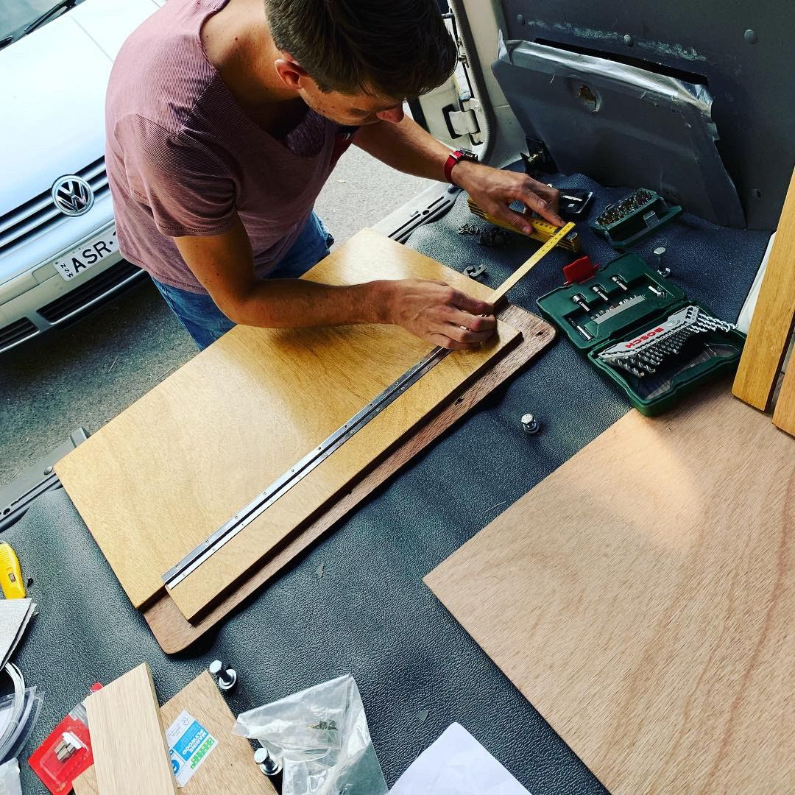
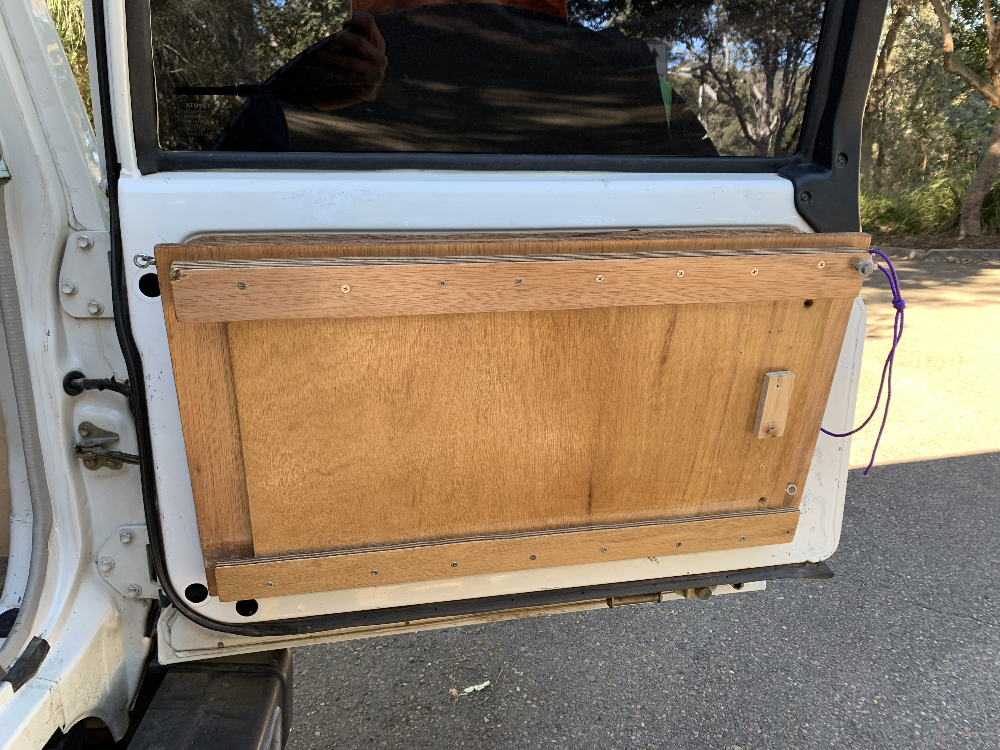
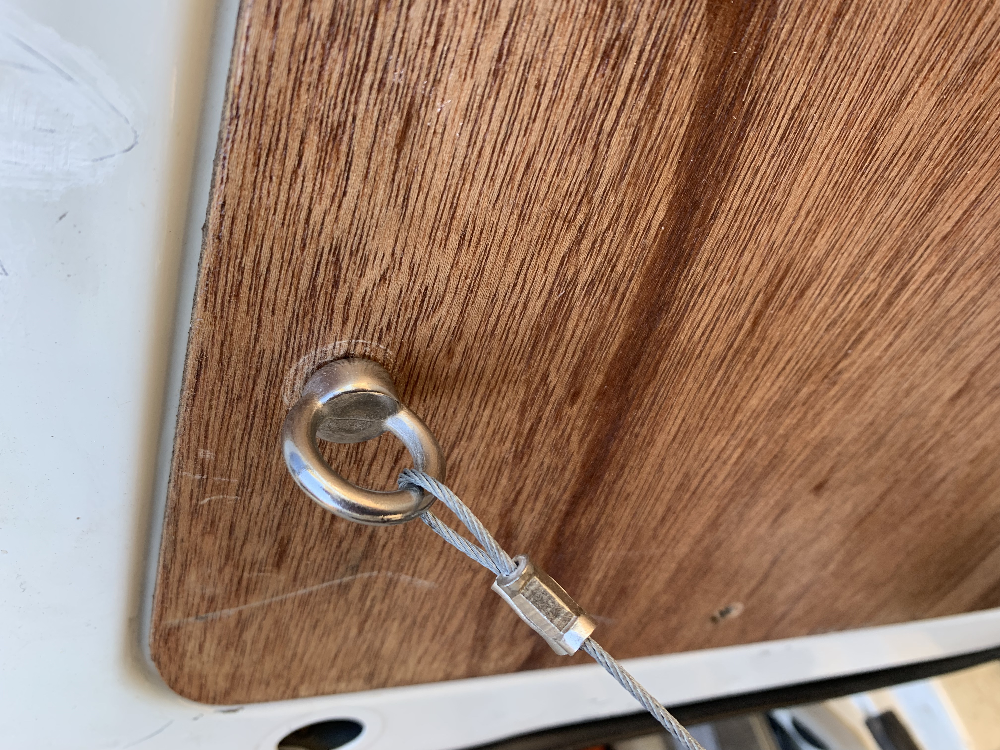
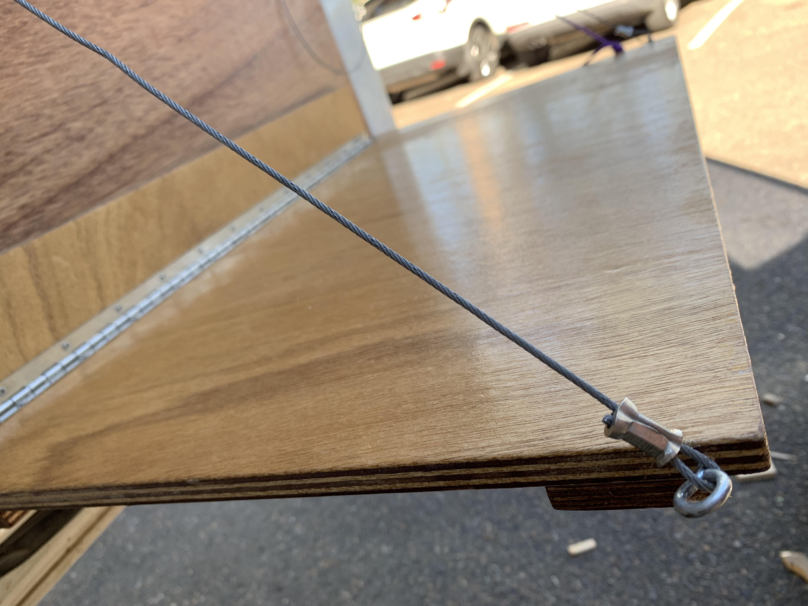
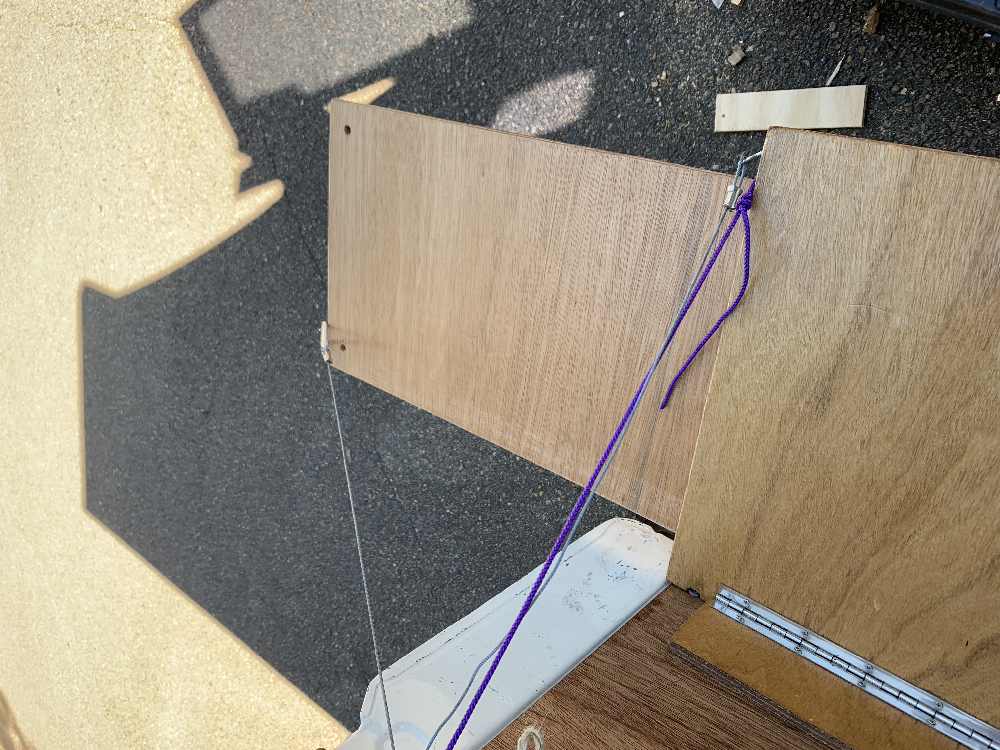

A must have for the Troopy is a fold down table attached to the backdoor.<!-- end --> This one comes with a slide-out extension underneath. It's real simple check out the steps below.

---

## Steps

#### Step 1 

> take off the old cover carefully, so you can draw a copy on the new plywood (including holes).

#### Step 2

> cut out the new plywood back-piece from the 9mm ply.

#### Step 3

> widen existing holes to fit the rivnuts, place and tighten rivnuts

#### Step 4

> cut out the table-piece, the slide-out, the slide-frame and the hinge-fix from 12mm ply

#### Step 5

> screw hinge-fix to back-piece

#### Step 6

> fix back-piece to door using bolts and rivnuts (we used eye bolts on the top to fix the wire)

#### Step 7

> place the slide-out ontop of the table-piece to measure where to place the frame - screw down the frame (ensure it's not to tight so you can still slide the slide-out)

#### Step 8

> fix table-piece to hinge-fix using the hinge

#### Step 9

> fix eye screws to table-piece end and connect eye screws to eye bolt using wire.

#### Step 10

> connect all wires with swages to fix them around the eye bolts

---

## Shopping List & measurements (in cm)

1. **backpiece**: 9mm ply (measure using old insert)
2. **table-piece** 12mm ply (71 x 40)
3. **slide-out** 12mm ply (62 x 32)
4. **slide-frame bottom** 12mm ply (68 x 3)
5. **slide-frame top** 12mm ply (68 x 5)
6. **hinge-fix** (length of your hinge)
7. threaded inserts for existing door holes: **rivnuts**
8. **bolts** (for rivnuts)
9. **eye bolts** (for rivnuts)
10. **eye screws** (for side of table)
11. **wire**
12. **small caribiner** (to connect a detachable wire from slide-out to door)
13. **swages** (to connect wire)

---

## Tools needed

* Jigsaw
* rivetgun or a self made [rivnut-tool](https://www.youtube.com/watch?v=SzWj5y00sVg) 
* Ruler & Pencil
* swaging tool (if you don't want to buy this you can use cord as well)

---