As a German there is not a lot to miss in Australia. They have great beer and sausages here - Aldi even sells sauerkraut in october! The one thing that is either expensive or hard to find is a tasty German sourdough bread. I've tried out a couple of recipes and keep coming back to this one.<!-- end -->

Firstly, all credit goes to [Ploetzblog](https://www.ploetzblog.de/2015/12/26/tonis-brot/) in particular the recipe "Tonis Bread". This amazing site comes with an endless list of delicious bread, baguettes, rolls and more. We started trying recipes back in Germany and at first found it challenging to get the right type of flour in Australia. I have slightly modified the recipe; I bake it in a cast iron pot. Kind of a little trick to get a tender, soft core and a crunchy, crisp crust!

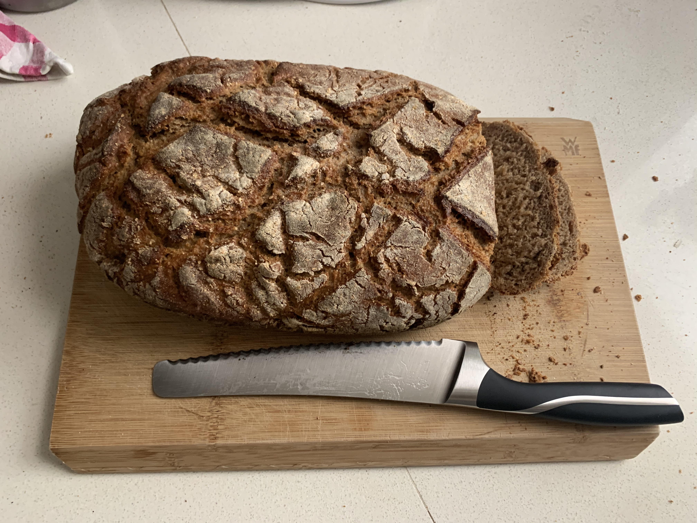

---

## Ingredients

This will be for two big loafs - I usually bake two of these every two weeks, quarter and freeze them.

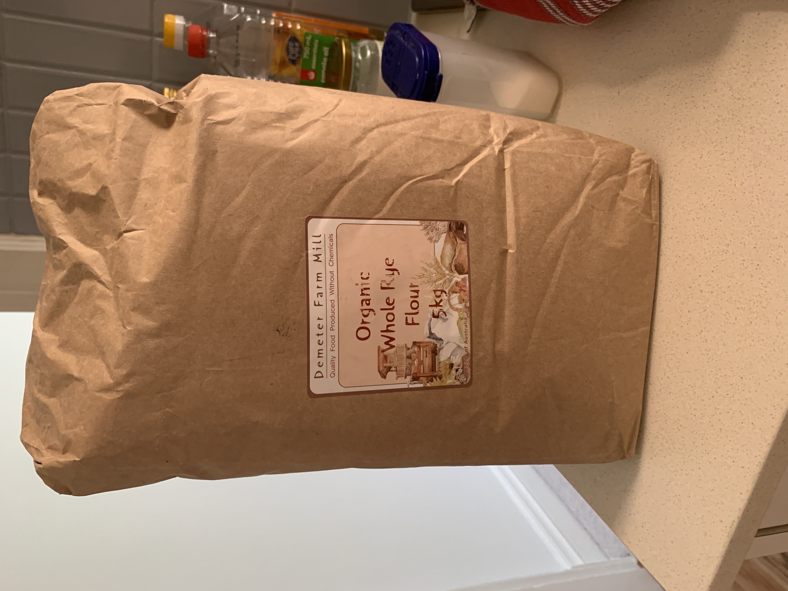

### Rye sourdough

* **600g** Rye flour - I used organic wholemeal flour as this was easiest to get in larger quantities.

* **700g** Water at 50 C - just hot tap water

* **12g** Salt

* **120g** Rye sourdough starter (see down below, this will need 3-4 days to be ready)

### Wheat sourdough

* **200g** Wholemeal wheat flour - Coles or Woolies have it. Australia does not have different types but the standard version works.
* **240g** Water at 50 C
* **4g** Salt
* **40g** Wheat sourdough starter (see down below, this will need 3-4 days to be ready)

### Pre dough

* **400g** Wholemeal wheat flour
* **200g** Water, cold
* **4g** Fresh yeast - Harris Farmers Market has it and you can just freeze and take out as much as you need.

### Main dough

* Rye sourdough
* Wheat sourdough
* Pre dough
* **600g** Rye flour
* **200g** Wholemeal wheat flour
* **400g** Water at 80 C - just heat a bit of water until it starts to produce little bubbles
* **32g** Salt

## Tools

* Spatula
* 3 medium, 1 large bowl
* 1-2 cast iron pots

---

## Steps

### 1 Rye sourdough starter

(not sure if this is how you call this)

You don't use a lot of yeast in a sourdough bread, you instead try and cultivate it, using these starters. It's simple and only takes a few minutes everyday.

I just keep these constantly and feed them everyday. If I go away, I put them in the fridge. You can keep them forever if you take good care.

Start with 25g of flour and 25g of warm water, mix and store at a warm place (23-26 degrees C which is pretty much room temperature).

Do this every day. Add both, mix and store again. The exact amount doesn't matter as long as water and flour are equally added. If you don't have a place with this temperature - yeah especially Australia without central heating - place it in the oven and just turn on the light. This produces a constant temperature that seems to do the job.

After three to four days the starter will have a lot of bubbles and smell a bit sour, which means you can start. If it does not work, try some fresh flour and/or a different temperature. Mine is stored in a sealed tupperware container.

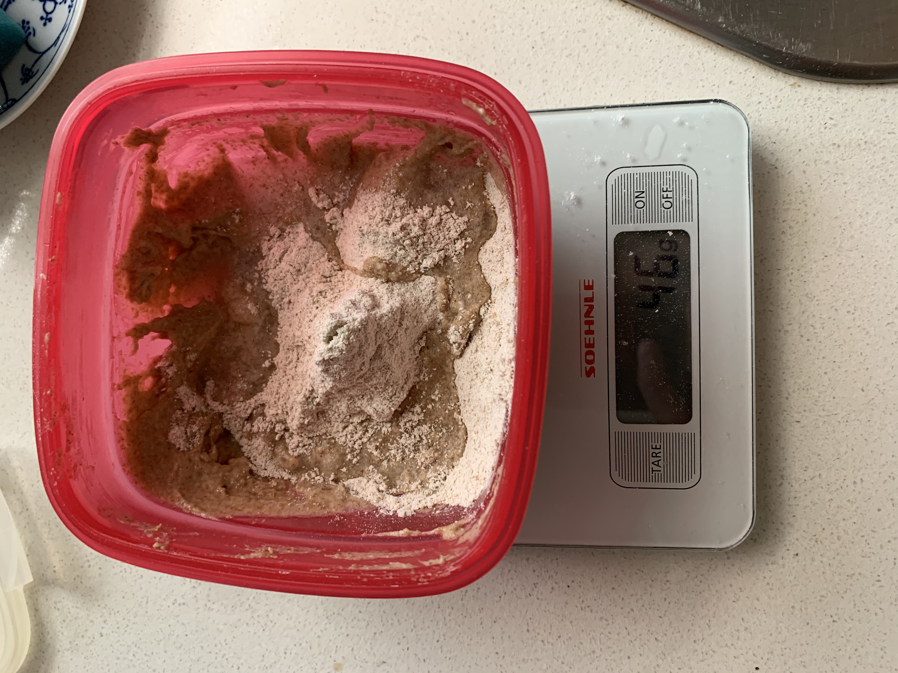

### 2 Wheat sourdough starter

See Rye sourdough starter above. Just use wheat flour.

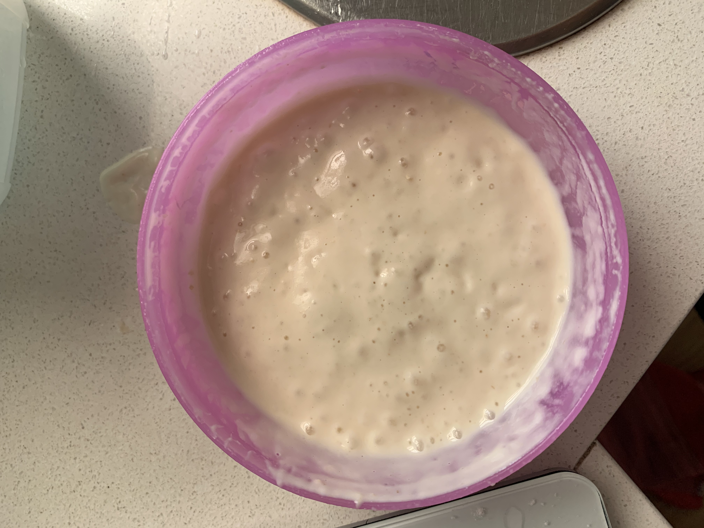

### 3 Pre dough and sourdoughs

1. Mix ingredients for the pre dough, rye sourdough and the wheat sourdough in 3 separate bowls (see images below).

2. Cover each with a linen towel and let it rest for 12-16 hours. The sourdoughs should be around 23-26 Celsius while the pre dough can be 20 degrees. I usually do this at 4pm the day before baking.

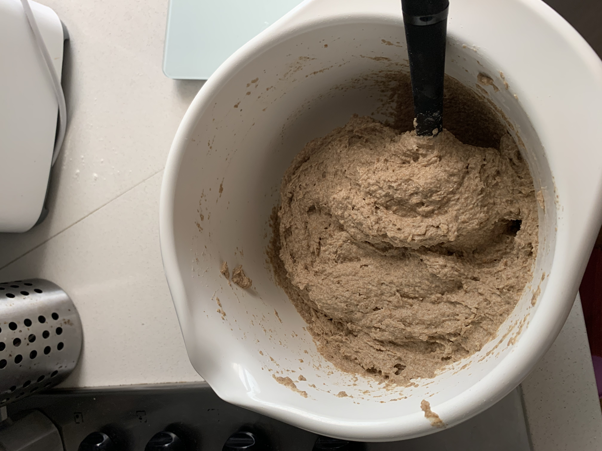

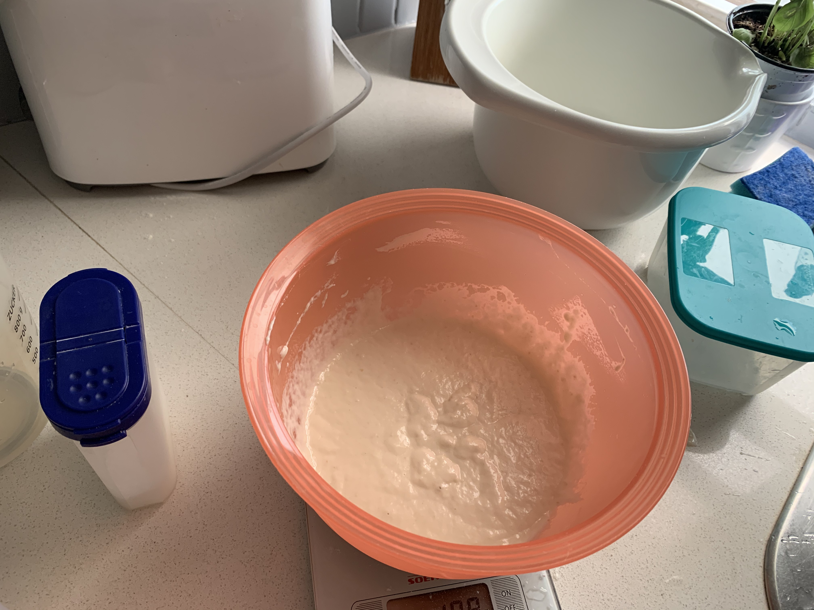

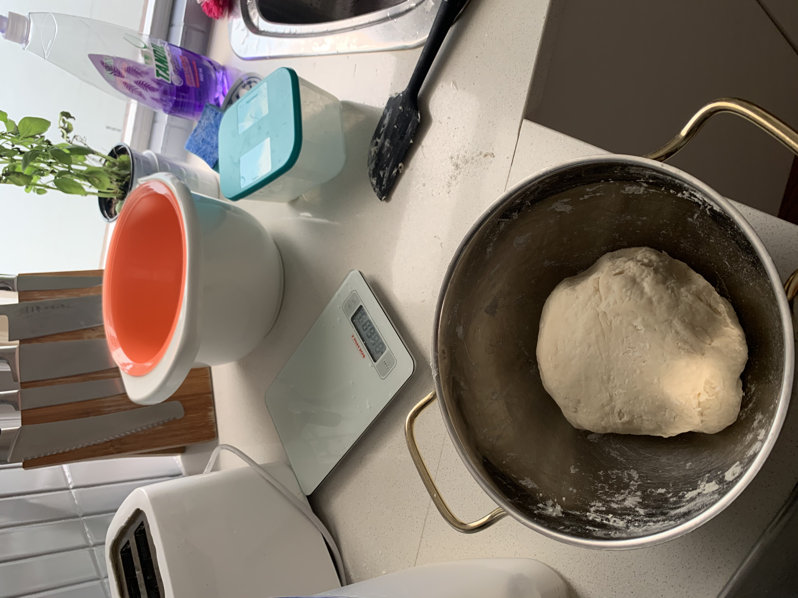

### 4 Main dough

If you've started at 4pm the previous say, you can start this the next morning 6am.

1. Mix rye sourdough, wheat sourdough, pre dough and 200g of wheat flour in a large bowl. This is really, really sticky, but that's just how a rye sourdough is. It will turn into a juicy bread soon.
2. Make sure you get through all the chunks of the pre dough.
3. Add 600g rye flour, 400g of hot water (80 C) and 32g of salt.
4. Still really sticky, but mix it well.
5. Let it sit for an hour at room temperature.
6. Spread some flour on your kitchen top and place half the dough on it (or all of it in case your are doing one bread). Cover the dough with flour and form it into a bread by folding it over a couple of times. It shouldn't be sticky anymore.
7. Add some flour to a linen towel and place the dough on it. Slice the top with a sharp knife. This is important so that it pops open on the top and not the bottom (see image below).
8. Let it rest for another hour.

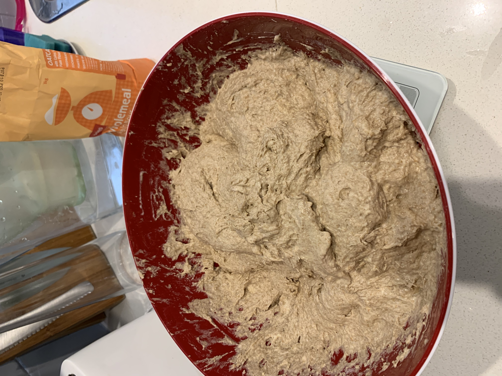

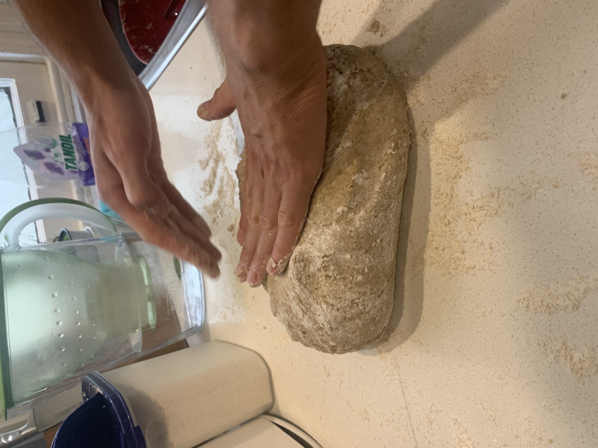

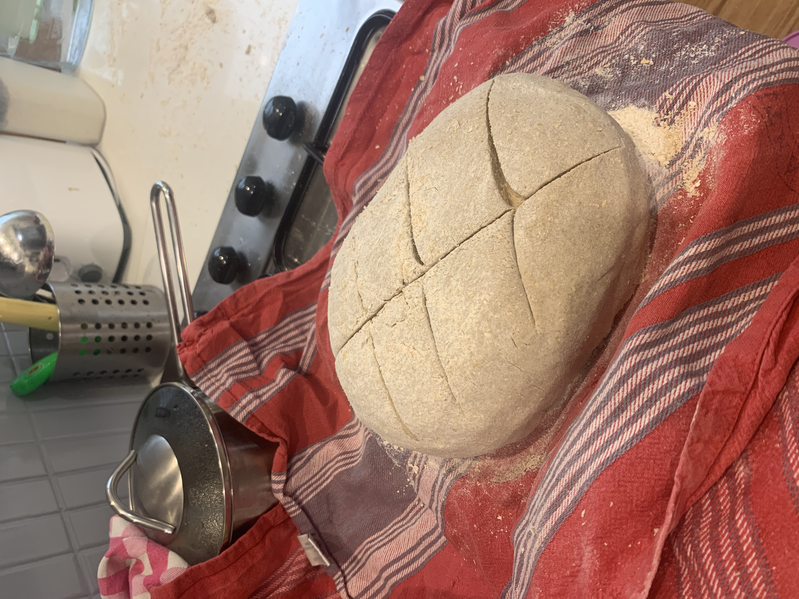

### 5 Baking

1. 30min into the rest, I turn on the oven - as high as it goes (260-270 C) and place the cast iron pot including lid inside.
2. After a full hour of resting (or 30min after you've started the oven), take the pot out, shut the oven, and place the dough inside the pot.
3. Put the pot back into the oven, covered by the lid.
4. Bake for 40min at 260 C.
5. Take off lid, reduce to 220 C and bake for another 20min.
6. Reduce to 180 and bake for 30min.
7. Done or do it again for the second one.

It's tempting but don't eat too much of it while it's hot - not good for your tummy! ;-)

It stays juicy for 3-4 days with a firm crust when stored in a bread bin. If you freeze it after it's cooled down, you'll have good bread for as long as you like.

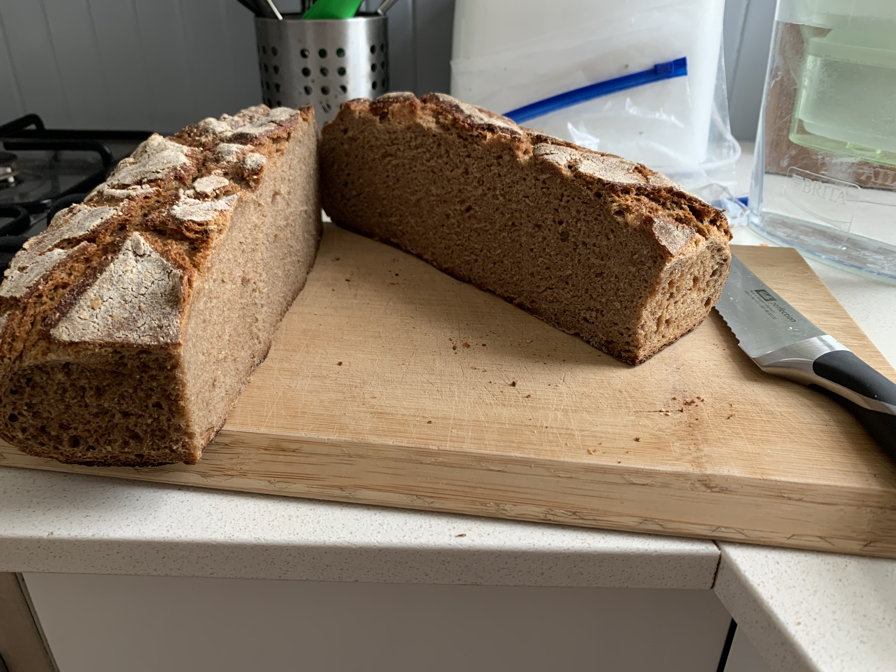

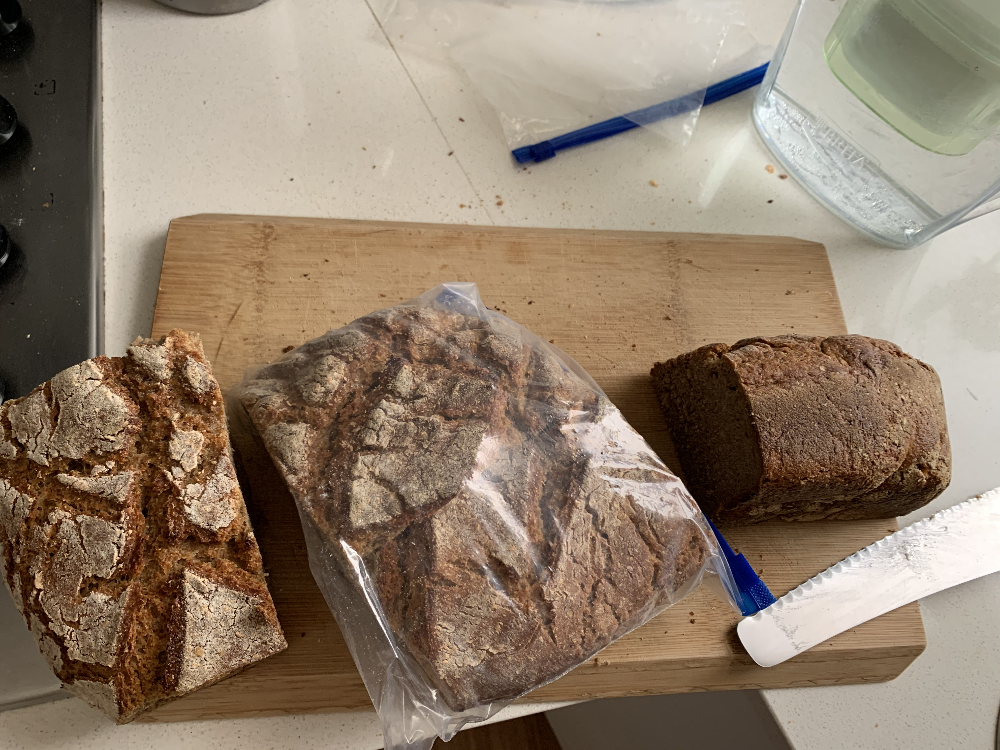