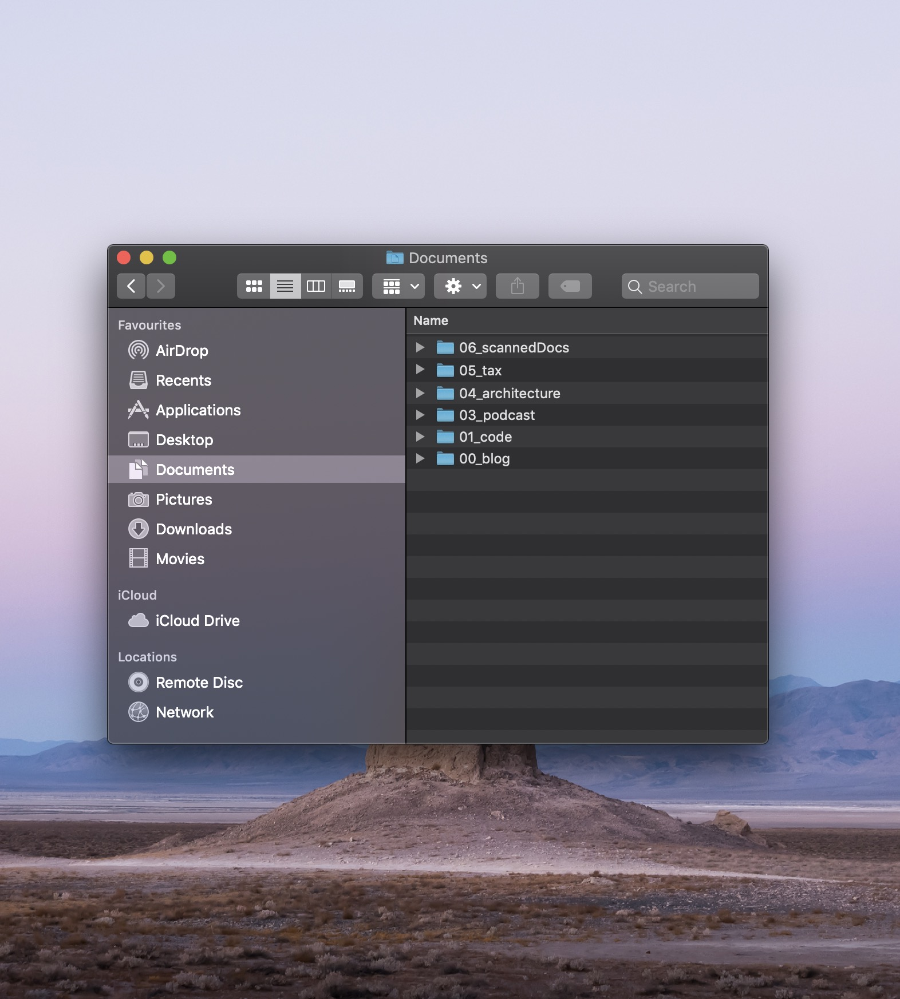
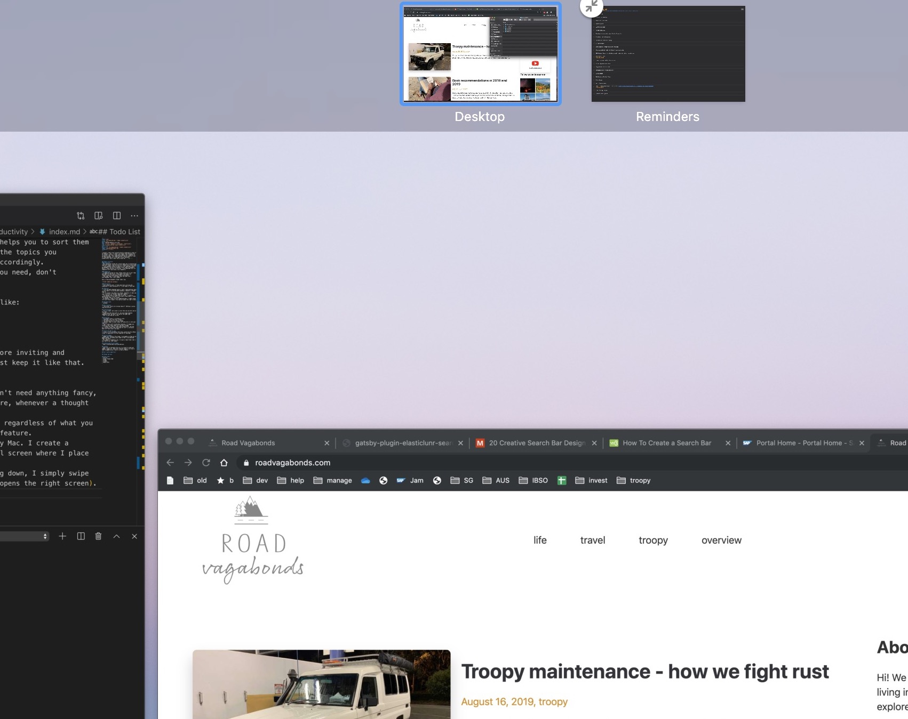
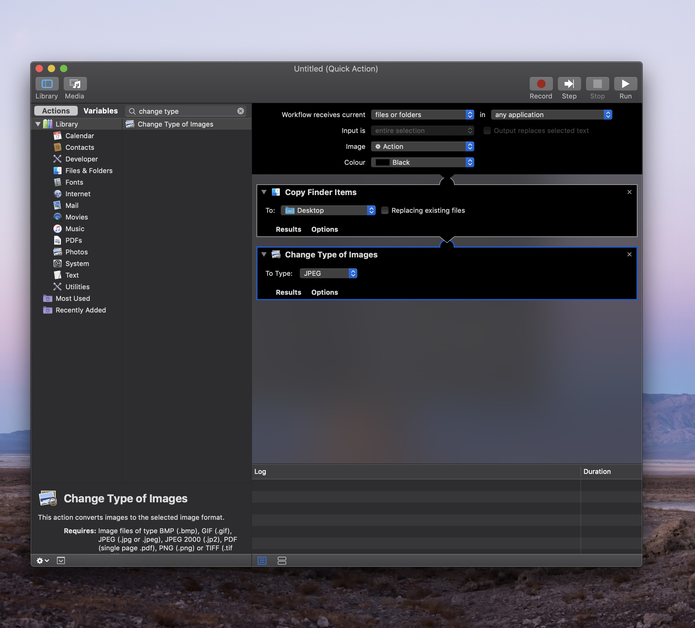
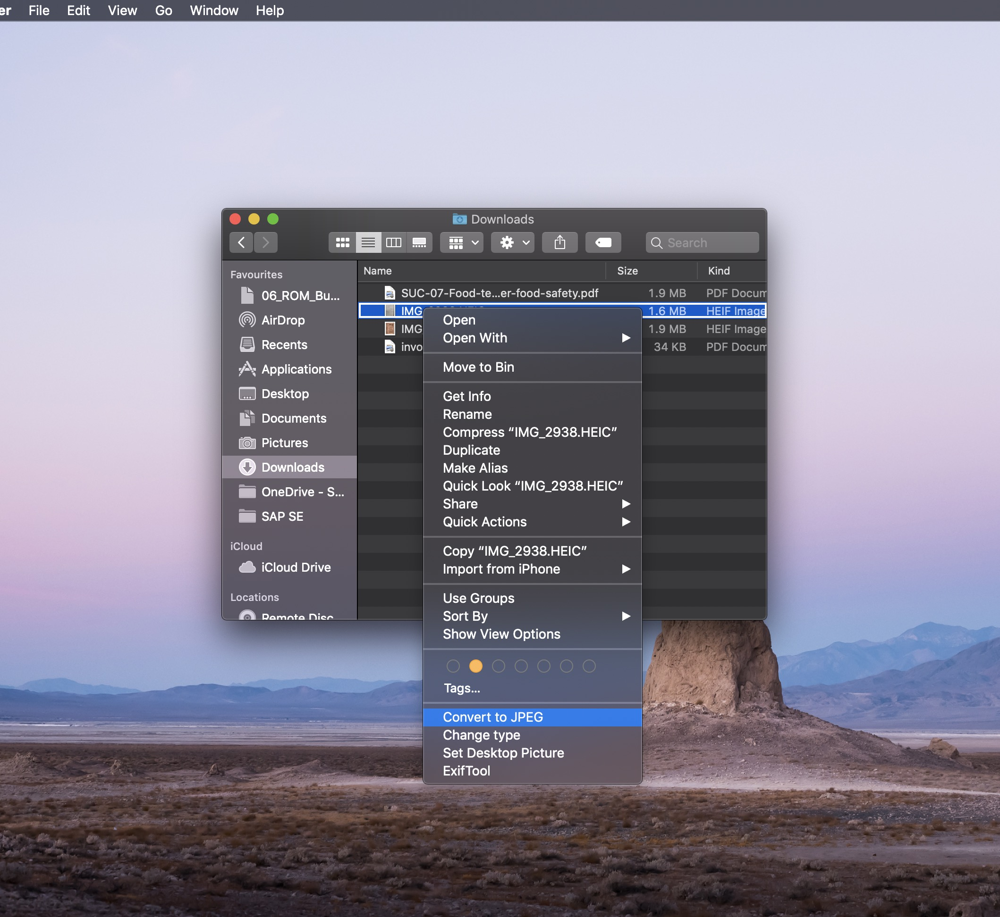
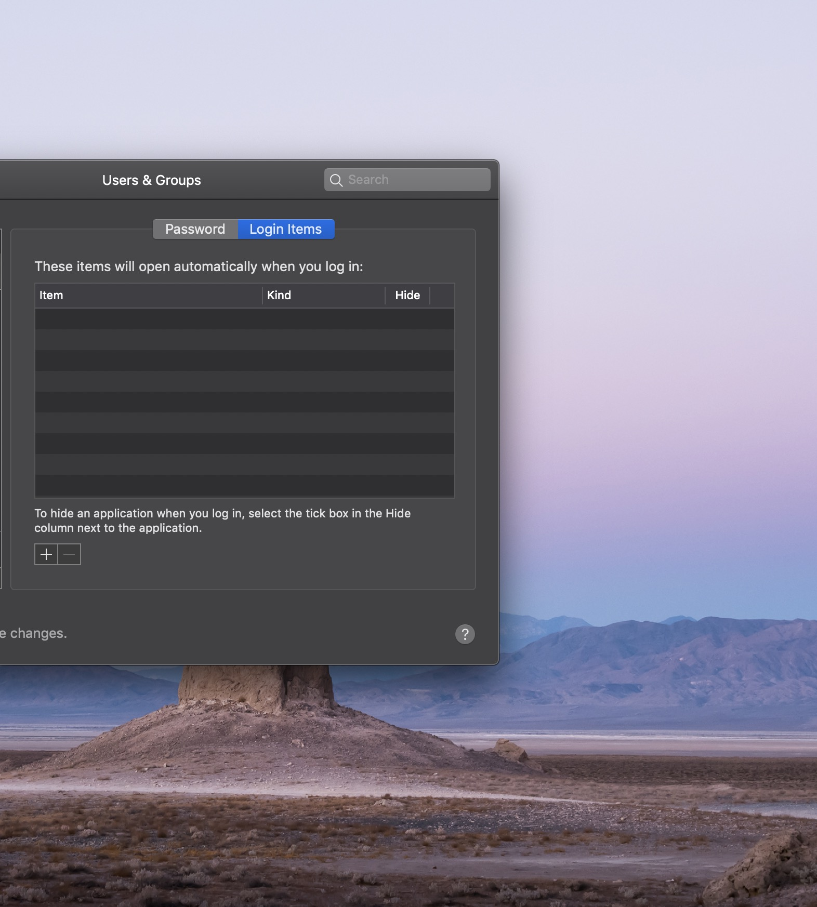

I come across a lot  of people who's computer is an absolute mess. Thinking of the amount of time we spend in front of these machines, **here are 14 things you can do to improve**<!-- end -->


## #1 Folder structure
------

#### Favorites

I use standard folders as much as I can.

```
    Documents
    -- 00_code
    -- 01_blog
    -- 03_podcast
    -- 04_architecture
    -- 05_tax
    -- 06_scannedDocs
    Pictures
    -- 00_declutter
    Movies
    -- 00_MyFavoriteComedy
    -- 01_Youtube Videos

```

Most operating systems do a pretty good job in preselecting important folders - but you can still change this to your needs. I pin to favorites whatever I need right now.

#### Numbering

A numbering system for your folders helps sort and identify them faster. Think about the topics you typically work on and create folders accordingly.

Here is how my documents folder looks like:



#### My Desktop

> Like a desk at work, it looks much more inviting and organised if there **nothing on** it. I just keep it like that.


## #2 Todo List
------

I use the **Apple Reminder app** as I don't need anything fancy, I just need it to be available anywhere, whenever an idea pops up.

> It is **synced** to my phone **via iCloud**, regardless of what you use, this is the most important feature.

> The reminder app is **always open** on my Mac. I create a second Desktop to the right of my usual screen where I place the reminder app in full-screen.

> So whenever I need to write something down, I **simply swipe left** with three fingers (this gesture opens the right screen).




## #3 Password manager
------

Passwords on notepads?

> Same password for every login?

> Password managers are not 100% safe either, but nothing will ever be 100% safe unless you disconnect from the internet and move to a remote island.

> There are a bunch of [articles](https://www.washingtonpost.com/technology/2019/02/19/password-managers-have-security-flaw-you-should-still-use-one/?noredirect=on) out there and the summary pretty much is: it's better ro use one than not to - this will allow you to generate strong individual passwords.

> I like LastPass as it's free.


## #4 Notifications
------

**Simply turn them off**. Nothing is worse than distraction when you're trying to work.


## #5 Cloud Storage
------

This is a must.

But a must is also to use only one at a time.
* You will be confused where your data is stored,
* have different tools reducing the performance/battery-life of your computer
* and will need to remember passwords / pay for multiple services.

**Simply choose one and stick with it**, you can always migrate somewhere else, but don't use two at the same time. I use Google Drive.


## #6 Discipline
------

**Stick to the rules!**

1. **Download files into their folders**. That's what you've created them for
2. It might take slightly longer to store files at the correct location, but you will be **much faster when searching** (I certainly open stuff more than I do save)
3. If you love using your desktop, put your folder structure there, but **don't just dump stuff there**
4. Whatever comes to mind, **swipe left or right** and write it into your todo list
5. **Don't store stuff at multiple locations**. If images are stored in the cloud, keep this the main storage


## #7 Converting HEIC to JPG
------

**The most annoying problem.**

> This always happens in transition phases between new technology - just think of the amount of USB interfaces we've had in recent years (HEIC uses much less storage and supports 16-bit color more is better!).

A little Automator helps converting the iPhone format to jpeg.

1. Open Automator, New Document, Choose Quick Action
2. Adjust top section as shown below
3. Search "Change type of images", drag it to the right (add copy finder item as asked by the popup)
4. Adjust setting as shown below
5. Save Automator and name it something like "Convert HEIC to JPEG"
6. Right click on an HEIC file to see the context menu showing your Automator Quick Action.
7. It works for multiple files and will copy the converted files to pictures (or whatever you have selected above)






## #8 Storing Images
------

Access all your photos on any device.

> I use Google Photos (it's basically free). My phone syncs photos and I can access them from any device.

> Images I frequently use on my computer, are stored in a temp folder **but I do not keep them there or sync them to my cloud drive**


## #9 Linking Spotify with phone
------

Nothing fancy, but the two can actually be linked so you can continue listening to the same playlist.

> In the Spotify app: **Settings** -> **Devices** -> **Devices Menu**


## #10 Airdrop
------

Send files from Phone to Computer or to other devices.

> On your mac: **command + space** -> **Airdrop** -> configure who can discover you


## #11 Important shortcuts
------

>**open search**: command + space

> **take a screenshot**: command + shift + 4
> 
> **change a file name**: return + selected file
>
> **copy a file instead of moving it**: option + drag 
> 
> **split screen like on Windows**: click and hold the green window button
> 
> **preview the file**: space + selected file (hit space again to close it)
> 
> **close a window**: command + w
> 
> **quite an application**: command + q


## #12 Do I really need this?
------

**Which apps to start on startup of your mac**. I like to decide what I want to run and therefore my Login Items is empty.

> this is how you do it: **System Preferences** -> **User & Groups** -> **Login Items**, to remove or add items.

**declutter** 
> I often go through my Applications folder to see what I can get rid of.




## #13 Chrome tab sync
------

This is a great feature.

> Even if you don't use it on multiple devices, it is a **backup** of your browser history, bookmarks, tabs etc.
> 
> **open Chrome settings** -> **login** with your gmail account -> **sync and google services** -> **manage sync** (I sync everything)
> 
> In case you set up a new computer all you do is download Chrome, sign in and it will **sync everything automatically**.


## #14 Other tools
------

> [Draw.IO](https://www.draw.io/) - a lightweight drawing tool for mindmap, architectures or process flows.

> [Visual Studio Code](https://code.visualstudio.com/) - my favorite coding app.

> [Chrome](https://www.google.com/chrome/) - fast browser

> [Clocker](https://apps.apple.com/us/app/clocker/id1056643111?mt=12) - if you work with different timezone, it sure helps.

> [Google Docs](https://docs.google.com/) - one of the main reason, I use Google Drive is that it links to Google Docs which is a true online MS Office competitor. Check out our [blog on how we organise ourselves](2019-3-1-how-we-organise-ourselves) to see how we use it.

---