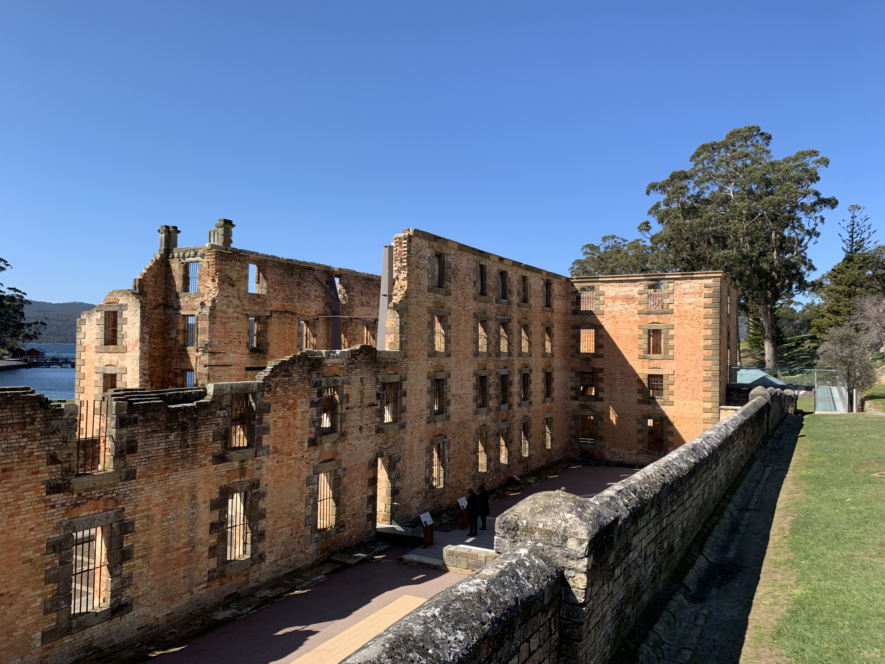
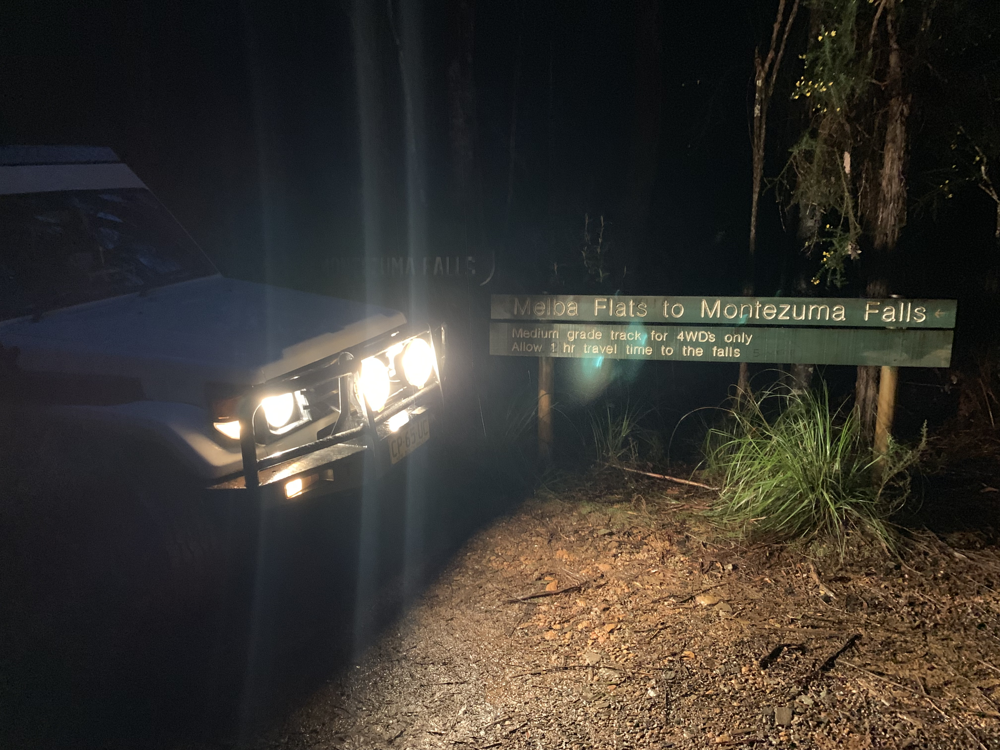
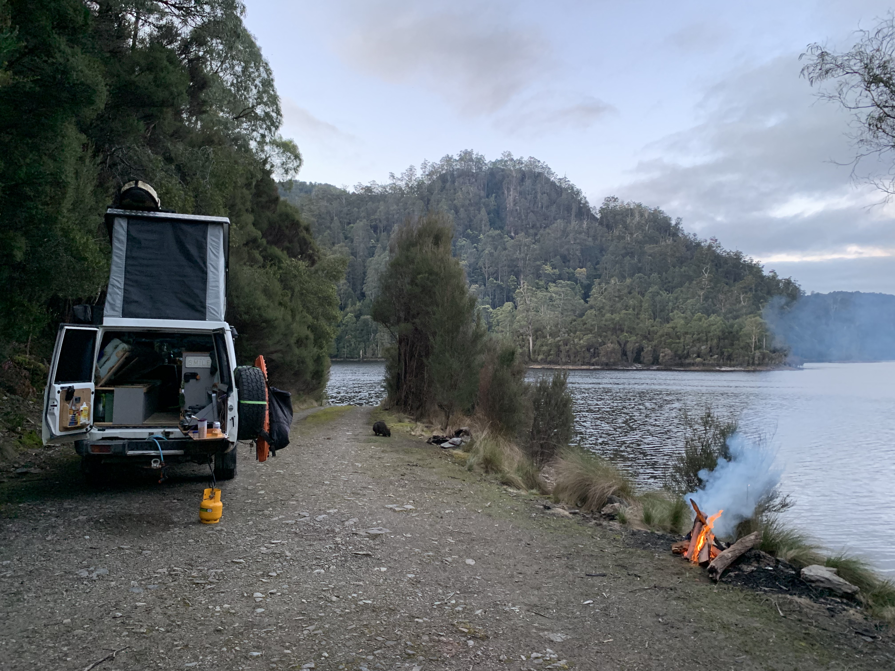
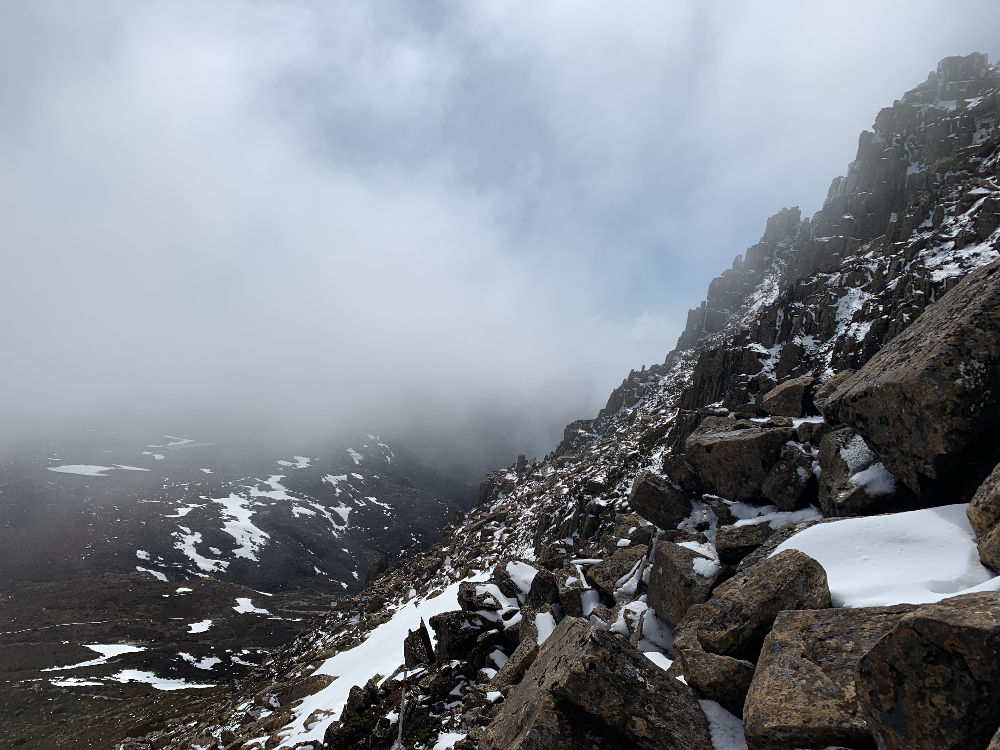

Tasmania has been on the list since we moved to Australia. It just looks so different to the rest of Australia and it absolutely was an amazing destination to travel to.

Tassie has a lot to offer; from white beaches, to snowy peaks and wild rain forests. Here is what you should not miss:

## Getting there

If your planning a road trip (especially camping) and live in Australia you will probably want to take the ferry from Melbourne to Devonport. [The Spirit of Tasmania](https://www.spiritoftasmania.com.au/) takes roughly 10 hours and offers a night- and a daytime trip. They have cabins, a restaurants, two cinemas and a whole bunch of other stuff to keep you busy. [Our troopy](2019-7-17-troopy-the-ultimate-overland-vehicle) with the pop top and roof rack exceeds 2.1m in height, but you can just book a higher spot accordingly. You can of course fly in two one of Tassies airports and rent a car/camper.

## The east

The east coast looks a bit like New South Wales with white beaches, clear blue water and - at least when we were there - good weather.

Waterhouse Coservation Area: nice camp spots, just check the wind forecast

<iframe src="https://www.google.com/maps/embed?pb=!1m18!1m12!1m3!1d33614.46218532205!2d147.64773671198648!3d-40.815422956312545!2m3!1f0!2f0!3f0!3m2!1i1024!2i768!4f13.1!3m3!1m2!1s0xaa79d0ca84054d63%3A0xf03c94eb451cf90!2sWaterhouse%20Conservation%20Area!5e0!3m2!1sen!2sau!4v1570581309711!5m2!1sen!2sau" width="380" height="300" frameborder="0" style="border:0;" allowfullscreen=""></iframe>

Police man point is a great campground, quite small but right at a beautiful beach.

<iframe src="https://www.google.com/maps/embed?pb=!1m18!1m12!1m3!1d3008.287508007108!2d148.2913561157585!3d-41.06270767929538!2m3!1f0!2f0!3f0!3m2!1i1024!2i768!4f13.1!3m3!1m2!1s0xaa770f4bd0e7cb6b%3A0xc3b948b3c9782854!2sPoliceman%E2%80%99s%20Point%20Campsite!5e0!3m2!1sen!2sau!4v1570582029830!5m2!1sen!2sau" width="400" height="300" frameborder="0" style="border:0;" allowfullscreen=""></iframe>

Bay of Fires, obviously is a hot spot with white beaches and the big red rock formations.

Great campground: Scamander Forest Reserve at a quiet river - a few 4x4 tracks close by.

<iframe src="https://www.google.com/maps/embed?pb=!1m18!1m12!1m3!1d3534.486553844313!2d148.2224527727233!3d-41.43459631206711!2m3!1f0!2f0!3f0!3m2!1i1024!2i768!4f13.1!3m3!1m2!1s0x0%3A0x0!2zNDHCsDI2JzA1LjgiUyAxNDjCsDEzJzI5LjkiRQ!5e1!3m2!1sen!2sau!4v1570582794032!5m2!1sen!2sau" width="400" height="300" frameborder="0" style="border:0;" allowfullscreen=""></iframe>

One of my highlights was [Ben Lomond National Park](https://en.wikipedia.org/wiki/Ben_Lomond_(Tasmania)). It's a long and empty ride and certainly not as busy as the Bay of Fires. It is a mountain plateau withing a skiing resort on top. The best part really is the Jacobs Ladder, a switchback dirt road up the mountain.

Beautiful campsite on the beach, north of [Freycinet National Park](https://www.discovertasmania.com.au/about/national-parks-and-wilderness/freycinet-national-park-wineglass-bay) with the Wineglass and Isthmus track.

<iframe src="https://www.google.com/maps/embed?pb=!1m18!1m12!1m3!1d56574.91206981976!2d148.2229126545929!3d-42.00833792816911!2m3!1f0!2f0!3f0!3m2!1i1024!2i768!4f13.1!3m3!1m2!1s0xaa716445ddbf5c8d%3A0x7bd30fa46b51ceef!2sFriendly%20Beaches%20camping%20area%20(bush%20camping)!5e1!3m2!1sen!2sau!4v1570583366191!5m2!1sen!2sau" width="400" height="300" frameborder="0" style="border:0;" allowfullscreen=""></iframe>

[Tessellated Pavement](https://en.wikipedia.org/wiki/Tessellated_pavement#Tessellated_Pavement,_Eaglehawk_Neck,_Tasmania) was worth a stop on our way down to [Port Arthur](https://portarthur.org.au/). It's really quite interesting and you can easily spend two days here - and you probably should for the 40$ entrance fee.

Great campground at Fortescue Bay - it's a gravel road and you don't need 4x4. It also is the trail head for the [Cape Huay trail](https://www.parks.tas.gov.au/?base=1533)

<iframe src="https://www.google.com/maps/embed?pb=!1m18!1m12!1m3!1d3472.145741108904!2d147.96112731581286!3d-43.14350297914217!2m3!1f0!2f0!3f0!3m2!1i1024!2i768!4f13.1!3m3!1m2!1s0xaa6da4927c07ca25%3A0x8eb6f0828a67fc31!2sFortescue%20Bay%20Camping%20Ground%2C%20Tasman%20National%20Park.!5e1!3m2!1sen!2sau!4v1570583970819!5m2!1sen!2sau" width="400" height="300" frameborder="0" style="border:0;" allowfullscreen=""></iframe>

## The West

[Cockle Creek](https://www.discovertasmania.com.au/about/regions-of-tasmania/hobart-and-south/cockle-creek) is a nice remote spot to stay, just don't camp all the way through - it might be a bit busy.

Beautiful campsite at [Mount Field](https://goo.gl/maps/mtCVpDBBEEubr3rXA) just north of Hobart with good facilities. Really nice hike through the snow.

Camp at [Lake Binney](https://goo.gl/maps/dZLAGc6zpAeoyvYq9). Very nice, quiet and free.

Visit [Lake St. Clair](https://www.discovertasmania.com.au/attraction/lakestclaircradlemtlakest) and hike up to mount Rufus, quite some snow patches and the weather changes quickly, so make sure to have proper gear (in winter)

Camp at Lake Burbury close to Queenstown - absolutely empty lakeside spot with no facilities but really nice.

<iframe src="https://www.google.com/maps/embed?pb=!1m18!1m12!1m3!1d2961.6715076155742!2d145.643996!3d-42.07166!2m3!1f0!2f0!3f0!3m2!1i1024!2i768!4f13.1!3m3!1m2!1s0x0%3A0x0!2zNDLCsDA0JzE4LjAiUyAxNDXCsDM4JzM4LjQiRQ!5e0!3m2!1sen!2sau!4v1570585138582!5m2!1sen!2sau" width="400" height="300" frameborder="0" style="border:0;" allowfullscreen=""></iframe>

[Bird river track](https://www.parks.tas.gov.au/index.aspx?base=2606) was an amazing drive, I felt like you don't actually need a 4x4 but it is very narrow and falling trees can limit height of the track.

[Montezuma Falls](https://goo.gl/maps/9j98mhjVbhZX88Rs9); you can access it through the town down a little hiking track or take a 4x4 track in. The track is rated medium, but if it's been raining it can actually be quite challenging at times. It takes 2 hours one way and you will need to go back the same way. There is a track forking back to the main road but it's rated difficult with deep holes and river crossings impassible in heavy rain.

[Lake Mackintosh](https://goo.gl/maps/PkPfq2PaLnNmne18A) has beautiful campsites right at the lake.

Cradle Mountain has to be on your list with breathtaking panoramas and a whole bunch of great hikes. I started from [Dove Lake](https://en.wikipedia.org/wiki/Dove_Lake_(Tasmania)), took the alternative route (steeper but faster) up to Marions Lookout and then climbed up Cradle Mountain. The last bit was pretty steep and you will need to climb - I actually couldn't make it all the way up because of deep snow fields on a steep slope section. I descended back down via the face track along the lake. It took me about 4-5 hours including two short breaks.

A good spot before heading back on the ferry in the morning, is the [Forth Valley Recreation Ground](https://goo.gl/maps/mjLk3yNSBSaWu4s66).

## Tips for your trip

1. get the [Holiday National Park Pass](https://www.parks.tas.gov.au/?base=914). A single pass is 24 and the holiday one 60, so it's cheaper once you visit three parks.
2. In September a few campgrounds where still closed, so you might want to call ahead of arrival.
3. We used [Wikicamps](https://www.wikicamps.com.au/) (Campsites etc.), [Maps.me](https://maps.me/) (tracks and trails, good offline capability), Google Maps (really good to just find stuff) and [Waze](https://www.waze.com/) (for traffic, speeding cameras etc.) - all have their own purpose - someone should really build a map to rule them all!
4. I only noticed this a few days / national parks into the trip, but you are not allowed to fly drones in national parks in Tassie.
5. Bring clothing for any situation, weather changes quickly down here.

## When to go

We did the trip around end of September and it was still a bit cold but nice and empty wherever we camped. No mozzies too.