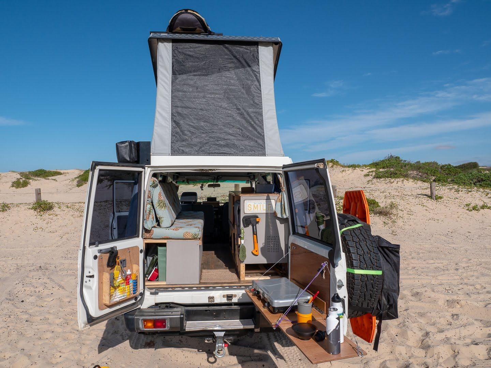
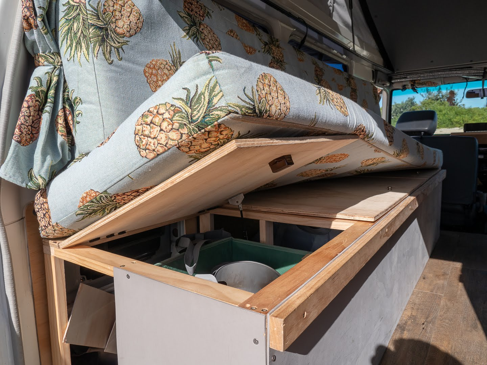
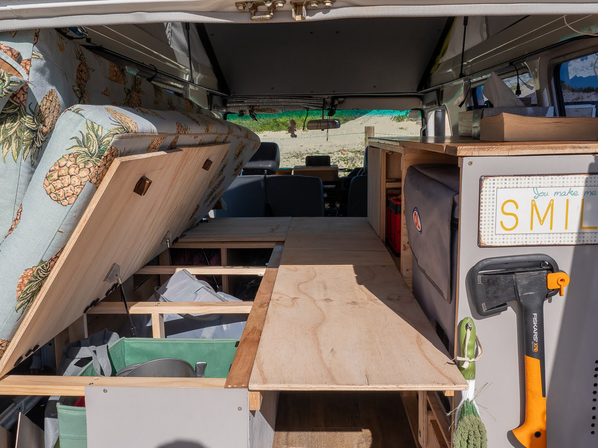
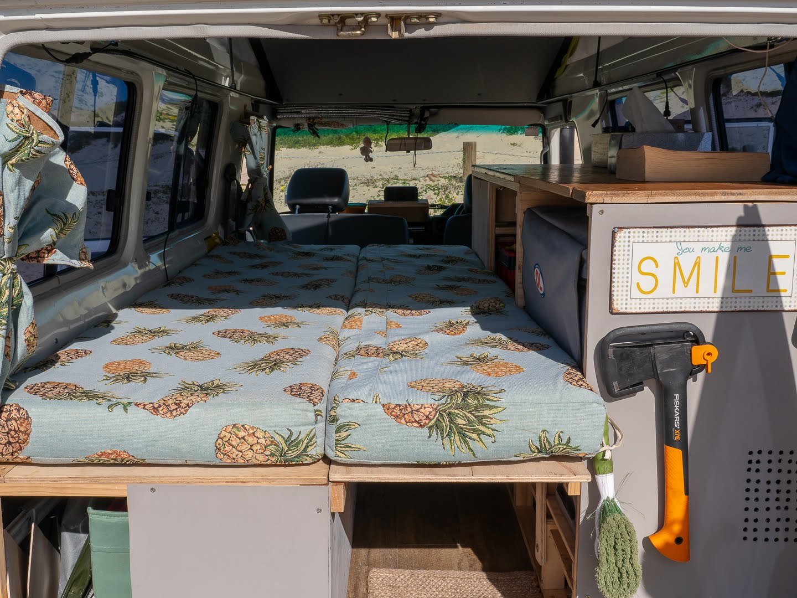
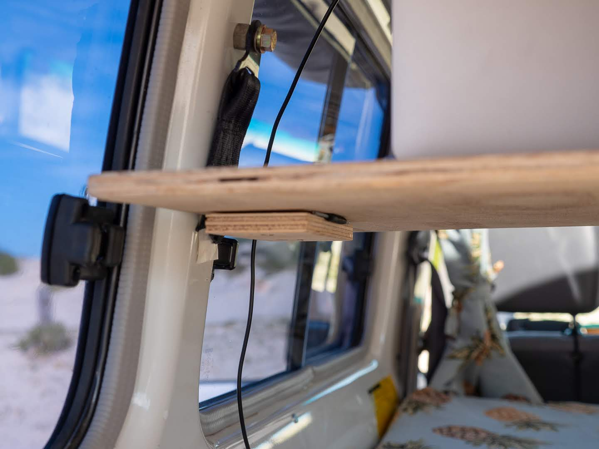
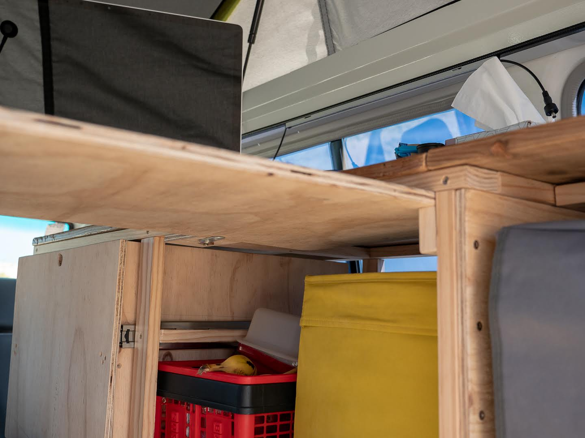

In between our [storage box](2019-7-30-troopy-fitout-storage-box-bench-bed-all-in-one) and [kitchen](2019-7-31-troopy-fitout-kitchen-slideout-fridge-and-drawers) fits a bed that can be converted into a desk.<!-- end -->

---

Before you start with this, think about how you want to fill the complete inside; **how wide do you want your bed to be? what height will allow you to still sit down and store enough?**

We have a poptop, so the height is adjusted to this and we wanted our fridge accessible from the backdoor. Additionally our bed is only for emergency as we use our poptop whenever we can, meaning we can live with a width of roughly 90cm.

See how we built the [kitchen](2019-7-31-troopy-fitout-kitchen-slideout-fridge-and-drawers and [box](2019-7-30-troopy-fitout-storage-box-bench-bed-all-in-one) in our other posts.

## Steps

#### Step 1; measure and prepare

> Take good measurements and draw up a rough set.
> We attached the side panels to the box and kitchen first before completing the bed.

#### Step 2; side frames

> The side frames will hold the bed so they need to cover the complete length.
> Attach them to box and kitchen.

#### Step 3; bed

> The bed is really simple, just cut two pieces of ply, that fit in between box and kitchen (one of them longer than the other will allow you to also use it as a table).
> We store the ply on the floor when we don't use the bed.

#### Step 4; desk

> The longer bed piece can slide under the kitchen frame.
> On the other side we used a piece of old seatbelt and attached it to the C-column with a bolt (a thread here already existed for the backseats)
> the seatbelt is fixed under the ply so it holds up the table.

---

## Shopping List

1. **Timber framing**: the complete frame of the kitchen - all vertical and horizontal (12x9xxx will do)
2. **Floors**: 12mm ply.
3. **Seatbelt, cable**: simple butt hinges

## Measurements (in cm)

> **Aisle**: L200 x W40 x H40

> **Bed floor 1**: L110 x W40

> **Bed floor 2**: L90 x W40

> **Frame**: W4 x H1.9

---

## Tools needed

* Jigsaw / Circular saw
* Drill
* Ruler & Pencil
