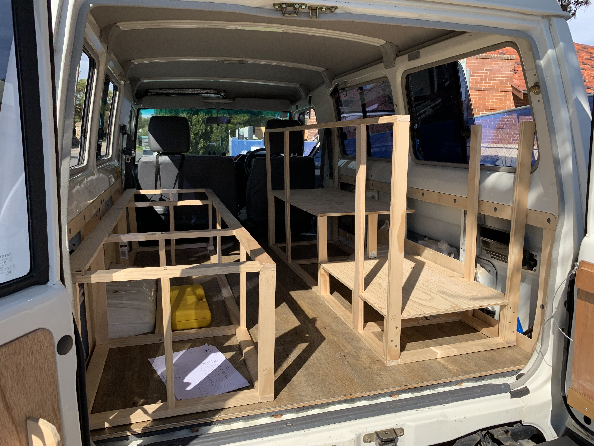

More storage and a nice kitchen-top is what we built next to [our storage box](2019-7-30-troopy-fitout-storage-box-bench-bed-all-in-one). It might look a bit more complicated but it's really easy once you've thought it through.<!-- end -->

---

Before you start with this, think about how you want to fill the complete inside; **how wide do you want your bed to be? what height will allow you to still sit down and store enough?**

We have a poptop, so the height is adjusted to this and we wanted our fridge accessible from the backdoor. Additionally our bed is only for emergency use as we sleep in our poptop whenever we can, meaning we can live with a width of roughly 90cm.

See how we built the [bed](2019-8-01-troopy-fitout-a-convertible-bed-and-desk) and [box](2019-7-30-troopy-fitout-storage-box-bench-bed-all-in-one) in our other posts.

Our main constraint building the kitchen was the size of our fridge.

## Steps

#### Step 1; Measure and Prepare

> Take good measurements and draw up a rough set up of the floor.
> Cut the timber frames into measured length.
> Lay it out on the floor to ensure it all fits. We have a few extra floors in here, so think about where you place the vertical frames. We needed one above the wheel arches to fit the fridge.

#### Step 2; Framing

> Fix the floor frame pieces together using screws directly or angles. In case you use screws directly make sure to pre drill holes so the timber doesn't split.
> Next, go vertical. Depending on the amount of floors you have, build it nice and sturdy, so that vertical pieces are attached to each other.

#### Step 3; Fridge

> We placed a floor over the wheel arches, to fit in our fridge.
> Use some drawer slides and a second floor to allow easy access to the fridge.
> Underneath the floor is a nice little compartment. Our Coleman stove fits in perfectly.
> Place this whole frame in the Troopy once in a while to make sure it actually fits.
> Take some of the remaining ply, a few washers and a long screw to secure the fridge while driving.

#### Step 4; Shelf floor

> Optimise storage and pull in another floor as a shelf.
> Height really depends on what you plan to store.
> One side of this will be open, so we can store bulky items.

#### Step 5; Drawer

> We thought a drawer would be handy for the other side of the shelf.
> It's not that easy to make it fit as timber frames and ply tends to bend slightly, so measure often.
> A drawer is just a box with drawer slides attached to the sides, so you'll need some timber frame to attach them to and some angles to build the box.

#### Step 6; Kitchen top

> No kitchen without a kitchen-top. We used some nice wood from an old chest, cut it to size and simply attached it to the frame.
> The part on the fridge side uses hinges - [like we did with the storage box](2019-7-30-troopy-fitout-storage-box-bench-bed-all-in-one) - so you can open the fridge without problems.

#### Step 7; Panels

> it all looks fancier with some painted 9mm ply panels + you can attach tools and have extra storage.

#### Step 8; Fix it to the floor

> if you built your floor on a piece of ply, [like we did](https://roadvagabonds.com/2019-7-17-how-to-put-a-floor-into-a-troopy) then you can just fix your frame to the floor.  
---

## Shopping List

1. **Timber framing**: the complete frame of the kitchen - all vertical and horizontal (H1.9xW4cm will do)
2. **Floors**: 12mm ply.
3. **Hinges**: simple butt hinges
4. **Angles**: these keep your drawer box together
5. **Screws**: depending on whether you use angles or longer screws directly
6. **Drawer slides**: we used [these](https://www.bunnings.com.au/goliath-slimline-drawer-slide-pair_p0043590) just check the width of the kitchen and the length it can travel
7. **Kitchen top**: Get creative or just buy one at Bunnings
8. **Side panels**: 9mm ply for all three sides of the Kitchen
9. **Paint**: yeah paint.

## Measurements (in cm)

> **Kitchen**: L180 x W50 x H80

> **Fridge floor**: H16 x L69

> **Fridge floor slide**: H20 x L69

> **Shelf floor**: H40 x L111

> **Drawer**: H36 x W45 x L47

---

## Tools needed

* Jigsaw / Circular saw
* Drill
* Ruler & Pencil
