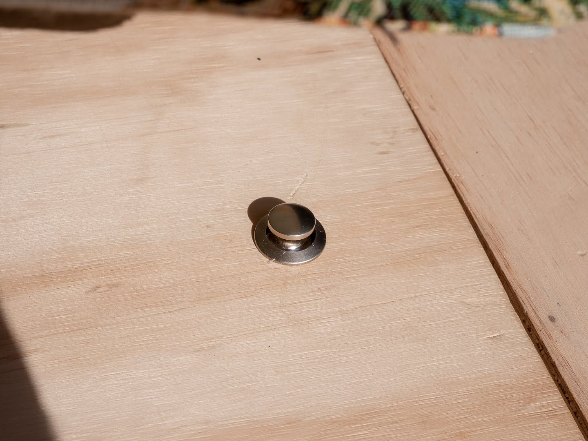

After [completing the floor](https://roadvagabonds.com/2019-7-20-diy-how-to-build-a-foldable-backdoor-table), we built a nice little living room starting with storage boxes.<!-- end --> You don't need to be a carpenter to get this done.

---

Before you start with this, think about how you want to fill the whole inside; **how wide do you want your bed to be? what height will allow you to still sit down and store enough? what else do you need to fit inside that has an impact on size (a fridge)?**

We have a poptop, so the height is adjusted to this and we wanted our fridge accessible from the backdoor. Additionally our bed is only for emergency as we use our poptop whenever we can - we can therefore live with a width of roughly 90cm.

See how we built the [bed](2019-8-01-troopy-fitout-a-convertible-bed-and-desk) and [kitchen](2019-7-31-troopy-fitout-kitchen-slideout-fridge-and-drawers) in our other posts.

## Steps

#### Step 1; Preparation

> Take good measurements and draw up a rough set-up of the floor.

#### Step 2; Framing

> Cut the timber frames into length.
> Lay it out on the floor to ensure it all fits. We opted for three compartments.

#### Step 3; The Box

> Fix the floor frame pieces together using screws directly or angles. In case you use screws directly make sure to pre drill holes so the frame doesn't split.
> Next, go vertical and make sure you have enough of these pieces distributed so the storage doesn't bend when you sit on it.
> On top goes another horizontal layer of framing.
> Make sure to place this whole frame in the troopy once in a while to make sure it actually fits.

#### Step 4; Lid & hinges

> The lid is made up of two pieces for every compartment, we used 12mm ply for back and front.
> Cut out the backpiece and frontpiece.
> Fix backpiece to frame and connect frontpiece using a hinge. Ensure you have short screws, so they don't pop out on the other side.

#### Step 5; Gas struts - the game changer (optional)

> If you have cushions on top it's going to be really heavy to keep the lid open while searching for stuff. Use short, 10kg struts and fix them to lid and the vertical frame (per compartment).
> You will need some mechanism to keep the lid closed. We found some catch locks on eBay. Measure often and possibly even try it out somewhere - it took me 5 tries to get the first one right.

#### Step 6; Beautify

> To make it not look like a box, we added some side panels using 9mm ply and painted them. We left some space on the side to reach into the Troopy side panels.

#### Step 7; Fix it to the floor

> if you built your floor on a piece of ply, [like we did](https://roadvagabonds.com/2019-7-17-how-to-put-a-floor-into-a-troopy) then you can just fix your frame to the floor.  

---

## Shopping List & measurements (in cm)

1. **Timber framing**: the complete frame of the box - all vertical and horizontal (H1.9xW4cm will do)
2. **Lid**: 12mm ply cut to the  lid and the piece holding the lid
3. **Hinges**: simple butt hinges
4. **Screws**: depending on whether you use angles or longer screws directly
5. **Gas struts**: we used [the short 10N / 10kg version](https://www.bunnings.com.au/goliath-195mm-100n-black-gas-strut_p4230023) - Bunnings also sells [the brackets](https://www.bunnings.com.au/goliath-20-x-25mm-stainless-steel-gas-strut-bracket-with-ball-stud_p4230027)
6. **Catch lock door push buttons**: [these are really cheap but do the job](https://www.ebay.com.au/itm/5pcs-Push-Button-Drawer-Cupboard-Door-Catch-Lock-Caravan-Motorhome-Cabinet-Knob/292705095588?ssPageName=STRK%3AMEBIDX%3AIT&_trksid=p2057872.m2749.l2649)
7. **Side panels**: 9mm ply for all three sides of the box.
8. **Paint**: yeah paint.

The measurements for the complete box are:
> L200 x W53 x H40

---

## Tools needed

* Jigsaw / Circular saw
* Drill
* Ruler & Pencil
