Mocking around with jerrycans for too long, spilling them, taking up space inside etc. we decided to get a water tank that fits underneath our 78 series.<!-- end -->

---

[Thorburns](http://www.thorburns.com.au/product/45l-water-tank-for-all-toyota-troopcarriers/) are located here in Sydney and offer an easy to fit 45L tank. They conveniently supply a pump so you can wire it up, you will need to think through how to plumb it up and what your requirements are. We chose a flexible set up where we can fill the tank from a hose, gravity feed it but also pump water out of a jerry can.

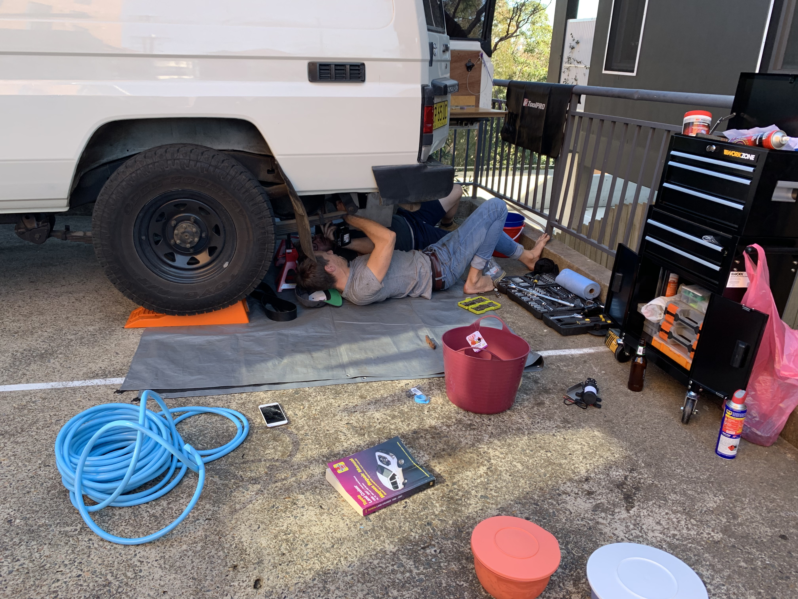

## Steps

#### Step 1; Fit the extension brackets

1. these go underneath the existing fuel tank bolts. They are long enough so will fit easily.
2. Do one at a time, so your fuel tank won't come crashing down, we supported the tanks with jackstands just to make sure.

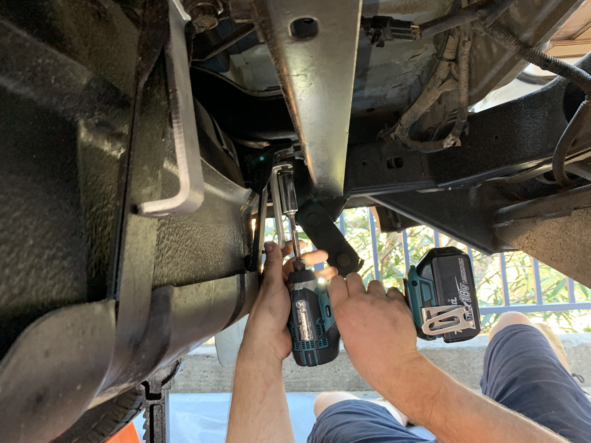

#### Step 2; Cover tank with foam

1. this will prevent the tank from rubbing against the steel chassis frame, we used the remaining formshield [from our floor](2019-7-17-how-to-put-a-floor-into-a-troopy)
2. Just stick a bit on the top and side using double sided tape

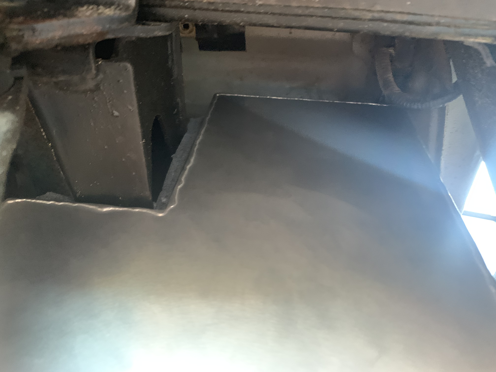

#### Step 3; Mount the tank brackets

1. Next mount he bracket to the extension, but don't tighten the bolts yet, just attach it loosely (I didn't attach the rear bar piece of the bracket at all).
2. Move the brackets to the sides a little bit so the tank will fit in.
3. Cut the rubber band in to the length required - it should cover the bracket between tank and bracket.
4. Place the rubber band on the bracket.

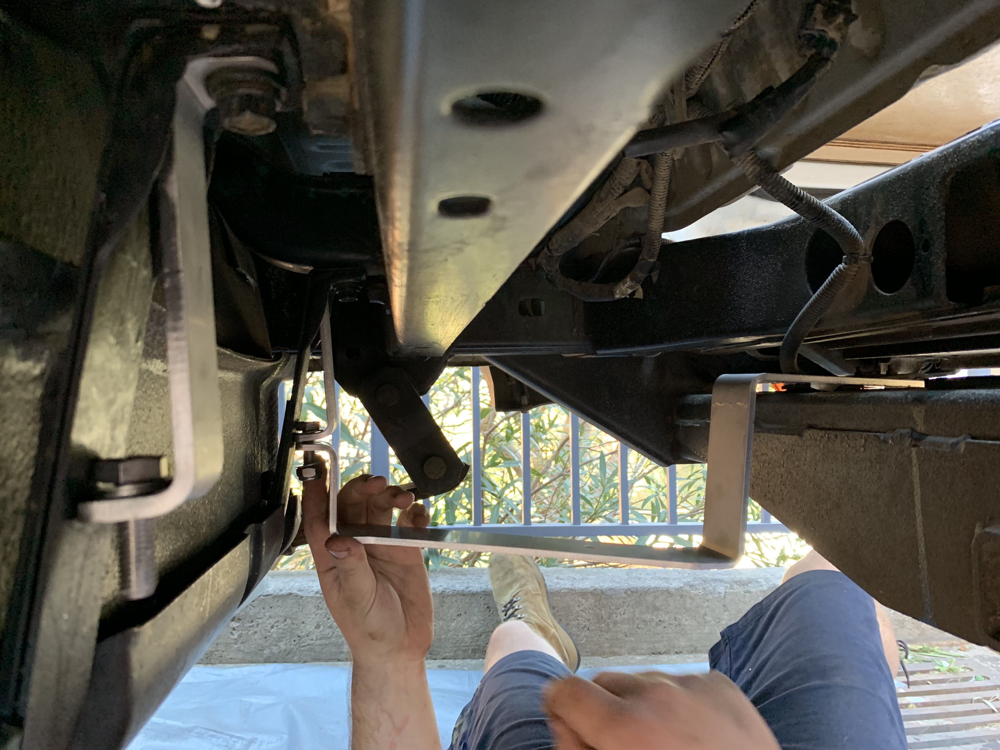

#### Step 4; install the tank

1. squeeze in the tank making sure you have enough room to fit the pump.
2. place it on the rubber band and fiddle the bracket underneath the tow bar.
3. bolt the brackets to the tow bar and the extension brackets.

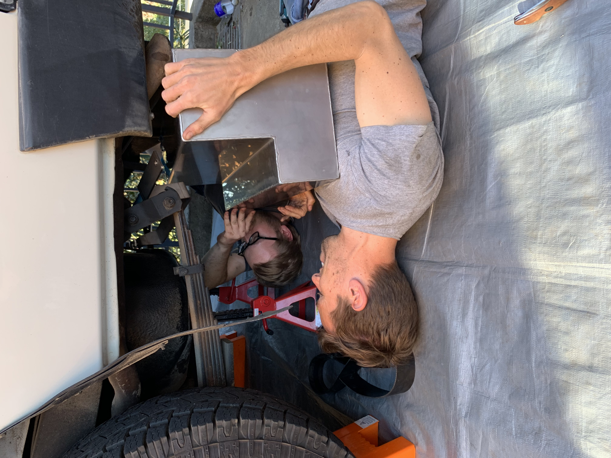

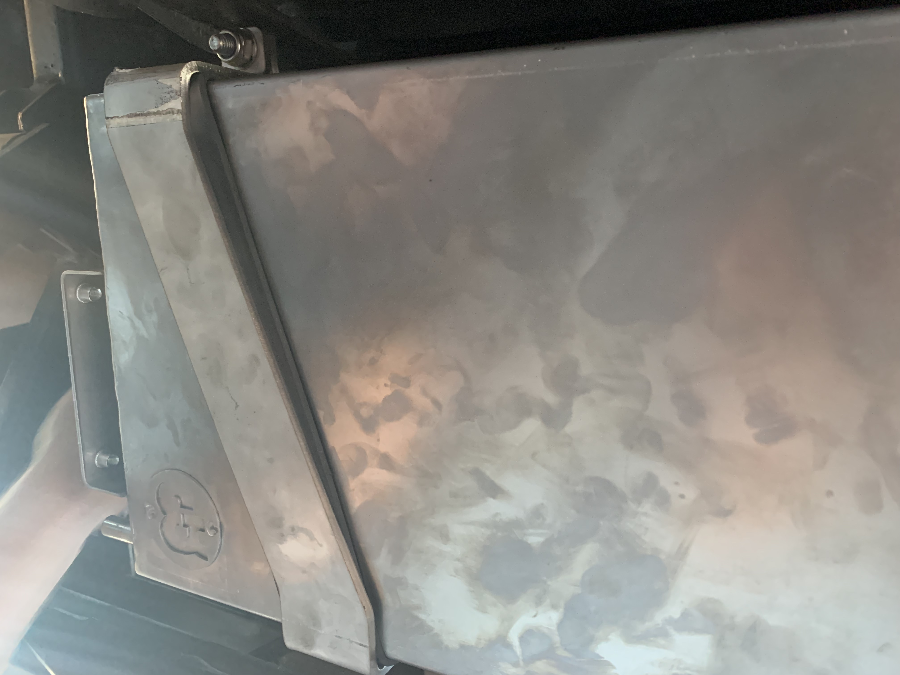

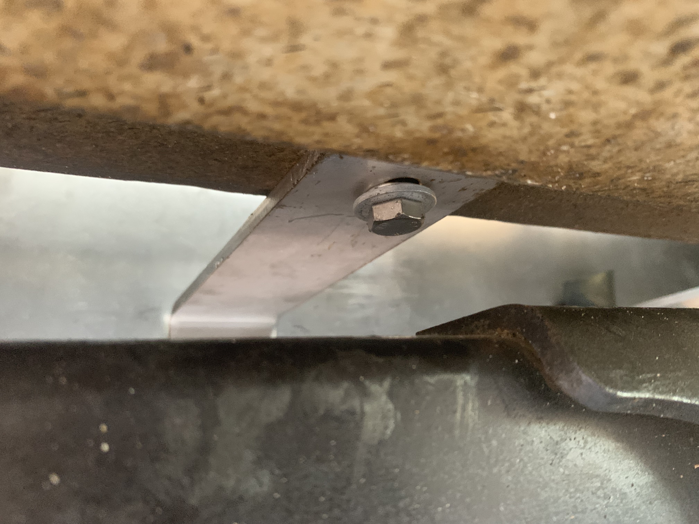

#### Step 5; Plumbing - attaching the pump

1. the pump comes with 4 bolts and a shield to protect it from rocks.
2. fix all of this to the side of the tank.
3. I've connected two short pieces of the 12mm hose directly to the pump and added two gardena hose connectors to it.

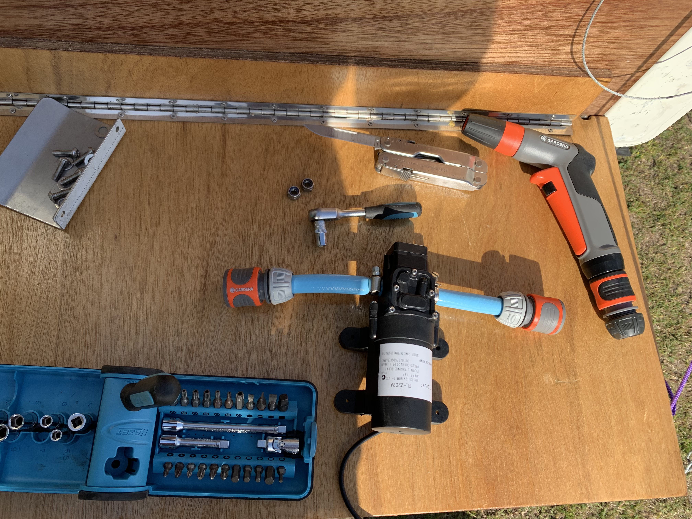

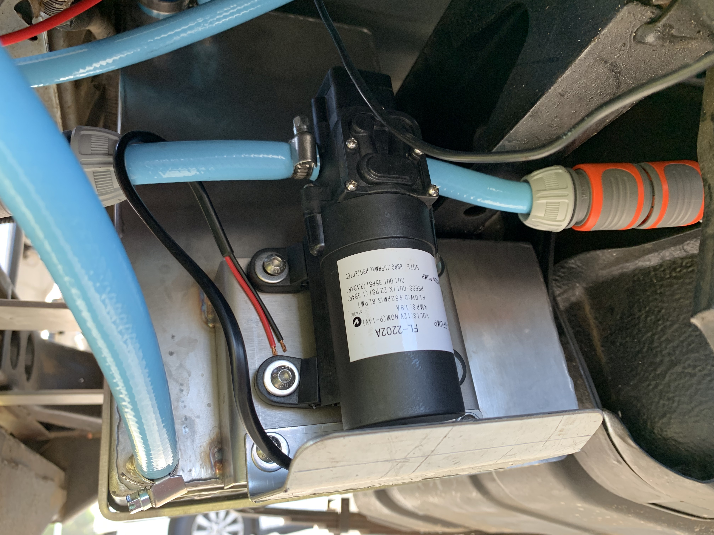

#### Step 6; Plumbing - filling mechanism

1. the inlet is roughly 25mm wide and i had to use two short pieces of tube to narrow it down to 12mm.
2. plug a 12mm piece on the breather and elevate it.
3. now the tank can be filled from a tap.
4. to switch it to pump filling, the incoming tube to the pump can be detached from the tank outlet (so it's not pumping out anymore).
5. this piece then goes into a jerrycan.
6. the outlet of the pump now get attached to the inlet ofn the tank (see diagram below).

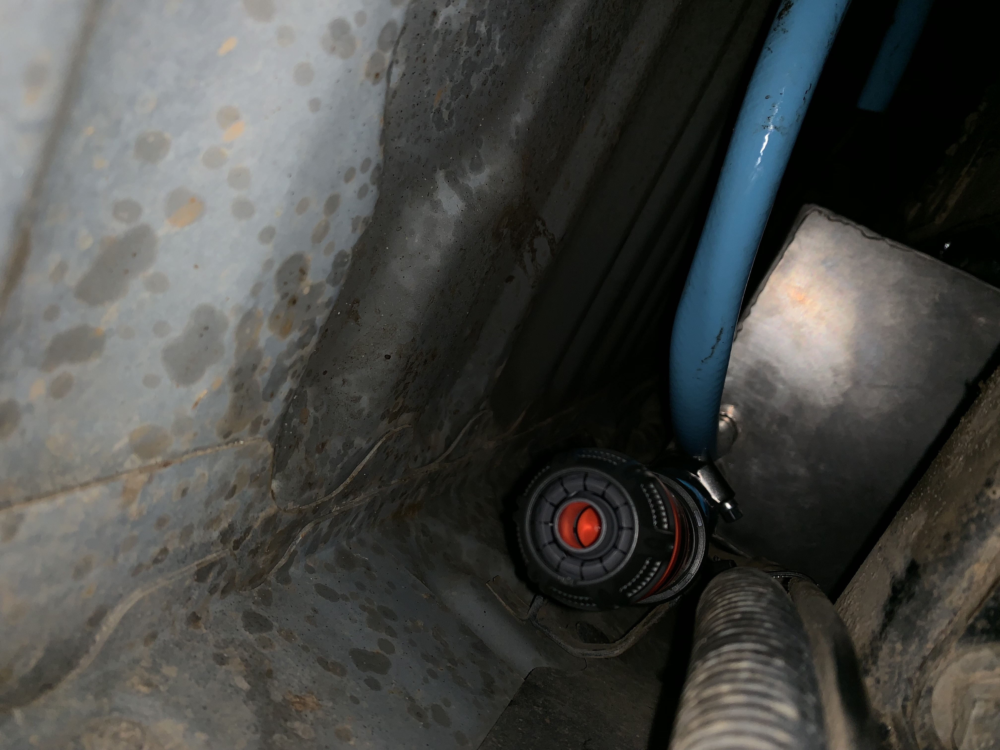

#### Step 7; Plumbing - shower / tap

1. The easiest way: connect a piece of 12mm hose to the thin outlet on the tank.
2. Plug it to the pump.
3. attach a longer hose with tap to the outlet of the pump and off you go.
4. I've done this flexibly, so the incoming hose to the pump dan be detached and used to fill water out of a jerry can (see image in Shopping List section).
5. Wire up the pump and connect to a switch.

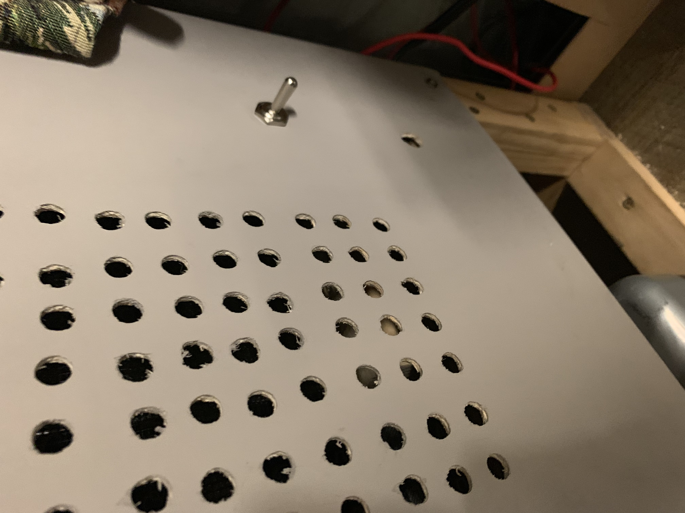

---

## Shopping List

**Thorburns 45L Water tank**: This comes with:

1. tank
2. water pump
3. tank brackets
4. bracket extensions
5. water pump mount bracket
6. bolts & washers
7. rubber band

**Plumbing**:

1. Water hose
2. Hose connectors (5-10)
3. Hose coupling (2-3)
4. Nozzle
5. Short 2.5mm tube to connect to tank
6. Hose clamp (5)
7. Flow reducing coupling (2.5mm to 12mm)

---

## Tools needed

* Wrench / Spanner
* Knife
