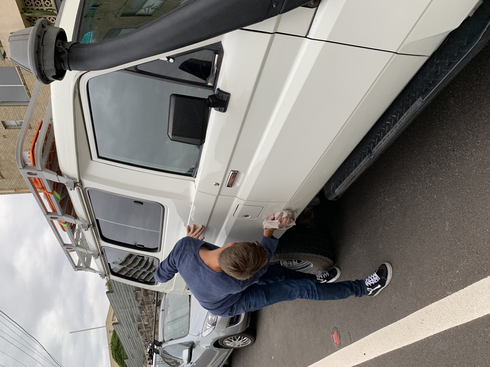
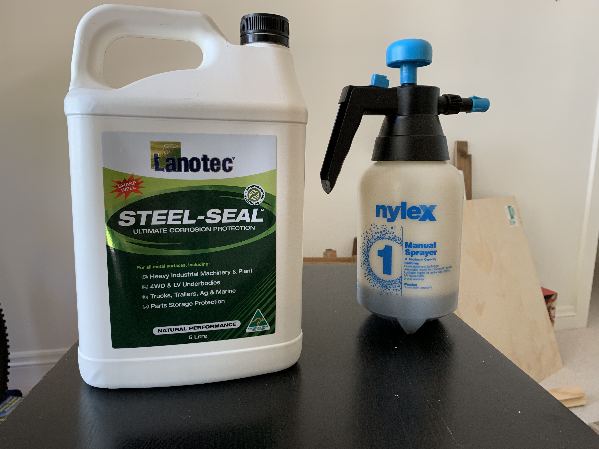
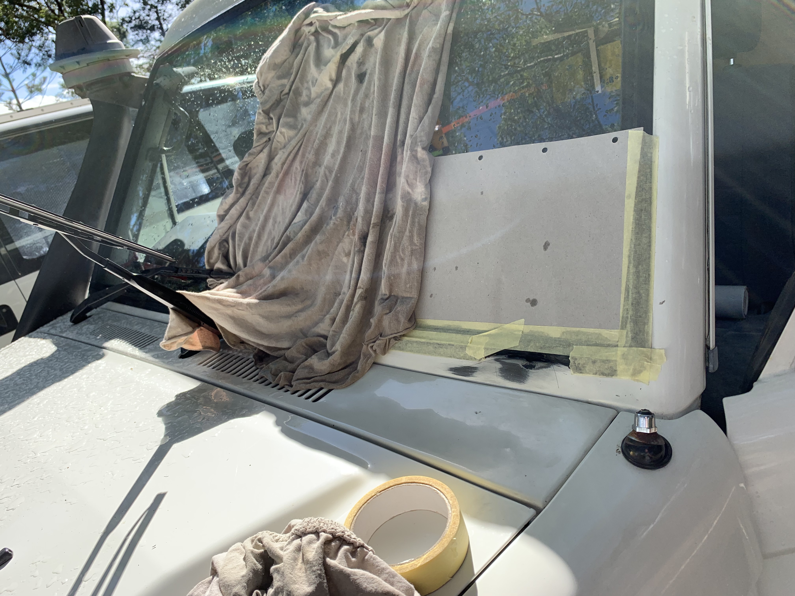

You put a lot of time and money into your Troopy and ideally you want to keep it and drive it for a while. Here is how we take care of rust, remove it and prevent it.<!-- end -->

---

## Procedures

#### Washing it frequently

> With the ocean right next door, there is a decent amount of salty air bringing salt and moisture to our chassis. We wash the Troopy at least once a month at a self service car wash - using just water.
> If we've been on the beach, I make sure to spend some extra time cleaning it underneath.

#### Waxing the surface

> This was recommended by a fellow Trooper, who uses Carnauba Wax to add an extra layer of protection. It also makes it nice and shiny (doesn't last long if you use the Troopy outside of the city)
> Initially we did this three times in a row to apply a sort of base coat and then switched to once a quarter

#### Underbody spray

> I heard about fish oil and lanolin many times and came across a guy who sprayed his troopy with lanolin sheep oil from underneath. I got myself a 5 liter canister of [Lanotec Steel-Seal](https://www.lanotec.com.au/product/steel-seal-australia/) and a pump-spray can from Bunnings. I first spray and then rub in the oily substance. According to Lanotec, this stuff is biodegradable and non harmful.
> I also do this once a quarter and can't wait for next time (doing this sucks big time but if it stops corrosion it might be worth it.)

#### Rust repair

> We try to fix everything as soon as possible so it can't spread far. There's some good guides from [SCA](https://www.supercheapauto.com.au/blog/buying-guides/paint-and-body-repair/rust-repair.html) out there.
> You pretty much brush down the rust, apply some sort of rust converter, use filler if it's something bigger, clean the surrounding paint, apply a base coat and spray with new paint.
> I'm certainly now expert on this and it doesn't always look pretty, but as long as it stops the rust it's a win.

---
