A simple step by step guide on how do complete the 10K service for your troopy by yourself. All you need is a couple of hours and everything that is described below.<!-- end -->

---

## Information

#### Parts
Part numbers [on Toyotas official site](https://toyota-general.epc-data.com/land_cruiser/hzj78r) - you'll need your frame number which is in under the bonnet. With these part numbers you can usually identify parts off eBay.

The larger suppliers such as [Ryco](https://www.rycofilters.com.au/catalogue/part/index/part/R2590P) and [Supercheap Auto](https://www.supercheapauto.com.au/on/demandware.store/Sites-supercheap-au-Site/en_AU/PartsGuide-Show) have their own search function.

#### Howto
[Haynes Repair Manual](https://haynes.com/en-au/?gclid=CjwKCAjwnrjrBRAMEiwAXsCc47oMuHCpeA_5dUR3gQjbsEzXWZDWXJcab6SWWFhHzhw615DvOutdlBoCeRcQAvD_BwE) is a great overview including troubleshooting and service - it explains in good detail what needs to be done.

Toyota Owners Manual, this ideally is in your car and will explain what oil, grease etc, you need and comes with the service interval as well.

[Youtube](https://www.youtube.com/watch?v=komGJ7Sirbs) - good rundown of what needs to be done.

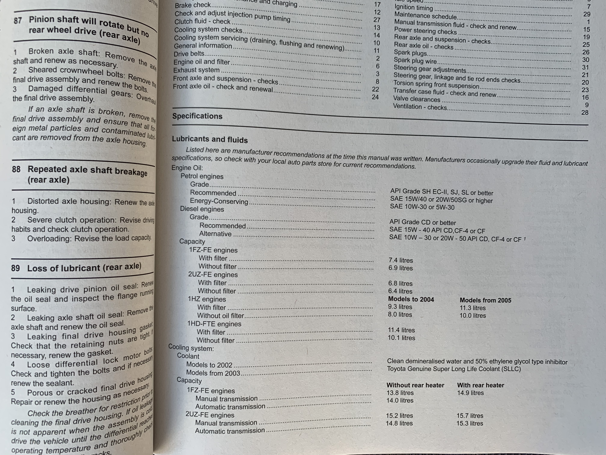

---

## Steps

#### Step 1; remove old oil

1. let the engine run for little bit - warm oil flows better.
2. drive it onto a tarp so you don't mess up the floor/street.
3. open the filler cap - where you'll fill in oil.
4. get a bucket big enough to hold all the oil (see above for amount of fluid).
5. loosen the bolt and unscrew it by hand, hold the bucket close once it pours out.
6. let the oil run out.

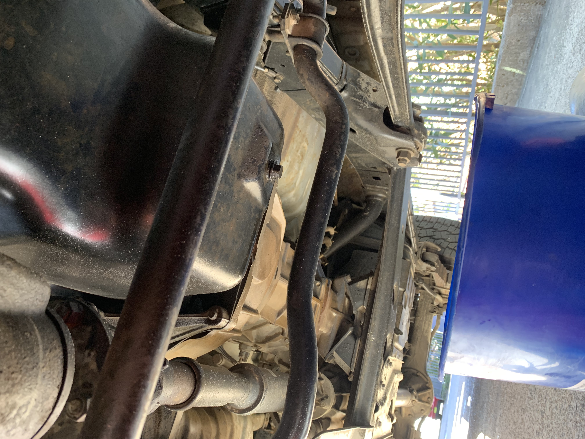

#### Step 2; change oil filter

1. this can be hard to get off so you might need a tool [like this](https://www.supercheapauto.com.au/p/toledo-toledo-oil-filter-remover---nylon-strap/540778.html#q=oil%2Bfilter%2Bremoval&lang=en_AU&start=1).
2. get a cloth underneath and unscrew slowly.
3. make sure to turn it downside up first before lifting it out - this will spill less.
4. take it out trying to catch as much as you can.
5. apply some oil on the rubber seals of the new filter, to get it off easier next time.
6. screw on the new filter hand-tight and then another 3/4.

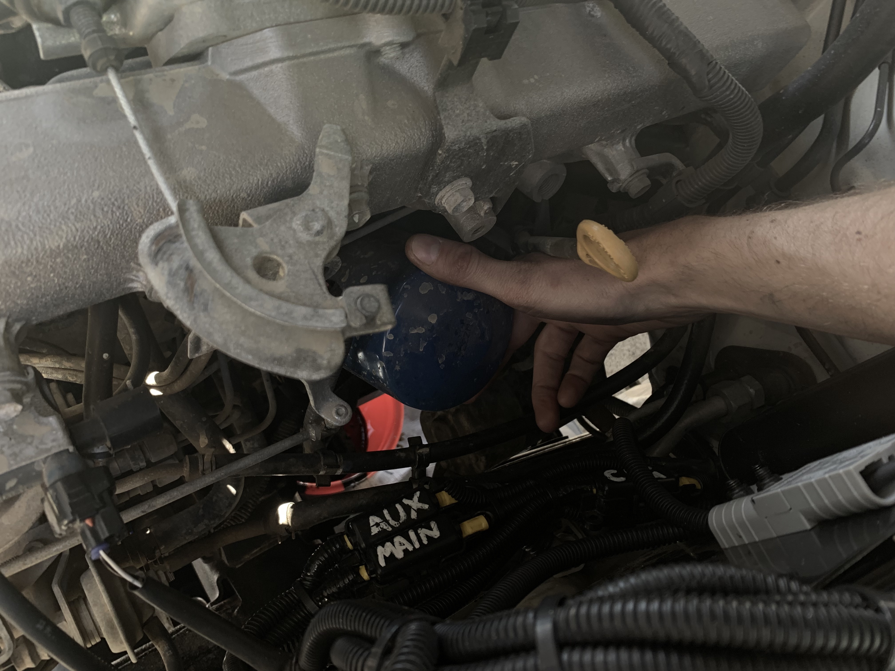

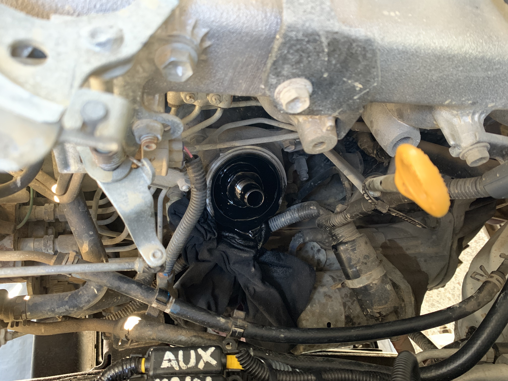

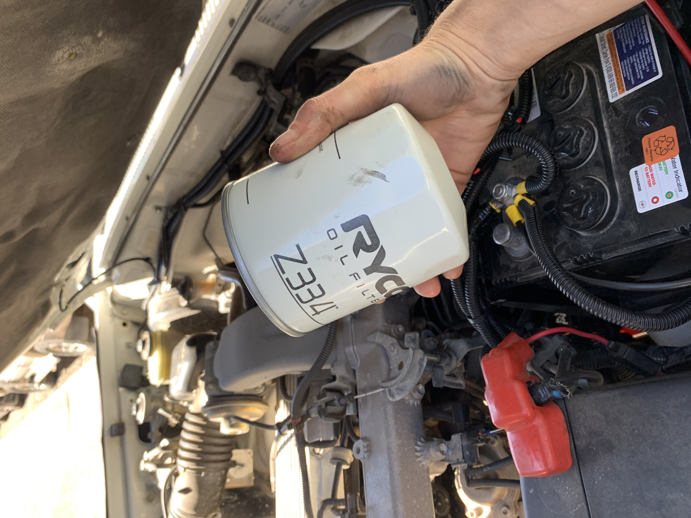

#### Step 3; change fuel filter

1. this can be even harder than the oil filter - you probably need a [filter removal tool](https://www.supercheapauto.com.au/p/toledo-toledo-oil-filter-remover---nylon-strap/540778.html#q=oil%2Bfilter%2Bremoval&lang=en_AU&start=1) now.
2. undo the sensor cable first
3. unscrew the plastic cap underneath the filter first - this works best with a multi grip plier.
4. unscrew the fuel filter and take it out, place a cloth underneath to catch the diesel.
5. replace it with the new filter (oil the seals), tighten it and attach the sensor cable.
6. unscrew the second fuel filter, this is a cartridge with a filter - you just replace the filter.
7. there's a nut underneath you loosen, replace the filter and screw it back on.
8. now you need to get the air out of the filters to fill it with diesel.
9. pump the little black rubber knob until you can't press it down anymore.

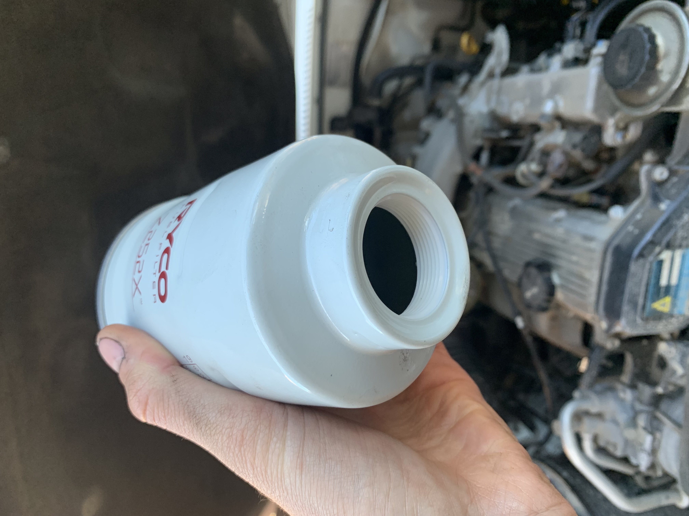

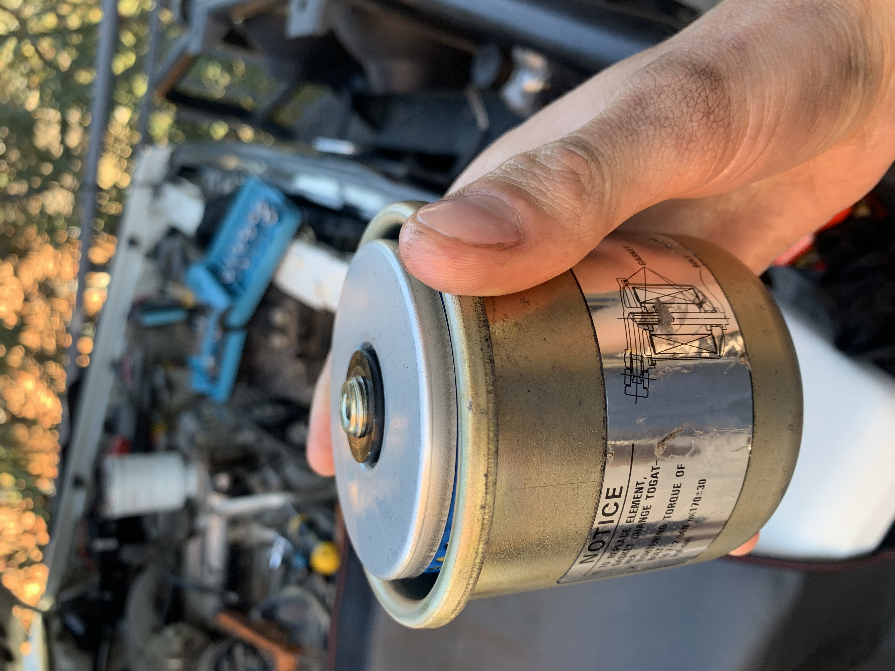

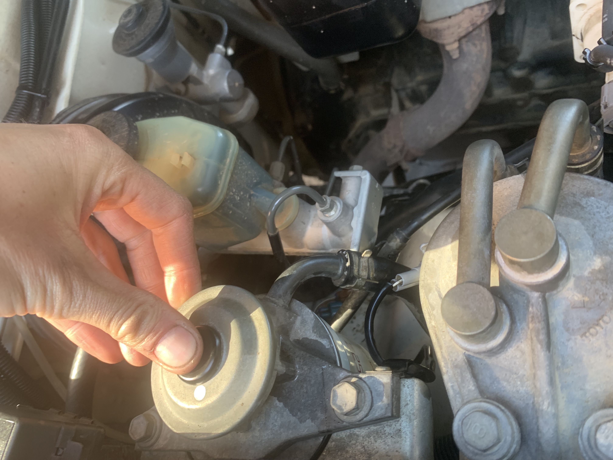

#### Step 4; refill with new oil

1. by now, all oil should be gone. Some people pour in a little sip of fresh oil to wash out the old.
2. screw the bolt underneath back in.
3. slowly pour in the new oil checking the dip stick as you go.
4. the filter will require some additional oil so fill it just over the high mark.
5. let it sit for a bit and see how full it is.
6. close the cap.
7. once you start the engine the filter will get filled and the level therefore drop.

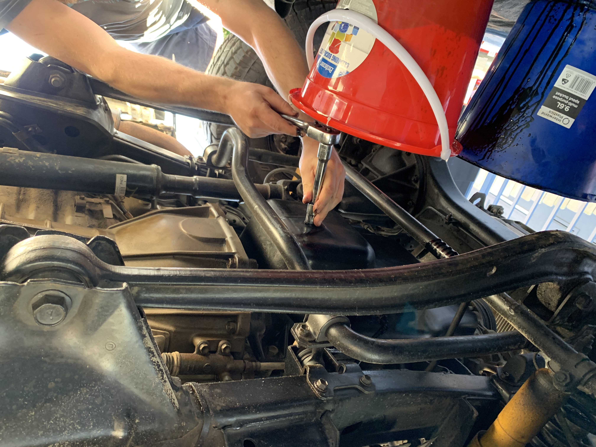

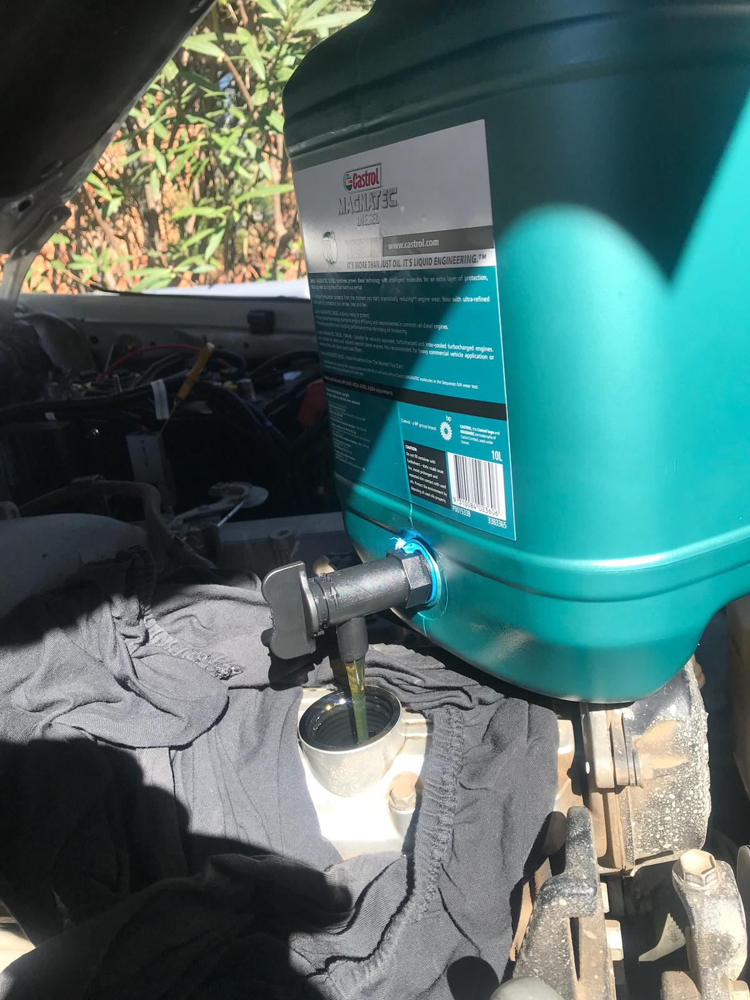

#### Step 5; Lubricate steering knuckle

1. there are a bunch of nipples, clean them, plug your grease gun and pump until the old grease comes out.

#### Step 6; Tighten propeller shaft bolts and lubricate propeller shaft

1. each joint (3 total) comes with 4 bolts. Just tighten them.
2. each joint has 2 grease nipples, clean them, attach your grease gun and pump until the old grease comes out. (ideally have a flexible outlet)

#### Step 7; Change the Air filter

1. this is really easy: Open the big round box attached to the snorkel.
2. take out the old filter
3. clean it from inside
4. place new filter and close the box.

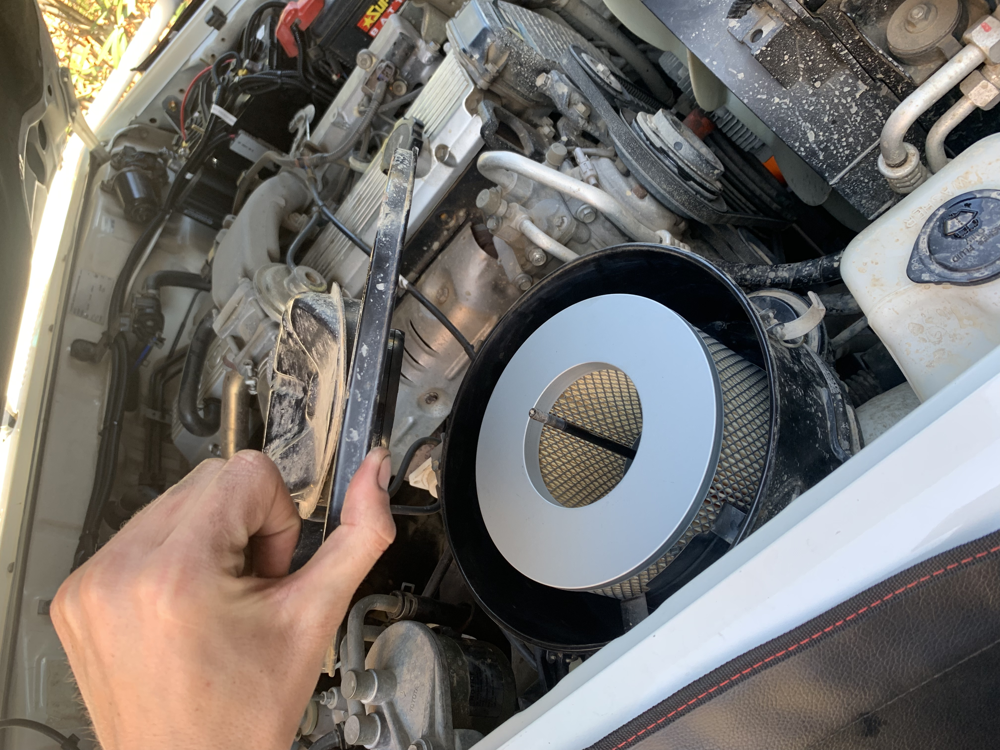

---

## Shopping List

**Engine Oil**: Specs are as follows (according to the Owners Manual):
> **oil grade**: API CF-4, CF, G-DLD-1, API CE, CD

> **viscosity** (SAE): 20W-50, 15W-40, 10W-30

> i used 10L of **Castrol Magnatec 15W-40**

**Oil Filter**: I used Ryco Z334

**Fuel Filter 1**: I used Ryco Z252X

**Fuel Filter 2**: I used Ryco R2590P

**Lubricant / Grease**: [NLGI No.2](https://en.wikipedia.org/wiki/NLGI_consistency_number)

---

## Tools needed

* Oil Filter removal tool
* Fuel filter removal tool
* Oil sump
* Normal set of wrenches and ratchets
* Grease gun
* Degreaser