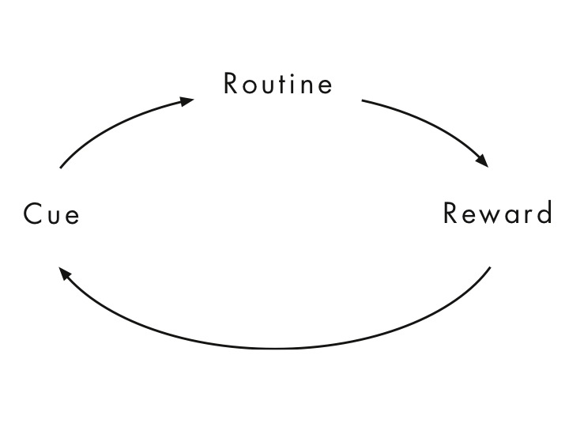

Do you ever wonder why other people get more stuff done than you? Where the 24 hours of your day went? Or what you actually got done within a day? Habits helped me to structure a bit of my day and turn certain activities into routines.

I get up at 0530 and run through a bunch of nearly automatic steps every day. Repeating these activities helps beating your inner voice telling you to do something else (like staying in bed or brainlessly scrolling through social media) because you simply get used to them. It's a great way to start your day with a sense of accomplishment and a good list of things already done.

## But first what are habits / routines / cues/ rewards?

[Charles Duhigg (The Power of Habit)](https://charlesduhigg.com/how-habits-work/) has the full explanation and while I highly recommend his book, here is a short version. According to him, a habit consists of

* a cue; that acts as the trigger of a routine (alarm clock at 0530)
* a routine; the activity you go through (a workout, meditation, journaling, etc .)
* a reward; seems obvious (this could be the coffee once you finish or just the feeling of accomplishment)

It's by no means easy to manipulate habits, but if you manage to see it that way, you might be able to connect certain cues, routines and rewards in a way that helps you.

Here is what I do:

### Excercise, flex workout for roughly (15min)
I personally like [this 15 minute flexibility workout](https://www.youtube.com/watch?v=L_xrDAtykMI). I simply follow along first thing in the morning, before checking my phone.

<iframe width="560" height="315" src="https://www.youtube.com/embed/L_xrDAtykMI" frameborder="0" allow="accelerometer; autoplay; encrypted-media; gyroscope; picture-in-picture" allowfullscreen></iframe>

### Meditation (20min)

I never thought I'd do something like this, but I absolutely love meditation and what it helps you to achieve.

What is it al about?
The key is; don't think of mediation as some spiritual, bell ringing, mantra praying activity, think of it as **a workout for your mind** (the thing that filters all that goes into our brain).
A great way to get started is a guided meditation using an app such as [Headspace](https://www.headspace.com), etc. If you don't want to pay subscription after your trial period, you can just set a timer on your phone and simply get going.

The core of the activity is not thinking of anything, recognizing when your mind has wandered off and then bringing it back to meditation.
I can absolutely recommend [10% happier written by Dan Harriss](https://www.tenpercent.com/).

Why would you?
In the same way physical exercise trains your body (a better posture, strength, cardio etc.) meditation trains your mind to focus, handle distraction, deal with stress anger and [much more](https://www.headspace.com/science/meditation-benefits)

### Journaling (10min)

I don't spend a lot of time on this but I the 5MJ (5 Minute Journal) helps me to think positive - it's really easy to think negative about everything, but can you think positive only?

The second type is about creativity; It kind of trains your mind to generate ideas.

#### 5MJ 
(slot in the morning and before I go to bed);.

Start in the morning:

**I am Grateful for:**
1. ... (the great friends I have)
2. ... (the stuff i've learned today)
3. ... 

**What would make today great:**
1. ...
2. ...
3. ...

**Daily practice:**
1. ...

Before going to bed I do:

**Amazing things that happened today:**
1. ...
2. ...
3. ...

**How could I have made today even better?**
1. ...
2. ...
3. ...

#### Daily 10

### Reading (30min)
I read for 30min.

So by the time i've completed this it's 0645 - pretty early still huh?

### Write one sentence a day
I love this. It sort of makes you feel like you don't have to do a lot but then you end up writing for 20-30min.

### Daily Email
I try to maximize the efficiency when working and that is only possible when reducing distractions. Besides turning off notifications, I try and don't check emails outside my scheduled times. If people really need me, they usually call me.

### One hour of hobbies
This can be video editing, coding on the blog, reading some more, working on the troopy etc.

# Bed time usually is around 2130
After reading Why We Sleep by Matthew Walker, I really take it serious to get 8 hours of sleep a night.