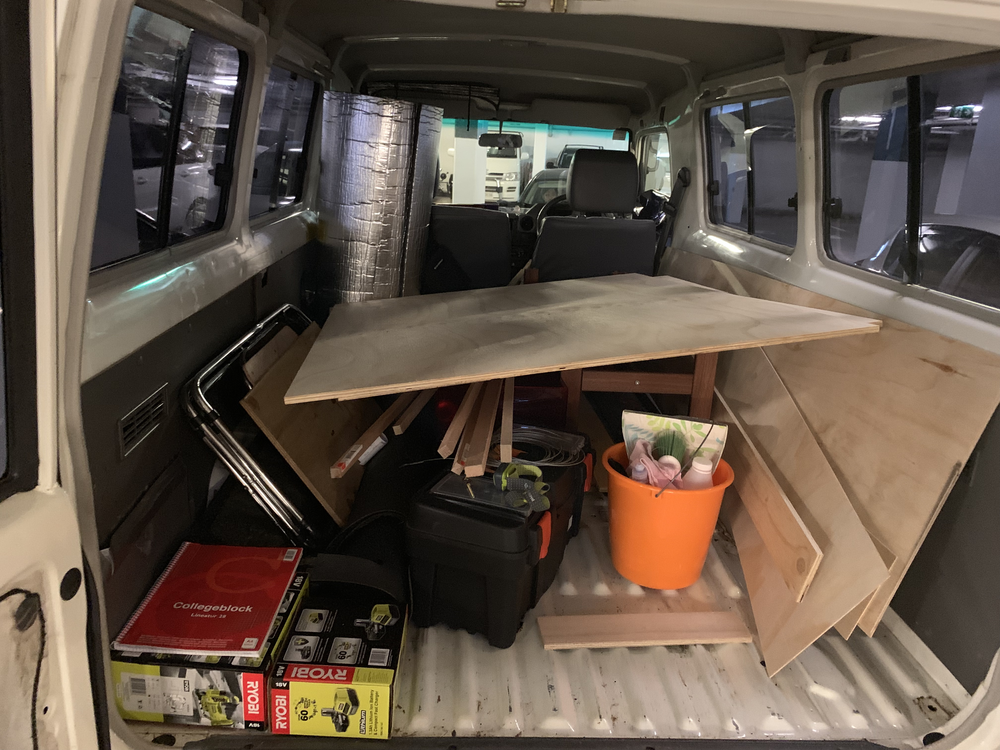

A must have for the Troopy is a fold down table attached to the backdoor.<!-- end -->

12mm plywood table
9mm ply back
If you don’t want to drill into the door, use rivnuts. They are quite cheap and can be inserted into the door so you will have a thread. Make sure the rivnut actually fits into to the pre drilled holes - they should be just about 9.5mm wide. There are a bunch of videos on how to build your own rivnut tool for 3 dollars.
Slide out table can be built by placing a few layers of wood just on top of each other and then cutting a slide out just in shape.
Use hooks for the top mount so you can fix some wire rope to it. You will again need a tool to connect the swages but you might be lucky and find a mate who has something.
COnnect a third wire rope to the slide out and connect it using another hook.
To easily pull out the slide-out i used an old seatbelt and just drilled it onto the slide out.

## Steps

1. take off the old cover carefully, so you can draw a copy on the new plywood (including holes).
2. cut out the new plywood back-piece from the 9mm ply.
3. widen existing holes to fit the rivnuts, place and tighten rivnuts
4. fix back-piece to door using bolts and rivnuts (we used eye bolts on the top to fix the wire) 
5. cut out the table-piece, the slide-out and the slide-frame from 12mm ply
6. place the slide-out ontop of the table-piece to measure where to place the frame - screw down the frame (ensure it's not to tight so you can still slide the slide-out)
7. fix table-piece to back-piece using the hinge
8. fix eye screws to table-piece end and connect eye screws to eye bolt using wire.
9. connect all wires with swages to fix them around the eye bolts

## Shopping List & measurements

1. backpiece: 9mm ply 
2. table: 12mm ply
3. threaded inserts for existing door holes: rivnuts
4. bolts
5. eye bolts
6. eye screws
7. wire
8. small caribiner (to connect a detachable wire from slide-out to door)
9. swages

## Tools needed

* Jigsaw
* rivetgun or a self made [rivnut-tool](https://www.youtube.com/watch?v=SzWj5y00sVg) 
* Ruler & Pencil
* swaging tool (if you don't want to buy this you can use cord as well)
