I've never ever done this before and the troopy still works! These are the steps I've gone through and my sources of information from.<!-- end -->

---

## Information

Haynes Repair Manual,
--> steps, amount of oil, service intervals
Toyota Owners Manual,
--> service steps, oil etc.
[Youtube Video](https://www.youtube.com/watch?v=komGJ7Sirbs) - good rundown of what needs to be done.

Table with all infor on service intervals and the oil required

My Toyota Warranty Warranty and Service Manual as the following information:

I: Drive Belts
R: Engine Oil
R: Engine Oil Filter
(R): Main Fuel Filter
R: Fuel Pre Filter
I: Water Sedimeter
I: Air  Filter
I: Battery
I: Brake pads and dicsc
I: Brake fluid
I: Clutch fluid
I: Power steering fluid
(I): Brake pipes and hoses
(I):  Steering wheel, linkage and steering gearbox oil
L: Steering knuckle, drag link and steering linkage
L: Propeller shaft
T: Propeller shaft bolts
(I): Front and rear suspension
I: Tyres and inflation pressure

---

## Steps

#### Step 1; remove old oil

1. let the engine run for little bit - warm oil flows better.
2. drive it onto a tarp so you don't mess up the floor/street.
3. open the filler cap - where you'll fill in oil.
4. get a bucket big enough to hold all the oil (see above)
5. loosen the bolt and unscrew it by hand, hold the bucket close once it pours out.
6. let the oil run out.

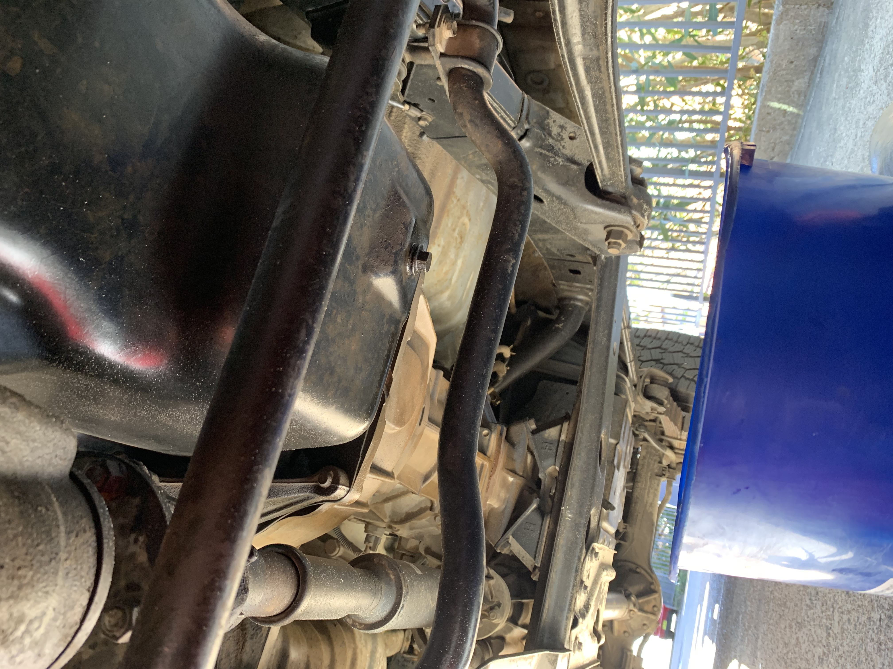

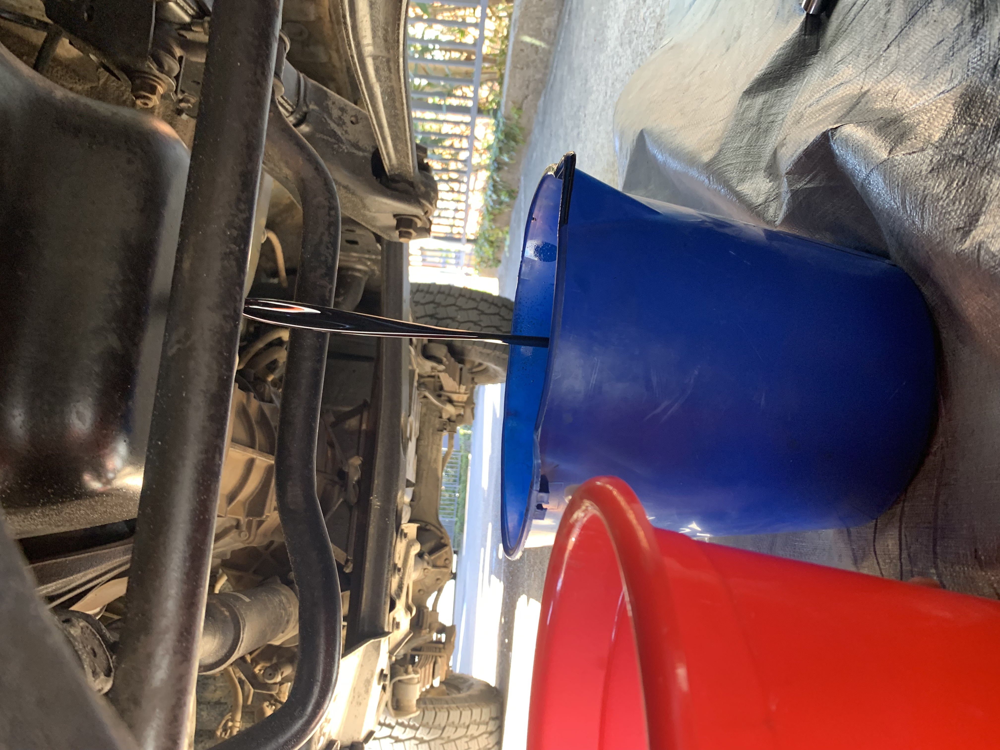

#### Step 2; change oil filter

1. This can be hard to get off so you might need a tool (sca grip tool or filter cap)
2. get a cloth underneath it and unscrew slowly
3. make sure to turn it downside up first before lifting it out - this will spill less.
4. take out trying to catch as much as you can.
5. apply some oil on the rubber seals of the new filter, to get it off easier next time.
6. screw on the new filter hand-tight and then another 3/4.

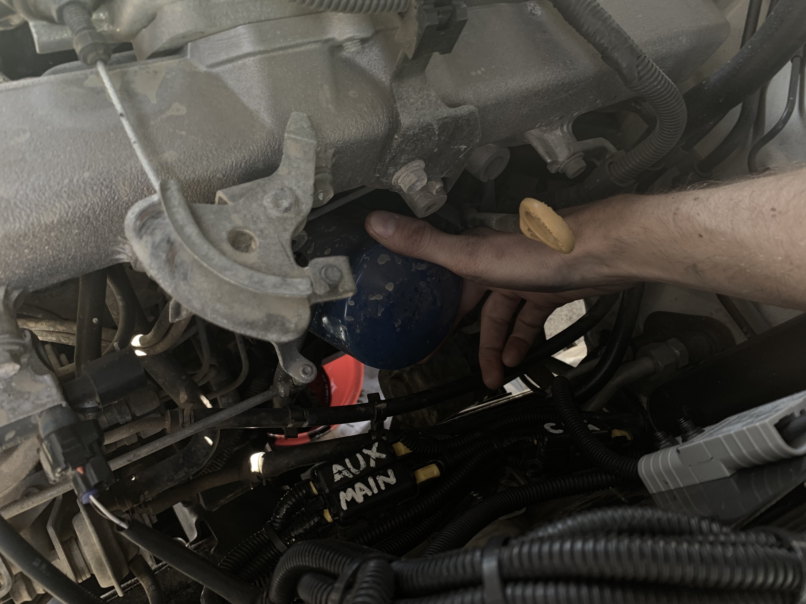

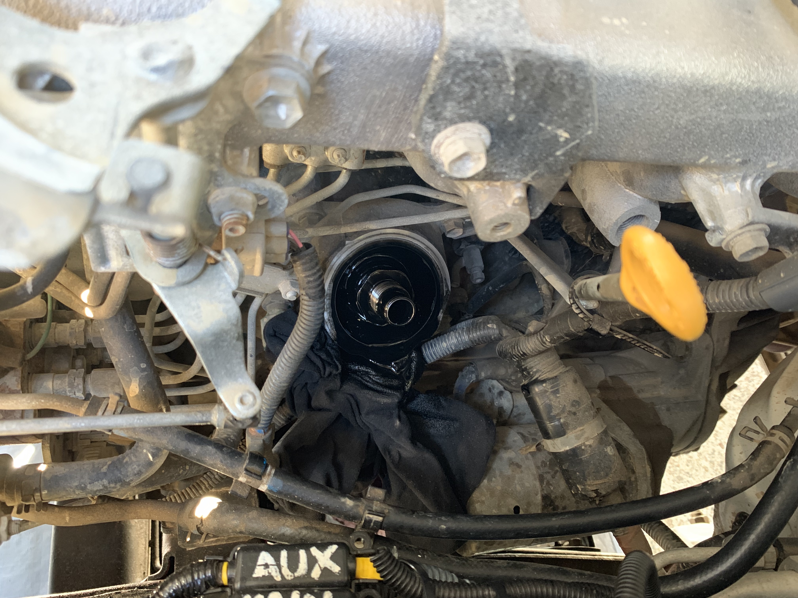

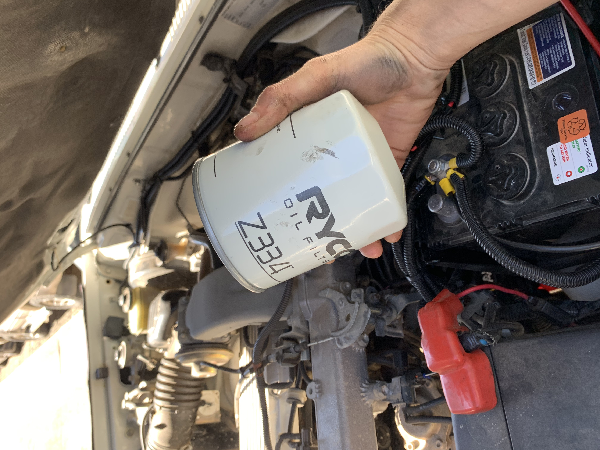

#### Step 3; change fuel filter

1. This can be even harder than the oil filter - you probably need a grip tool.
2. undo the sensor cable first
3. unscrew the plastic cap underneath the filter first - this works best with a multi width plier.
4. unscrew the fuel filter and take it out, place a cloth underneath to catch the diesel.
5. replace it with the new filter (oil the seals), tighten it and attach the sensor cable.
6. unscrew the second fuel filter, this is a cartridge with a filter - you just replace the filter.
7. There's a nut underneath you loosen, replace the filter and screw it back on.
8. Now you need to get the air out of the filters and fill it with diesel.
9. pump the little black rubber knob until you can't press it down anymore.

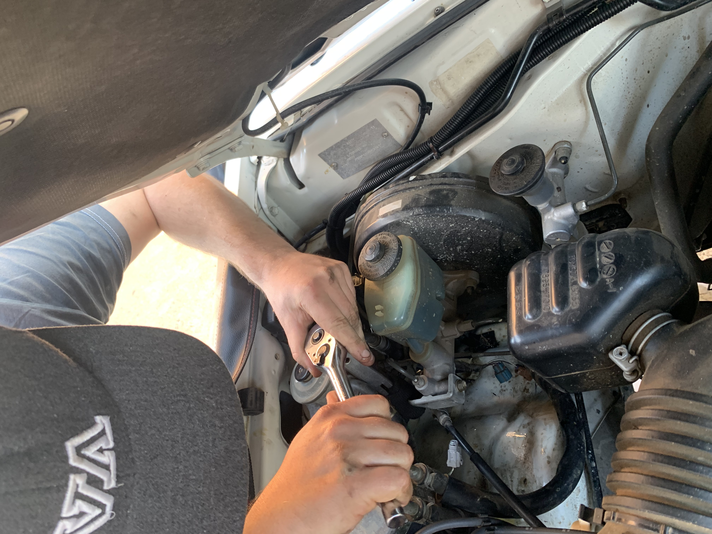

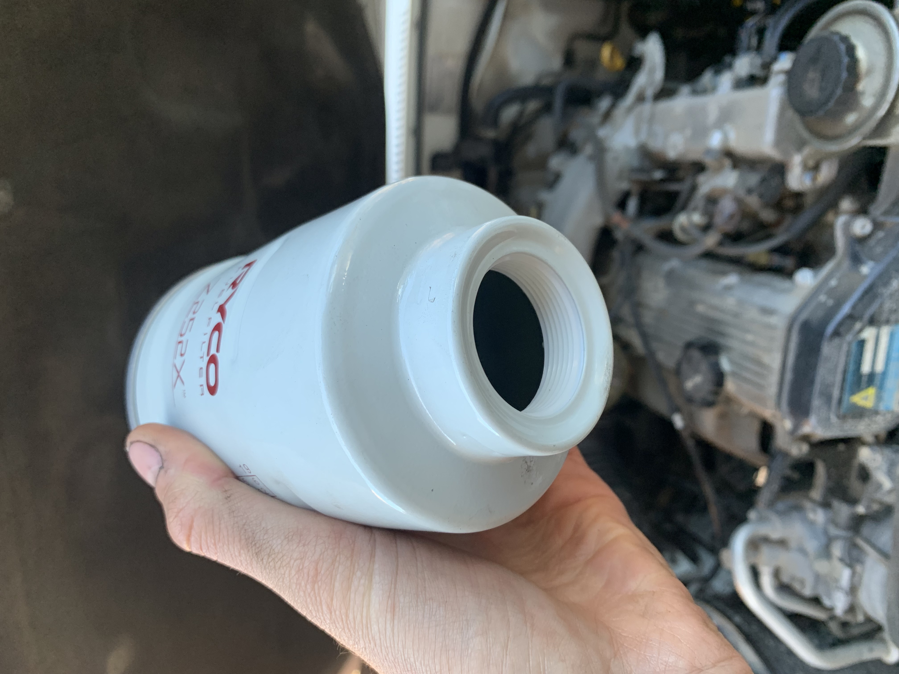

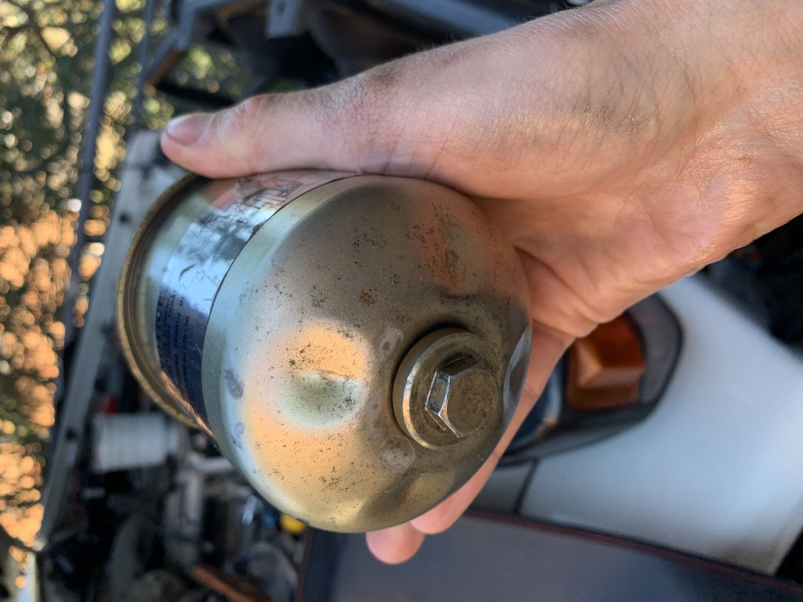

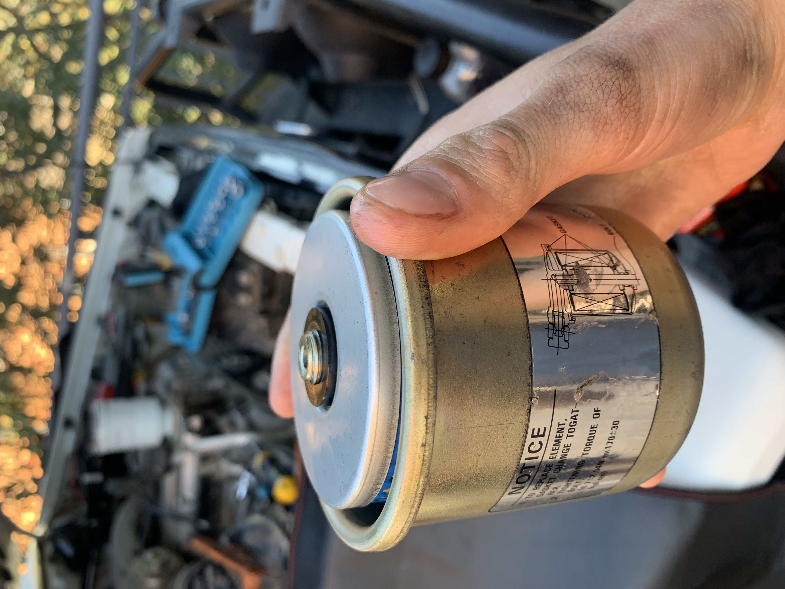

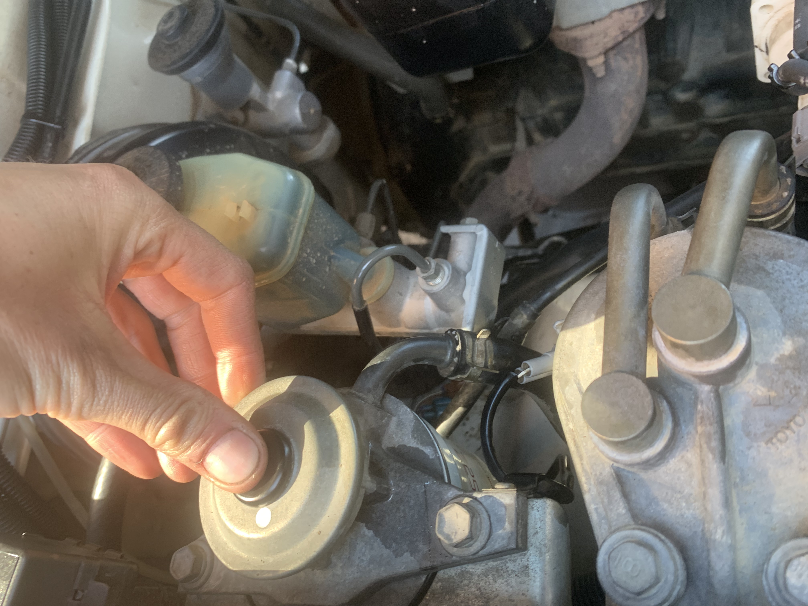

#### Step 4; refill with new oil

1. by now, all oil should be gone. Some people pour in a little sip of fresh oil to wash out the old.
2. screw the bold underneath back in.
3. slowly pour in the new oil checking the dip stick as you go.
4. the filter will require some additional oil so fill it just over the high mark.
5. let it sit for a bit and see how full it is.
6. close the cap.

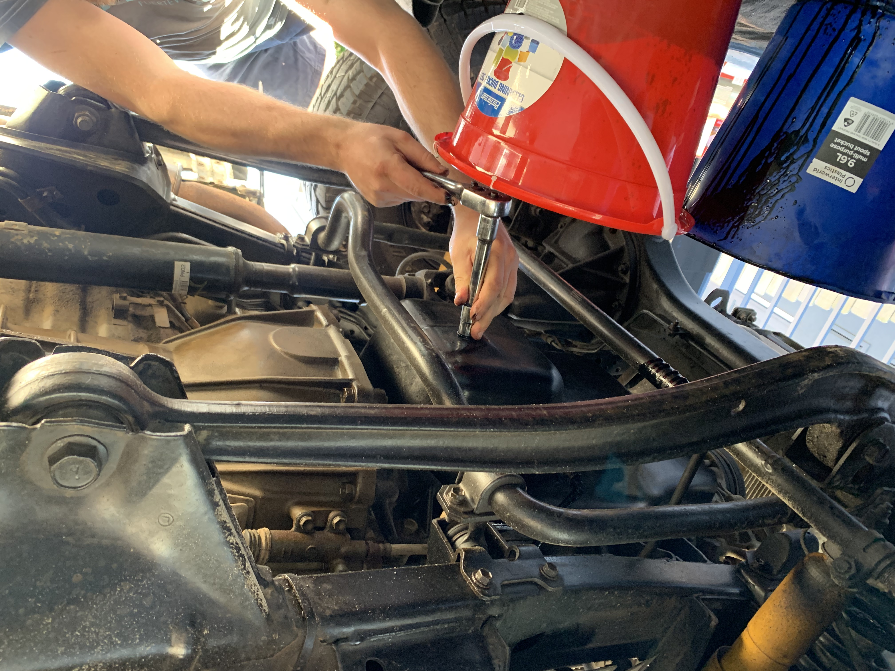

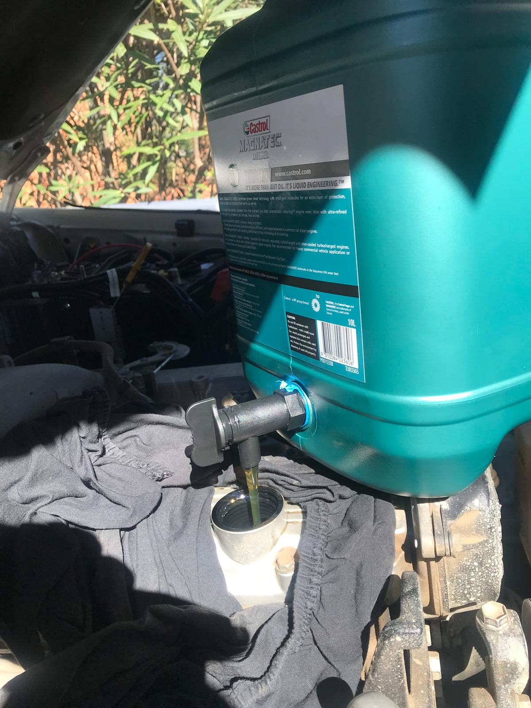

#### Step 5; Lubricate steering knuckle

#### Step 6; Tighten propeller shaft bolts and lubricate propeller shaft
1. Grease to be used [NLGI No.2](https://en.wikipedia.org/wiki/NLGI_consistency_number) 
2. This guy explains what it's about.

#### Step 7; Change the Air filter

1. This is really easy: Open the big round box attached to the snorkel.
2. Take out the old filter
3. Clean it from inside
4. Place new filter and close the box.

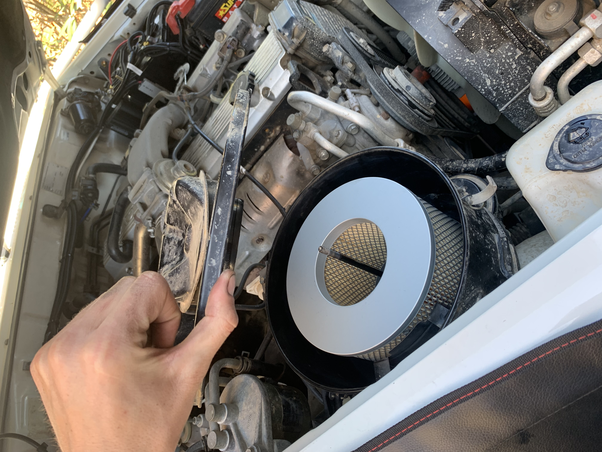

---

## Shopping List

1. **Engine Oil**: Specs are as follows (according to the Owners Manual):
> Oil grade: API CF-4, CF, G-DLD-1, API CE, CD
> Viscosity (SAE): 20W-50, 15W-40, 10W-30
1. **Oil Filter**: my 1HZ needs a Ryco Z334 - the part number for the genuine part is:
2. **Fuel Filter 1**: my 1HZ needs a Ryco Z252X - the part number ... 
3. **Fuel Filter 2**: my 1HZ has two fuel filters.
4. **Lubricant / Grease**:

---

## Tools needed

* Oil Filter removal tool
* Fuel filter removal tool
* Oil sump
* normal set of wrenches and ratchets
* grease gun
